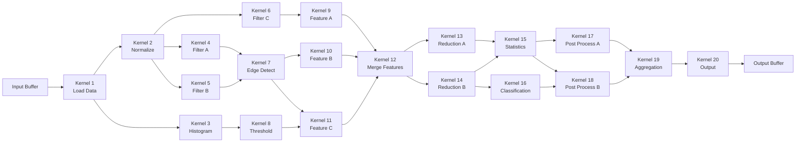
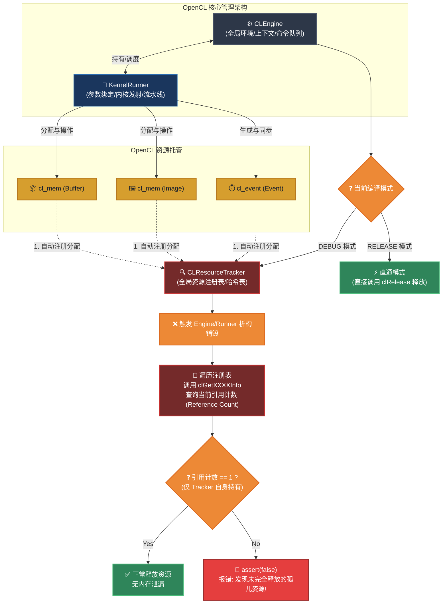
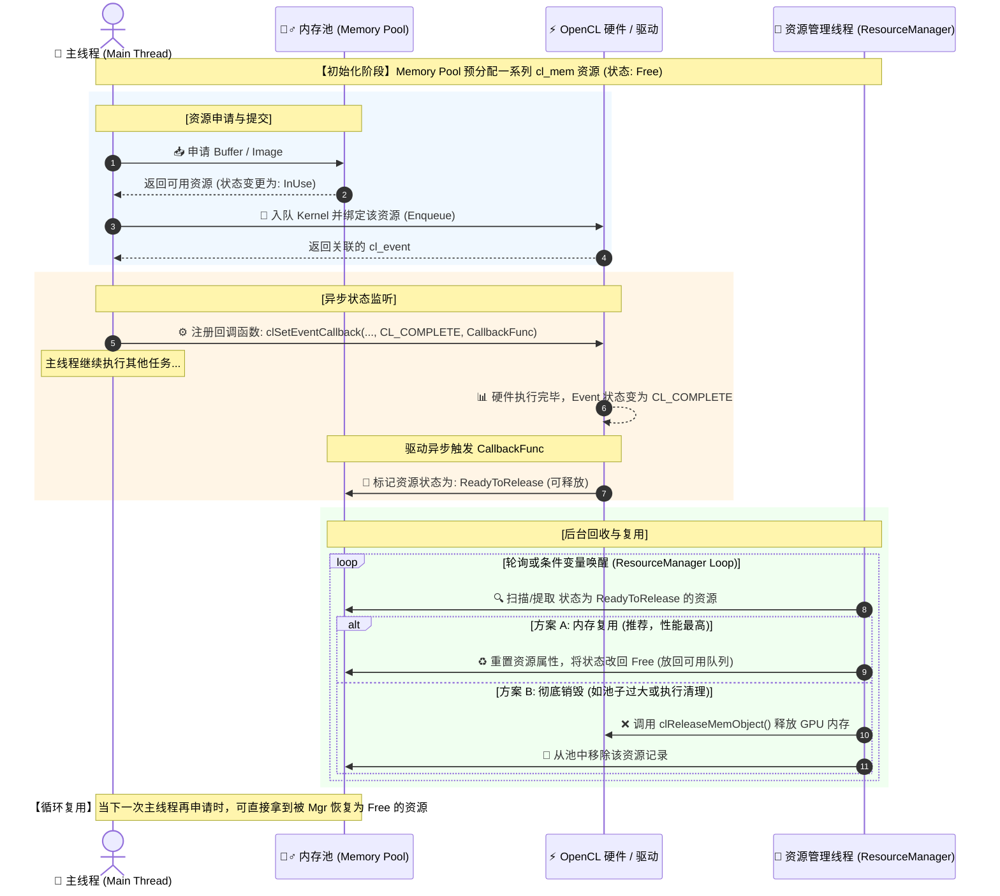
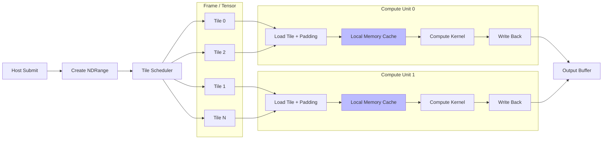

# OpenCL优化工程总结

**摘要**：OpenCL 程序的性能优化是异构计算工程实践中的核心环节。GPU 优化的核心逻辑高度一致：尽量让计算单元（ALU）持续运转，同时避免数据传输成为瓶颈（Memory Wall）。本文系统总结了 OpenCL 工程中的关键优化手段，涵盖内存访问优化（共享内存利用、访存合并、常量内存与图像内存）、计算效率优化（消除分支分歧、寄存器压力控制、向量化计算）、任务调度优化（工作组大小调优、流水线并行与双缓冲、多命令队列并发）以及硬件特性利用（Local Memory 进阶、内置函数与原生指令、Image 硬件加速）四大维度，并结合矩阵乘法、直方图、规约等典型场景给出具体优化策略与代码示例，为 OpenCL 工程性能调优提供系统性参考。

**关键字**：OpenCL；性能优化；内存访问优化；计算效率；工作组调优；异构计算

## 1 核心优化理念

&emsp;&emsp;OpenCL 程序的性能瓶颈通常集中在两个方面：**内存带宽**和**计算吞吐**。GPU 拥有大量的计算核心，但内存子系统的带宽相对有限。如果每个计算单元都在等待数据，那么再多的核心也无法发挥作用。因此，OpenCL 优化的核心思路可以概括为：

1. **最大化计算密度**：让每个工作项尽可能多地执行有效计算，减少空闲等待。
2. **最小化数据传输**：减少主机与设备之间的数据传输，优化设备内部的内存访问模式。
3. **充分利用硬件特性**：根据目标硬件的架构特点（如 Warp/Wavefront 大小、Local Memory 大小、寄存器数量）调整并行粒度和内存策略。

&emsp;&emsp;下面的图示总结了 OpenCL 优化的主要方向及其关系：

```
                    ┌──────────────────────────────────┐
                    │       OpenCL 性能优化全景          │
                    └──────────────────────────────────┘
                                    │
            ┌───────────────────────┼───────────────────────┐
            │                       │                       │
            ▼                       ▼                       ▼
    ┌───────────────┐     ┌───────────────┐     ┌───────────────┐
    │  内存访问优化  │     │  计算效率优化  │     │  任务调度优化  │
    └───────────────┘     └───────────────┘     └───────────────┘
            │                       │                       │
    ┌───────┼───────┐     ┌───────┼───────┐     ┌───────┼───────┐
    │       │       │     │       │       │     │       │       │
    ▼       ▼       ▼     ▼       ▼       ▼     ▼       ▼       ▼
  共享   访存   常量/   分支   寄存器  向量化  工作组 流水线  多队列
  内存   合并   图像   消除   压力   计算   调优   并行   并发
```

## 2 内存访问优化

&emsp;&emsp;内存访问通常是 OpenCL 程序的最大性能瓶颈。GPU 的全局内存（Global Memory）虽然容量大，但访问延迟高达数百个时钟周期。合理利用内存层次结构是优化的第一步。

### 2.1 利用共享内存（Local Memory）

&emsp;&emsp;局部内存（Local Memory）位于每个计算单元（Compute Unit）内部，访问速度远快于全局内存，可达到全局内存带宽的数倍乃至十倍以上。将频繁访问的数据从全局内存缓存到局部内存，是减少全局内存访问次数、降低延迟的核心手段。

**优化策略**：
- 将工作组内重复访问的全局内存数据预先加载到局部内存。
- 使用 `barrier(CLK_LOCAL_MEM_FENCE)` 确保所有工作项完成数据加载后再进行计算。
- 控制局部内存使用量，避免超出硬件限制（通常为 32KB–64KB）。

**示例：使用 Local Memory 优化矩阵乘法**

&emsp;&emsp;以矩阵乘法为例，朴素实现中每个工作项直接从全局内存读取数据，每个元素 `C[i][j]` 需读取 2N 次全局内存。通过将矩阵分块加载到局部内存，可使每个工作项大幅减少全局内存访问。

```c
// 使用 Local Memory 的分块矩阵乘法
__kernel void matmul_tiled(
    __global const float* A,
    __global const float* B,
    __global float* C,
    const int N)
{
    // 分块大小通常设置为工作组大小
    const int TS = get_local_size(0); // Tile Size = 工作组大小
    
    // 分配局部内存
    __local float Asub[16][16]; // TS 需与工作组大小一致
    __local float Bsub[16][16];
    
    int row = get_global_id(0);
    int col = get_global_id(1);
    
    float sum = 0.0f;
    
    // 按块遍历
    for (int t = 0; t < N / TS; t++) {
        // 每个工作项协作加载一块数据到局部内存
        int localRow = get_local_id(0);
        int localCol = get_local_id(1);
        Asub[localRow][localCol] = A[row * N + t * TS + localCol];
        Bsub[localRow][localCol] = B[(t * TS + localRow) * N + col];
        
        // 确保整个工作组的数据加载完毕
        barrier(CLK_LOCAL_MEM_FENCE);
        
        // 计算当前块的部分和
        for (int k = 0; k < TS; k++) {
            sum += Asub[localRow][k] * Bsub[k][localCol];
        }
        
        // 确保所有工作项完成本块计算后再加载下一块
        barrier(CLK_LOCAL_MEM_FENCE);
    }
    
    C[row * N + col] = sum;
}
```

&emsp;&emsp;经过 Local Memory 优化后，全局内存访问次数从 O(N³) 降至 O(N³/TS)，性能可提升数倍至数十倍。

### 2.2 保证访存合并（Memory Coalescing）

&emsp;&emsp;访存合并是指同一工作组（更准确地说，同一 Warp/Wavefront）内的多个工作项访问的全局内存地址连续时，GPU 可以将多次内存访问合并为单次宽内存事务（Memory Transaction），从而大幅提升全局内存带宽利用率。相反，如果访问模式分散（如跨步访问、随机访问），每个工作项的访问可能触发独立的内存事务，造成带宽浪费。

**优化原则**：
- 确保同一 Warp/Wavefront（通常 32 或 64 个工作项）访问的内存地址连续且对齐（通常 128 字节对齐）。
- 数据结构设计上优先采用数组结构体（Structure of Arrays, SoA）而非结构体数组（Array of Structures, AoS），以利于连续访问。
- 工作项索引映射到内存地址时，优先将 `get_global_id(0)` 映射到最小的内存步长维度。

**示例：SoA vs AoS**

```c
// 不推荐：AoS 布局，访问不连续
struct Particle_AoS {
    float x, y, z;
    float vx, vy, vz;
};

// 推荐：SoA 布局，访问连续
struct Particles_SoA {
    __global float* x;
    __global float* y;
    __global float* z;
    __global float* vx;
    __global float* vy;
    __global float* vz;
};

// 内核中访问 SoA 数据，连续读取 x 坐标
__kernel void update_positions(
    __global const float* x,
    __global const float* vx,
    __global float* new_x,
    const float dt)
{
    int gid = get_global_id(0);
    // 所有相邻工作项访问 x[gid]、x[gid+1]、x[gid+2]... 是连续的
    new_x[gid] = x[gid] + vx[gid] * dt;
}
```

**访问步长与合并效率**：
- **步长为 1**：所有访问可完美合并，带宽利用率接近 100%。
- **步长为 2**：合并效率约 50%，一半的数据被浪费。
- **大步长或随机访问**：每个工作项各自触发内存事务，效率极低。

### 2.3 常量内存与图像内存

&emsp;&emsp;OpenCL 提供了常量内存（Constant Memory）和图像内存（Image Memory）作为特殊的优化手段。

**常量内存（Constant Memory）**：
- 适合存储所有工作项共享的只读数据（如滤波器系数、查找表）。
- 硬件通常有独立的常量缓存（Constant Cache），读取延迟很低。
- 同一 Warp/Wavefront 内所有工作项读取同一地址时效率最高（广播机制）。
- 限制：容量较小（通常 64KB），仅适合小数据集。

```c
// 使用常量内存存储滤波器系数
__kernel void convolution(
    __global const float* input,
    __constant float* kernel, // 常量内存
    __global float* output,
    const int width,
    const int kernel_size)
{
    // 所有工作项共享同一份 kernel 数据
    // 硬件通过广播机制高效分发
    ...
}
```

**图像内存（Image Memory）**：
- OpenCL 图像对象（`image2d_t`、`image3d_t`）使用专用的纹理缓存（Texture Cache），提供硬件加速的 2D/3D 空间局部性访问。
- 支持硬件双线性/三线性插值、边界处理（clamp/ repeat/ mirror）等功能，无需手工编码。
- 对于图像处理、空间滤波等具有 2D 访问模式的场景，图像内存通常优于 Buffer。

```c
// 使用图像内存进行双线性插值采样
__kernel void resize_image(
    __read_only image2d_t src,
    __write_only image2d_t dst,
    const float scale_x,
    const float scale_y)
{
    // 硬件双线性插值，无需手工编码
    sampler_t sampler = CLK_NORMALIZED_COORDS_FALSE |
                        CLK_ADDRESS_CLAMP_TO_EDGE |
                        CLK_FILTER_LINEAR;
    int gx = get_global_id(0);
    int gy = get_global_id(1);
    float2 coord = (float2)(gx * scale_x, gy * scale_y);
    float4 pixel = read_imagef(src, sampler, coord);
    write_imagef(dst, (int2)(gx, gy), pixel);
}
```

## 3 计算效率优化

### 3.1 消除分支分歧（Warp Divergence）

&emsp;&emsp;在 GPU 架构中，同一 Warp/Wavefront（NVIDIA 为 32 个工作项，AMD 为 64 个工作项）内的所有工作项以 SIMD 模式执行同一条指令。当内核中存在条件分支（`if-else`）时，如果部分工作项进入 `if` 分支，另一部分进入 `else` 分支，这两条路径将被串行执行（部分工作项被屏蔽），导致并行效率损失——这便是**分支分歧**（Warp Divergence）。

**优化策略**：

1. **按分支拆分工作空间**：将可能产生不同分支的工作项分配到不同工作组或分别启动不同内核。例如，在处理偶数/奇数元素的场景中，分别启动处理偶数和奇数元素的内核（或通过工作组 ID 分组）。

```c
// 不推荐：分支分歧
__kernel void bad_branch(__global const float* input, __global float* output) {
    int gid = get_global_id(0);
    if (gid % 2 == 0) {
        // 偶数工作项执行路径 A
        output[gid] = complex_func_a(input[gid]);
    } else {
        // 奇数工作项执行路径 B
        output[gid] = complex_func_b(input[gid]);
    }
    // 同一 Warp 内，两种路径串行执行！
}
```

```c
// 推荐：按分支拆分为两个独立内核
__kernel void process_even(__global const float* input, __global float* output) {
    int gid = get_global_id(0) * 2; // 只处理偶数索引
    output[gid] = complex_func_a(input[gid]);
}

__kernel void process_odd(__global const float* input, __global float* output) {
    int gid = get_global_id(0) * 2 + 1; // 只处理奇数索引
    output[gid] = complex_func_b(input[gid]);
}
```

2. **数据驱动的分支消除**：用算术运算替代分支。例如 `a = (cond) ? x : y` 可改写为 `a = cond * x + (1 - cond) * y`（当 `cond` 为 0 或 1 时）。

```c
// 推荐：用选择函数消除显式分支
__kernel void no_branch(__global const float* input, __global float* output) {
    int gid = get_global_id(0);
    // 使用 select 内置函数，编译器可生成为无分支的位选择指令
    output[gid] = select(complex_func_b(input[gid]), 
                          complex_func_a(input[gid]), 
                          (gid % 2) == 0);
}
```

### 3.2 寄存器压力控制（Register Pressure）

&emsp;&emsp;每个工作项拥有私有内存（Private Memory），通常由寄存器实现。寄存器是所有内存层次中速度最快的存储单元，但每个计算单元的寄存器数量是有限的（例如 NVIDIA GPU 每个 SM 有 65536 个 32 位寄存器，AMD GPU 每个 CU 有类似限制）。

&emsp;&emsp;当内核中使用了过多局部变量（这些变量通常被编译为寄存器），硬件能同时驻留的工作项数量就会减少，这种状况称为**寄存器压力**（Register Pressure）。工作项数量减少意味着 GPU 无法通过足够的并行度隐藏内存延迟，从而导致整体性能下降，即**占用率**（Occupancy）不足。

**优化策略**：

1. **减少局部变量数量**：复用变量、将计算拆分为更小的子内核。
2. **避免大数组分配为私有内存**：大数组（如超过 64 个元素的数组）会被编译器溢出（Spill）到全局内存，性能严重退化。
3. **使用 `__attribute__((reqd_work_group_size(X, Y, Z)))`**：让编译器在已知工作组大小时做出更好的寄存器分配决策。
4. **权衡占用率与寄存器使用**：有时保留更多寄存器以支持复杂的单工作项计算，比追求高占用率更有利。需通过 Profiling 验证不同配置的效果。

```c
// 在开发时可查询设备的最大工作组大小和局部内存大小
cl_uint max_work_group_size;
clGetDeviceInfo(device, CL_DEVICE_MAX_WORK_GROUP_SIZE, 
                sizeof(max_work_group_size), &max_work_group_size, NULL);

cl_ulong local_mem_size;
clGetDeviceInfo(device, CL_DEVICE_LOCAL_MEM_SIZE, 
                sizeof(local_mem_size), &local_mem_size, NULL);

// 设置编译器选项以查看寄存器使用情况
// 编译时可使用 "-cl-nv-verbose"（NVIDIA）或类似选项查看寄存器使用量
const char* options = "-cl-mad-enable -cl-fast-relaxed-math";
clBuildProgram(program, 1, &device, options, NULL, NULL);
```

### 3.3 向量化计算

&emsp;&emsp;OpenCL 提供了内置的向量数据类型（如 `float4`、`int8`、`double2` 等），一次指令可操作多个数据元素。利用向量类型可以：
- 减少指令发射次数。
- 提高内存带宽利用率（一次加载/存储多个元素）。
- 更好地利用 GPU 的 SIMD 硬件单元。

```c
// 标量版本
__kernel void scalar_add(__global const float* a, 
                         __global const float* b,
                         __global float* c) {
    int gid = get_global_id(0);
    c[gid] = a[gid] + b[gid];
}

// 向量化版本：一次处理 4 个元素
__kernel void vector_add(__global const float4* a,
                         __global const float4* b,
                         __global float4* c) {
    int gid = get_global_id(0);
    c[gid] = a[gid] + b[gid]; // 单条指令完成 4 个 float 加法
}
```

&emsp;&emsp;注意：向量化需要数据对齐（`float4` 要求 16 字节对齐），否则可能反而降低性能。

## 4 任务调度优化

### 4.1 工作组大小调优

&emsp;&emsp;工作组大小（Work-group Size）是影响 OpenCL 性能的关键参数。合理的工作组大小需要平衡以下因素：

- **硬件限制**：每个计算单元有最大支持的工作组大小（`CL_DEVICE_MAX_WORK_GROUP_SIZE`）和最大工作项总数（`CL_KERNEL_WORK_GROUP_SIZE`）。
- **Warp/Wavefront 大小**：工作组大小应设为 Warp/Wavefront 大小的整数倍，以充分利用 SIMD 硬件。NVIDIA GPU 的 Warp 大小为 32，AMD GPU 的 Wavefront 大小为 64。
- **占用率**：工作组大小和 Local Memory 使用量共同决定了单个计算单元能同时驻留的工作组数量。通常工作组越大，占用率越低，但共享数据的复用率更高。
- **任务粒度**：工作组中工作项太少会导致管理开销过大；太多可能超出硬件资源限制。

**实践建议**：
- 从 Warp/Wavefront 大小（32/64）开始尝试，逐步调整到 64、128、256，通过 Benchmark 确定最优值。
- 使用 `clGetKernelWorkGroupInfo` 查询内核特定的推荐工作组大小。
- 在无 Local Memory 使用的简单内核中，通常较大的工作组（128–256）性能更好。

```c
// 查询内核的工作组信息
size_t preferred_work_group_size_multiple;
clGetKernelWorkGroupInfo(kernel, device,
    CL_KERNEL_PREFERRED_WORK_GROUP_SIZE_MULTIPLE,
    sizeof(preferred_work_group_size_multiple),
    &preferred_work_group_size_multiple, NULL);

size_t kernel_max_work_group_size;
clGetKernelWorkGroupInfo(kernel, device,
    CL_KERNEL_WORK_GROUP_SIZE,
    sizeof(kernel_max_work_group_size),
    &kernel_max_work_group_size, NULL);

// 设置工作组大小时，确保是 preferred_work_group_size_multiple 的整数倍
size_t local_size = preferred_work_group_size_multiple * 2; // 如 32 * 2 = 64
size_t global_size = ((N + local_size - 1) / local_size) * local_size; // 向上取整
```

### 4.2 流水线并行与双缓冲

&emsp;&emsp;GPU 执行模型支持命令队列中的命令异步执行。利用这一特性，可以实现**数据传输与计算重叠**，即在内核执行的同时进行下一批数据的传输。

**双缓冲（Double Buffering）策略**：
- 创建两份缓冲区，一份用于当前内核计算，另一份用于数据传输。
- 通过 OpenCL 事件（Event）机制控制依赖关系，确保数据就绪后再开始计算。

```c
// 双缓冲流水线示例
cl_mem buf_a[2], buf_b[2], buf_c[2];
// ...创建双缓冲区...

cl_event write_event[2], kernel_event[2];

// 第 0 帧：写入 buf[0]，然后执行内核
clEnqueueWriteBuffer(queue, buf_a[0], CL_FALSE, ...);
clEnqueueNDRangeKernel(queue, kernel, ..., &kernel_event[0]);

// 第 1 帧：在内核执行 buf[0] 的同时并行写入 buf[1]
clEnqueueWriteBuffer(queue, buf_a[1], CL_FALSE, ...);
clEnqueueNDRangeKernel(queue, kernel, ..., 1, &kernel_event[0], &kernel_event[1]);

// 读取结果：使用事件确保前一个内核完成
clEnqueueReadBuffer(queue, buf_c[0], CL_TRUE, ..., 1, &kernel_event[0], NULL);
clEnqueueReadBuffer(queue, buf_c[1], CL_TRUE, ..., 1, &kernel_event[1], NULL);
```

&emsp;&emsp;这种策略在数据流处理的场景（视频处理、传感器数据处理）中尤为有效，可将 GPU 空闲等待时间降至最低。

### 4.3 多命令队列并发

&emsp;&emsp;OpenCL 允许为一个设备创建多个命令队列（Command Queue），但不要求它们之间天然并行——多数现实设备仅有一个硬件调度引擎。不过，多命令队列的意义在于：

1. **独立的事件管理和同步域**：不同优先级或不同数据流的内核可放入不同队列，便于组织和调度。
2. **乱序队列（Out-of-Order Queue）**：通过 `CL_QUEUE_OUT_OF_ORDER_EXEC_MODE_ENABLE` 开启乱序队列，允许不相关的命令同时执行。需配合事件控制依赖关系。

```c
// 创建乱序命令队列
cl_command_queue out_of_order_queue = clCreateCommandQueueWithProperties(
    context, device,
    (cl_queue_properties[]){
        CL_QUEUE_PROPERTIES,
        CL_QUEUE_OUT_OF_ORDER_EXEC_MODE_ENABLE,
        0
    }, &err);
```

## 5 硬件特性利用与高阶技巧

### 5.1 Local Memory 的 Bank Conflict 避免

&emsp;&emsp;局部内存由多个 Bank 组成（通常 32 个 Bank），每个 Bank 每周期可服务一个访问请求。当同一个 Warp/Wavefront 内的多个工作项访问的地址落在同一个 Bank 的不同字（Word）时，请求将被串行处理，这种现象称为 **Bank Conflict**。

**避免策略**：
- 为 Local Memory 数组添加 Padding（填充列），打散地址映射。
- 设计数据访问模式使相邻工作项访问相邻 Bank 地址。

```c
// Bank Conflict 示例（假设 32 个 Bank，每个 4 字节）
// 访问 A[tx * 32]：tx = 0,1,2,...,31 → 步长 32，所有地址映射到同一 Bank！
// 常规优化：添加 Padding
__local float A_padded[16][16 + 1]; // 多一列 Padding
// 现在访问 A[tx * 17]：步长 17，与 Bank 数 32 互质，避免 Conflict
```

### 5.2 规约（Reduction）优化

&emsp;&emsp;规约操作（求和、最大值、最小值等）是 GPU 计算中的常见模式。朴素实现（单个工作项遍历全部数据）效率极低，优化的关键在于**树形规约**（Tree Reduction）。

```c
// 工作组内树形规约
__kernel void reduce_sum(__global const float* input,
                         __global float* output,
                         __local float* scratch,
                         const int N) {
    int gid = get_global_id(0);
    int lid = get_local_id(0);
    int group_size = get_local_size(0);
    
    // 从全局内存加载数据
    scratch[lid] = (gid < N) ? input[gid] : 0.0f;
    barrier(CLK_LOCAL_MEM_FENCE);
    
    // 树形规约
    for (int stride = group_size / 2; stride > 0; stride >>= 1) {
        if (lid < stride) {
            scratch[lid] += scratch[lid + stride];
        }
        barrier(CLK_LOCAL_MEM_FENCE);
    }
    
    // 每个工作组写出一个结果
    if (lid == 0) {
        output[get_group_id(0)] = scratch[0];
    }
}
```

### 5.3 内置函数与原生指令

&emsp;&emsp;OpenCL 提供了丰富的内置函数（如 `sin`、`cos`、`exp`、`sqrt` 等），并在数学精度和速度之间提供了不同层次的选项：

| 函数后缀   | 精度     | 性能   | 说明                                         |
|-----------|---------|--------|---------------------------------------------|
| 无后缀     | 标准精度 | 中等   | 符合 IEEE 754 标准                           |
| `_native` | 低精度   | 最快   | 使用硬件原生指令，精度因设备而异              |
| `_half`   | 中等精度 | 较快   | 比标准快，精度介于 native 和标准之间           |

```c
// 使用快速数学选项
// 编译时启用快速数学优化
// clBuildProgram(program, 1, &device, "-cl-fast-relaxed-math", NULL, NULL);

// 内核中显式使用 native 函数
__kernel void fast_exp(__global const float* input, __global float* output) {
    int gid = get_global_id(0);
    // native_exp 比 exp 快 3-5 倍，但精度大约为 7 位有效数字
    output[gid] = native_exp(input[gid]);
}
```

&emsp;&emsp;此外，OpenCL 支持融合乘加指令（FMA, Fused Multiply-Add），可将 `a * b + c` 编译为单条指令，提升精度和性能。编译选项 `-cl-mad-enable` 可启用该优化。

### 5.4 异步传输与 pinned memory

&emsp;&emsp;主机与设备之间的数据传输通过 PCIe 总线进行，其带宽显著低于设备内部带宽。使用 **Pinned Memory**（页锁定内存）是加速主机-设备数据传输的关键手段。

**Pinned Memory 优势**：
- 普通主机内存（Pageable Memory）在 DMA 传输前需先拷贝到 Pinned Memory，额外消耗带宽和延迟。
- Pinned Memory 允许 GPU 直接 DMA 访问，消除中间拷贝步骤。
- 配合异步传输（`clEnqueueWriteBuffer` 的 `blocking` 参数设为 `CL_FALSE`），可实现传输与计算的完全重叠。

```c
// 使用 CL_MEM_ALLOC_HOST_PTR 分配 Pinned Memory
cl_mem pinned_buf = clCreateBuffer(context,
    CL_MEM_READ_WRITE | CL_MEM_ALLOC_HOST_PTR,
    size, NULL, &err);

// 映射到主机地址空间
float* host_ptr = (float*)clEnqueueMapBuffer(queue, pinned_buf, CL_TRUE,
    CL_MAP_WRITE, 0, size, 0, NULL, NULL, &err);

// 直接在 Pinned Memory 上写入数据
for (size_t i = 0; i < count; i++) {
    host_ptr[i] = 42.0f; // 直接写入，无需额外拷贝
}

// 解除映射，提交到设备
clEnqueueUnmapMemObject(queue, pinned_buf, host_ptr, 0, NULL, NULL);
```

## 6 典型场景优化策略总结

&emsp;&emsp;以下将常见的计算场景与对应的优化手段进行系统归纳。没有一种优化策略是“银弹”，实际工程中需要结合目标硬件、数据规模和计算模式进行针对性的选择和组合。

| 计算场景       | 核心瓶颈                 | 主要优化手段                                        | 典型性能提升       |
|---------------|-------------------------|---------------------------------------------------|------------------|
| 矩阵乘法       | 全局内存带宽              | 分块 + Local Memory、访存合并、向量化                 | 10×–50×          |
| 卷积/滤波      | 同一数据重复读取            | Image Memory / 纹理缓存、常量内存存放卷积核           | 3×–10×           |
| 规约（求和等） | 同步开销 + 访存模式        | 树形规约、Local Memory、避免 Bank Conflict           | 5×–20×           |
| 直方图         | 原子操作冲突               | 分工作组本地直方图 + 全局合并、减少原子操作竞争          | 5×–10×           |
| 排序/查找      | 分支分歧 + 不规整访问       | 无分支选择、SoA 布局、利用 Local Memory 分组排序      | 2×–5×            |
| 粒子模拟       | 随机访存 + 分支（边界处理）   | SoA 布局、分离边界/内部粒子到不同内核、Local Memory    | 3×–8×            |
| 深度学习推理    | 矩阵/卷积运算性能           | 矩阵乘法优化（Im2Col/分块）、内存复用、FP16/INT8 量化   | 视模型和硬件而定    |

## 7 性能剖析与迭代优化流程

&emsp;&emsp;性能优化不是一次性工作，而是一个**测量→分析→优化→验证**的迭代过程。推荐的优化流程如下：

```
           ┌──────────────────────────┐
           │  1. 编写正确性基准代码    │
           └──────────┬───────────────┘
                      ▼
           ┌──────────────────────────┐
           │  2. 使用 Profiling 工具   │
           │    识别性能瓶颈（热点）    │
           └──────────┬───────────────┘
                      ▼
          ┌───────────────────────────┐
          │  3. 是否内存带宽受限？      │──是──▶ 应用内存访问优化（Local Memory、访存合并等）
          └───────────┬───────────────┘
                      │ 否
                      ▼
          ┌───────────────────────────┐
          │  4. 是否计算单元利用率低？   │──是──▶ 消除分支分歧、提升占用率、向量化计算
          └───────────┬───────────────┘
                      │ 否
                      ▼
          ┌───────────────────────────┐
          │  5. 是否主机-设备传输瓶颈？  │──是──▶ 异步传输、流水线、Pinned Memory
          └───────────┬───────────────┘
                      │
                      ▼
          ┌───────────────────────────┐
          │  6. 重复直到达到性能目标    │
          └───────────────────────────┘
```

**常用 Profiling 工具**：
- **OpenCL 自带 Profiling**：通过 `CL_QUEUE_PROFILING_ENABLE` 和 `clGetEventProfilingInfo` 获取内核执行和传输的精确时间。
- **NVIDIA Nsight Compute / Nsight Systems**：适用于 NVIDIA GPU，可分析内存带宽、占用率、Warp 分歧等指标。
- **AMD Radeon Profiler / CodeXL**：适用于 AMD GPU。
- **Intel VTune Profiler**：适用于 Intel CPU/GPU 平台，提供全面的性能分析。

## 8 实际工作中遇到的问题与解决
&emsp;&emsp;OpenCL 的优化方法总体上比较固定，前面各节已做了系统梳理。本节简要介绍实际工作过程中的针对性优化及取得的具体收益。（由于具体数据保存在工作电脑上，本文将仅作为基本的工作总结，不涉及任何工作内容细节。）

- 平台：MTK 平台。
- 优化目标：性能、功耗、内存。

### 8.1 做好 Profiling
&emsp;&emsp;常规的优化思路是发现瓶颈之后再做 Profiling，定位问题并解决——这个思路本身没有问题。但根据我的实际操作经验，从一开始就做好 Profiling 是一个更值得推荐的习惯。Profiling 包含两部分：
- **代码级 Trace**：对自己开发的代码进行耗时和内存跟踪，需要自行添加 Trace 代码，也可以使用开源框架。
- **系统级 Perf 工具**：使用 perfetto、simpleperf 等工具抓取 GPU/CPU 频率及 workload 等信息，观察实际运行状况。

&emsp;&emsp;既然有 Perf 工具可以做 profiling，为什么还要自己写代码 Trace？简单来说，通过代码 Trace 发现的问题通常更容易定位——你的代码和 Trace 日志之间有着直接的对应关系。例如在我自己的开发过程中，通过自研的 Tree Tracer 可以直观地看到每个函数的耗时和具体执行情况，一眼就能发现瓶颈在驱动接口层，立刻就可以制定针对性的优化方案。而如果通过 Perf 工具去抓取，首先相比直接查看日志要多一道解析 perfdata 数据的工序（虽然可以脚本化，但总归比直接看 Trace 日志慢）。此外，不同机器对 Perf 的支持程度参差不齐，通常 Linux 机器都能拿到 Perf 数据，但不一定能拿到你预期的指标。至少从我的经验来看，自己写 Trace 是定位问题最简单、最快速的途径。我的工作流程是：先看自己的 Trace 找问题，找不到再去看 perfdata。下面是实际 Trace 输出的一个示例（可以直观地解释为什么能从日志中一眼定位问题）：
```bash
Root ---------------------------------------------------------> 1023 ms

├── Initialize Runtime ---------------------------------------> 42 ms
│   ├── Create Context ---------------------------------------> 15 ms
│   ├── Create Queue -----------------------------------------> 8 ms
│   └── Build Program ----------------------------------------> 19 ms
│
├── Upload Input Buffers -------------------------------------> 87 ms
│   ├── Upload Image -----------------------------------------> 52 ms
│   └── Upload Parameters -----------------------------------> 35 ms
│
├── Compute Graph --------------------------------------------> 801 ms
│   │
│   ├── Kernel 1 : Load Data --------------------------------> 23 ms
│   │
│   ├── Kernel 2 : Normalize --------------------------------> 51 ms
│   ├── Kernel 3 : Histogram --------------------------------> 37 ms
│   │
│   ├── Kernel 19 : Aggregation -----------------------------> 16 ms
│   └── Kernel 20 : Final Output ----------------------------> 10 ms
│
├── Download Results -----------------------------------------> 63 ms
│   ├── Read Output Buffer ----------------------------------> 51 ms
│   └── Validation ------------------------------------------> 12 ms
│
└── Cleanup --------------------------------------------------> 30 ms
    ├── Release Buffers -------------------------------------> 12 ms
    ├── Release Kernels -------------------------------------> 10 ms
    └── Release Context -------------------------------------> 8 ms
```

### 8.2 关于性能优化
&emsp;&emsp;以如下 Kernels 流程图为例（一个典型的复杂处理管线）：


&emsp;&emsp;这是一个非常复杂的处理管线，不同 Kernel 之间相互依赖，且存在大量多对多的拓扑关系。OpenCL 的优化手段正如前文所述，关键在于如何针对具体场景灵活实施：
1. **谓词（Predicate）**。使用内置谓词（built-in select 等）减少显式 if 分支。实际测试中收益较小，可能是编译器已做了类似优化，但无论如何仍建议主动使用；
2. **预编译（Pre-compilation）**。尽可能将可在编译期确定的变量或计算通过宏/模板预编译进 Kernel。对于分支条件在运行期间固定、但可能在不同运行场景中取不同值的情况，可以为每种分支版本编写独立的 Kernel；
3. **向量化与寄存器**。尽可能使用向量类型读取和寄存器计算，实际收益非常大；
4. **Local Memory**。Local Memory 的效果需要根据具体硬件和场景评估。在 MTK Arm Mali GPU 上实测收益没有那么显著，反而会增加额外的内存负担；
5. **更少的位宽**。尽可能使用较小的位宽进行计算（如避免使用 long 等宽类型），好处有两方面：减少内存占用和提升计算吞吐。但需结合实际场景权衡，毕竟降低位宽通常意味着精度损失；
6. **计算等价变换**。仔细观察待优化部分是否可以用其他更高效的方式实现以达到相同目的。例如我在实践中，将中值滤波的中值选择改用 Bose-Nelson 排序网络实现，获得了约 90% 的性能提升；
7. **展开（Unrolling）**。展开有两种：一种是将复杂计算展开交由编译器优化，另一种是 for 循环展开。后者建议实际测试后再决定，因为编译器有时展开得比手工更好；
8. **Local Size 调优**。Local Size 的设置不要凭感觉，也不需要逐个 Kernel 去穷举（比如上面 20 个 Kernel，逐一枚举的工作量太大）。建议先通过 cl 接口获取驱动建议的 Local Size，然后在此基础上对单个 Kernel 上下浮动测试，基本就能确定最佳的 Local Size。实际开发中，驱动建议的值比我最初手动设置的性能明显更好，而我在其基础上微调后又获得了约 10% 的额外提升；
9. **完全的并行化**。尽量让 GPU 驱动无阻塞地运行，避免 CPU 端操作阻塞 GPU 调度，使用 Event 机制管理 Kernel 之间的依赖关系；
10. **充分利用硬件能力**。如 DMA 等硬件特性，尽可能直接使用；
11. **扩展（Extensions）**。利用厂商扩展支持的能力降低开销，例如 command_buffer 等。

### 8.3 关于资源管理
&emsp;&emsp;OpenCL 的资源管理主要围绕 `cl_mem`（Buffer/Image）和 `cl_event` 展开，其他资源的管理相对简单。
- `cl_event`：管理较为简单，每次创建后注册到统一表格中，执行完毕后统一销毁即可，开销很低；
- `cl_mem`（Buffer/Image）：管理相对复杂一些。简单做法是在初始化阶段统一申请，退出时统一销毁；复杂做法可以实现一个 MemoryPool（详见 8.4 节），但需注意资源销毁的时机。

&emsp;&emsp;这里建议做好 Trace。无论是 RAII 还是统一 Trace 方案，基于引用计数的资源追踪能省去大量排查工作。下面是我实现的统一资源追踪机制——每次发生泄漏时触发 ASSERT，问题非常容易被发现。最初打算采用 RAII 方案，但当时选择了放弃；现在回顾来看，RAII 方案可能是更合适的选择。



### 8.4 MemoryPool
&emsp;&emsp;最初的方案非常简单：需要使用时 `createImage`/`createBuffer`，使用完释放。但通过 Trace 日志发现，总的 `createBuffer`/`createImage` 耗时占比非常高。为此我设计了一套 CL MemoryPool 方案，其基本思路与操作系统中的内存链表管理类似：
1. 初始化阶段申请一块大的 `cl_mem` Buffer，构建空闲链表；
   1. 启动资源管理线程，该线程周期性检查是否存在待销毁的块。若有，则将该块标记为 free，并尝试与相邻空闲块合并；
2. Kernel 运行时申请 `cl_mem` Buffer/Image 时，先查询空闲链表中是否有满足需求的块。若有，则切割出 SubBuffer 并新建节点更新链表；
3. Kernel 执行结束时触发回调，回调中通知该资源可销毁；
4. 进程退出时统一销毁 MemoryPool。



&emsp;&emsp;实践过程中，该方案确明显降低了驱动接口的耗时（SubBuffer 分配仅需几微秒），但又引入了新的问题。由于同时存在驱动线程、资源管理线程和主线程三个线程，为了保障资源管理器的线程安全，我对资源操作加了锁。这导致三个线程之间出现锁竞争，进而造成 GPU workload 无法被填满（GPU Starvation），如下图所示：

```mermaid
%% ⚡ 锁竞争导致的 GPU 性能瓶颈分析图
gantt
    title GPU Starvation Root Cause Timeline
    dateFormat X
    axisFormat %Lms

    section GPU
    K1                           :done, k1, 5, 20
    STARVATION                   :crit, s1, 20, 35
    K2                           :done, k2, 35, 55
    STARVATION                   :crit, s2, 55, 70

    section CPU Critical Path
    MainThread BLOCKED           :crit, mt1, 10, 35
    MainThread BLOCKED           :crit, mt2, 45, 70

    section Lock Owner
    CallbackThread               :crit, cb1, 20, 25
    RecycleThread                :crit, rc1, 25, 35
    CallbackThread               :crit, cb2, 55, 60
    RecycleThread                :crit, rc2, 60, 70

```



&emsp;&emsp;针对上述锁竞争问题，最终方案调整为：根据处理流程将内存划分为若干组，在初始化阶段提前分配好，并预先标记复用时机与方式。这样的好处是 OpenCL 驱动侧与 CPU 之间不会产生新的运行时交互，性能提升显著，基本达到目标；缺点是与具体任务强绑定，需要针对每种任务自定义资源复用策略。

### 8.5 内存优化
&emsp;&emsp;内存优化的思路相对直接：
1. 尽可能使用较少的位宽；
2. 尽可能复用（ping-pong 双缓冲策略）；
3. Tile 分块处理。分块时需关注整个流程中的最大访问邻域，且 tile-padding 建议以实际最大访问邻域为基准，向上取整到 $2^n$ 对齐。



## 9 总结

&emsp;&emsp;OpenCL 的性能优化是一个系统工程，需要在**内存效率**和**计算效率**之间寻求最优平衡。核心优化手段概括如下：

1. **内存访问优化**：利用 Local Memory 分块复用数据、保证访存合并（Memory Coalescing）、合理使用常量内存和图像内存。
2. **计算效率优化**：消除 Warp Divergence、控制寄存器压力以维持合理占用率、利用向量类型和原生函数提升计算密度。
3. **任务调度优化**：将工作组大小设为 Warp/Wavefront 的整数倍并匹配硬件限制、通过流水线使数据传输与计算重叠。
4. **高级精调**：规避 Local Memory 的 Bank Conflict、对原子操作进行冲突打散、善用 Pinned Memory 和异步传输。

&emsp;&emsp;性能优化的效果最终必须通过实际的 **Profiling** 数据加以验证。开发者应当养成“假设驱动”的优化习惯——根据 Profiling 数据定位瓶颈，提出可验证的优化假设，实施变更后再次测量对比。只有在充分理解硬件架构特性的前提下，结合具体的计算场景，才能将 OpenCL 程序的计算潜力充分发挥。

&emsp;&emsp;此外，工程实践中的经验表明：从一开始就建立完善的 Trace/Profiling 基础设施、有效管理 OpenCL 资源的生命周期、以及针对具体硬件特性设计内存复用策略，这些工程层面的积累对于持续提升性能同样至关重要。

## 参考文献
- [OpenCL 2.2 Reference Pages](https://www.khronos.org/registry/OpenCL/sdk/2.2/docs/man/html/)
- [OpenCL Best Practices Guide (CUDA)](https://docs.nvidia.com/cuda/cuda-c-best-practices-guide/index.html)
- [AMD OpenCL Optimization Guide](https://gpuopen.com/learn/amd-opencl-optimization-guide/)
- [Intel OpenCL Optimization Guide](https://www.intel.com/content/www/us/en/developer/articles/guide/opencl-optimization-guide.html)
- [OpenCL in Action – Matthew Scarpino](https://www.manning.com/books/opencl-in-action)