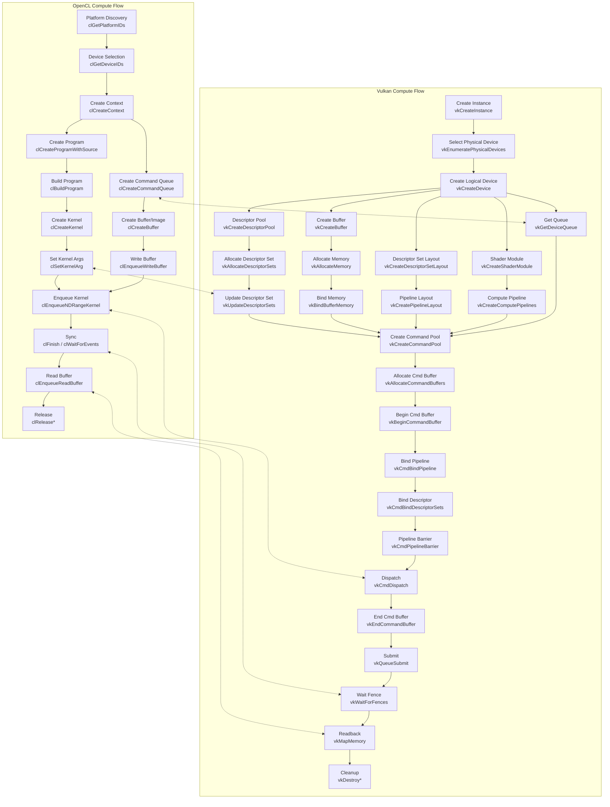

# Vulkan Compute 

## 1 Vulkan
### 1.1 Vulkan简介


&emsp;&emsp;Vulkan 是由 Khronos 主导开发的跨平台图形与计算API，于2016年2月正式发布1.0版本，旨在解决传统图形API（如 OpenGL）在高性能、低开销、多线程支持等方面的局限性。Vulkan 的核心定位是“跨平台、显式控制、低开销的统一图形与计算API”，打破了传统图形API与计算API分离的格局，让图形渲染与并行计算能够共用一套底层资源模型与调度体系，大幅提升协同效率。
&emsp;&emsp;Vulkan 的设计围绕“显式控制、低开销、可预测性与可扩展性”展开，其核心思想是将传统图形 API 中由驱动隐式处理的行为全部上移至应用层，从而实现对 GPU 的精细化控制。
- **完全显式化设计**：资源管理、内存分配、同步机制与状态转换均由开发者显式控制，驱动不再进行隐式状态推导与同步；
- **接近零抽象开销（Zero-overhead abstraction）**：通过管线状态对象（PSO）预编译、命令缓冲区复用及多线程命令记录机制，显著降低 CPU 端开销，使性能瓶颈从 API 层转移至应用设计；
- **统一资源与执行模型**：图形与计算共享统一的资源抽象（Buffer/Image/Memory）与队列体系，为高效协同执行提供基础；
- **规范驱动的一致性**：通过严格定义的 API 行为模型减少驱动差异，但仍需针对不同硬件特性进行适配；
- **可扩展架构**：基于扩展机制与特性查询体系，使新硬件能力能够在保持核心 API 稳定的前提下持续演进。

### 1.2 Vulkan vs OpenCL vs OpenGL
&emsp;&emsp;在深入理解Vulkan之间，这里先简单对比下Vlukan和OpenGL/OpenCL之间的区别，以方便本身了解这两个API的读者更加容易理解Vulkan。

&emsp;&emsp;OpenGL 是一个典型的**全局状态机模型**：所有渲染操作都依赖上下文中隐式维护的状态（如绑定的缓冲、着色器、纹理等），绘制指令本身不携带完整信息，这使其易于上手但也带来状态耦合强、行为不透明和性能不可控等问题；相比之下，Vulkan 采用**显式状态与命令缓冲模型**，所有资源绑定、同步与管线状态都需要开发者明确指定并预先记录到 Command Buffer 中，从而消除了隐式状态带来的不确定性，实现更高的性能、可预测性以及多线程扩展能力。


&emsp;&emsp;OpenCL核心模型围绕**设备抽象（Device）、上下文（Context）、命令队列（Command Queue）与内核（Kernel）执行**展开，开发者通过显式地管理内存对象（Buffer/Image）、数据传输以及 Kernel 调度来驱动计算任务，强调数据并行与硬件抽象；相比之下，Vulkan 虽然同样提供计算能力（Compute Pipeline），但其设计更偏向**统一图形与计算的低开销显式 API**，在资源绑定（Descriptor）、同步（Pipeline Barrier）和命令录制（Command Buffer）层面提供更细粒度控制，能够将计算与图形任务高效融合，并在多线程与性能可预测性方面优于 OpenCL，但代价是开发复杂度更高、抽象层更底层。

| 维度        | Vulkan                   | OpenGL             | OpenCL                 |
| --------- | ------------------------ | ------------------ | ---------------------- |
| **核心定位**  | 图形 + 计算统一 API            | 图形渲染 API           | 通用并行计算 API             |
| **执行模型**  | Command Buffer（预录制 + 提交） | 即时调用（全局状态驱动）       | Kernel + Command Queue |
| **状态管理**  | 完全显式（无隐式状态）              | 全局状态机（强隐式）         | 显式（以内核和内存为中心）          |
| **控制粒度**  | 极细（同步 / 内存 / 调度全可控）      | 粗（依赖驱动）            | 中（计算调度可控）              |
| **多线程能力** | 强（原生支持并行录制）              | 弱（Context 限制）      | 中（多队列执行）               |
| **图形能力**  | 完整支持                     | 完整支持               | 不支持                    |
| **计算能力**  | 强（Compute Pipeline）      | 较弱（Compute Shader） | 核心能力                   |
| **典型特点**  | 高性能、可预测、复杂度高             | 易用、状态隐式、性能不稳定      | 专注数据并行、跨设备抽象           |


## 2 Vulkan Compute Model
&emsp;&emsp;Vulkan通过一套统一的执行与资源模型（Pipeline + Descriptor + CommandBuffer + Queue），将图形管线和计算管线抽象为并列的两种执行形式：图形管线是包含固定功能阶段的多阶段流水线，而计算管线则是更通用的单阶段并行执行模型；二者共享相同的资源绑定、调度与同步机制，从而实现数据在 GPU 内的无缝流动与协同执行。


&emsp;&emsp;Vulkan Compute 的管线是相对图形管线独立的，开发人员可以根据具体应用场景灵活构建纯计算流程或与图形流程协同的混合 Pipeline，而无需依赖固定功能阶段或渲染流程；这种独立性体现在 Compute Pipeline 仅由 Shader 与资源绑定（Descriptor）驱动，通过 Command Buffer 显式调度执行，并可自由选择队列、同步策略与内存访问方式，从而实现从单一数据并行计算到复杂多阶段 GPU 数据流水线的高效构建，同时保持对执行顺序、资源可见性以及性能行为的完全可控。

&emsp;&emsp;下面将围绕对象模型、资源模型、执行模型三个模型理解Vulkan Compute的底层架构设计。


### 2.1 对象模型

&emsp;&emsp;Vulkan 将所有功能抽象为**强类型、显式管理**的对象（如 `VkInstance`、`VkDevice` 等），通过这些对象清晰描述 GPU 的能力、资源、绑定关系与执行流程。与 OpenGL 依赖“索引 ID + 隐式状态机”的管理方式相比，Vulkan 的对象模型更直观；与 OpenCL 相比，其对象分工更精细，边界更明确。

&emsp;&emsp;Vulkan 对象按功能可分为以下层级：

* **顶层对象：`Instance`**  
  `Instance` 是 Vulkan 的全局入口，负责建立应用与底层驱动的连接，完成运行时初始化（包括扩展加载、验证层启用、物理设备枚举）。它不承担资源管理或计算执行职责，更接近“全局运行时入口”；与 OpenCL 中直接关联设备资源的 `context` 不同，Vulkan 的 `Device` 才更接近 OpenCL `context` 的角色。此外，`Instance` 无隐式状态，不绑定线程或渲染目标，通常一个应用仅需一个 `Instance` 即可。


---

* **设备对象：`PhysicalDevice`、`Device`、`Queue`**  
  - `PhysicalDevice` 代表实际 GPU 硬件，仅用于查询设备能力（如队列类型、内存类型、硬件限制），不参与执行。  
  - `Device`（逻辑设备）是基于 `PhysicalDevice` 创建的核心对象，是应用与 GPU 的“执行契约”，负责资源创建（Buffer、Image）、内存管理、管线构建等，是所有计算操作的基础。  
  - `Queue` 是 `Device` 中的执行单元，用于提交并执行命令缓冲区（`CommandBuffer`）。不同类型的队列（图形、计算、传输）对应 GPU 不同的执行能力，支持多队列并发（如异步计算）。  
  三者构成“硬件能力描述 → 使用方式定义 → 实际执行”的完整链路。

---

* **资源对象：`Buffer`、`Image`、`DeviceMemory`、`BufferView`/`ImageView`、`DescriptorSet`、`DescriptorPool`、`DescriptorSetLayout`**  
  资源对象负责数据的存储、组织与访问，是计算任务的数据基础：  
  - `Buffer`（线性数据）与 `Image`（结构化数据）描述数据的用途与结构，本身不持有内存，需显式绑定 `DeviceMemory`（实际物理内存分配单元）后才能使用；  
  - `BufferView`/`ImageView` 定义资源的访问视图，使同一资源可通过不同格式或子区域被访问；  
  - `DescriptorSet` 及其相关对象（Layout、Pool）用于将资源绑定到 Shader，使 GPU 执行时能访问对应数据。  
  整体而言，资源对象定义了“数据是什么以及如何被访问”。

---

* **管线与命令对象：`ShaderModule`、`PipelineLayout`、`ComputePipeline`、`CommandPool`、`CommandBuffer`**  
  - `ShaderModule` 是 SPIR-V 格式的编译后着色器程序，是 GPU 执行逻辑的核心；  
  - `PipelineLayout` 定义 Shader 所需的资源接口（如 DescriptorSet 布局、Push Constant），相当于 Shader 与外部资源的“接口契约”；  
  - `ComputePipeline` 封装计算执行的完整状态（Shader + 资源布局），为不可变对象，创建成本高但执行效率高；  
  - `CommandPool` 管理命令缓冲区的内存分配，`CommandBuffer` 则负责录制具体 GPU 指令（如绑定管线、分发计算任务）。


&emsp;&emsp;Vulkan 对象的创建与销毁需**显式管理**，使用完成后必须调用对应销毁函数释放资源，否则会导致显存或系统内存泄漏。此外，对象间存在严格的层级依赖关系：所有子对象由父对象创建（如 `Device` 依赖 `Instance`，资源与管线对象依赖 `Device`，`CommandBuffer` 依赖 `CommandPool`），生命周期需遵循“先创建父对象、再创建子对象；销毁时先销毁子对象、再销毁父对象”的原则。

&emsp;&emsp;对象创建的核心流程为：  
1. 创建 `Instance` → 2. 枚举 `PhysicalDevice` → 3. 创建 `Device` 与 `Queue` → 4. 创建 `CommandPool` → 5. 分配 `CommandBuffer` → 6. 创建资源与管线对象 → 7. 执行计算 → 8. 按依赖顺序销毁所有对象。

&emsp;&emsp;这种显式管理不仅体现在对象生命周期，还贯穿资源绑定、内存分配、同步控制等环节（如 Buffer/Image 需手动绑定 `DeviceMemory`，`DescriptorSet` 需从 `DescriptorPool` 分配，命令需通过 `CommandBuffer` 录制并提交）。Vulkan 不提供任何隐式管理，所有行为由开发者明确指定，虽增加了开发复杂度，但带来了完全可预测的性能与资源控制能力——开发者可精确掌控内存分配、对象复用与命令调度，避免传统 API 中隐式管理导致的性能波动。


### 2.2 资源模型

&emsp;&emsp;资源模型是 Vulkan 中描述**数据存储、组织与 Shader 访问方式**的核心机制。与 OpenGL、早期 CUDA 等提供“高度抽象 + 隐式内存管理”的 API 不同，Vulkan 将物理内存分配、逻辑视图映射、缓存同步彻底解耦，为最大化 GPU 硬件利用率提供了精细控制接口。

&emsp;&emsp;Vulkan 资源管理体系依托三个底层抽象：**物理内存（DeviceMemory）**、**逻辑资源（Buffer/Image）**、**描述符映射（Descriptors）**。

---

**物理内存（DeviceMemory）**
&emsp;&emsp;物理内存是 GPU 可直接寻址的真实显存或主机可见内存，是 Vulkan 资源的实际存储载体。Vulkan 不提供隐式内存分配，所有内存需由应用显式申请、绑定、释放。驱动会暴露多个**内存堆（Memory Heap）**与**内存类型（Memory Type）**，分别对应显存容量、CPU 可访问性、缓存策略等属性，应用需通过查询选择满足场景的内存类型：  
- `DEVICE_LOCAL`：仅 GPU 可高速访问，适合常驻 GPU 的数据；  
- `HOST_VISIBLE`：CPU 可映射读写，用于数据上传/下载；  
- `HOST_COHERENT`：无需显式刷新缓存，保证 CPU/GPU 视图一致；  
- `HOST_CACHED`：CPU 侧启用缓存，提升读效率但需显式同步。  

> Vulkan 允许将多个 Buffer/Image 通过偏移量（Offset）放置在同一块物理内存中，减少内存碎片；而 OpenCL 资源通常为独立内存块。

---

**逻辑资源（Buffer/Image）**
&emsp;&emsp;Buffer（缓冲区）与 Image（图像）是 Vulkan 对外暴露的逻辑资源对象，本身不持有内存，仅描述数据的用途、结构与访问规则，需绑定物理内存后才能使用：  
- `Buffer`：线性数据结构（数组、结构体、SSBO），适用于通用计算；  
- `Image`：多维结构数据（2D/3D 纹理），适用于空间局部性强的访问模式。  

> OpenCL 的 `cl_mem` 对象在创建时已锁定背后的存储空间，即使 2.0 引入 SVM（共享虚拟内存），资源与存储的解耦灵活性仍不及 Vulkan。

---

**描述符与描述符集（Descriptors & Descriptor Sets）**
&emsp;&emsp;Shader 不直接连接 Buffer/Image，描述符是 Shader 访问外部资源的绑定接口，负责将资源映射到着色器绑定槽，实现 CPU 侧资源与 GPU 着色器的连接：  
- **描述符（Descriptor）**：指向资源的“句柄”，包含资源类型、状态（如 Image Layout）与内存范围；  
- **描述符集（DescriptorSet）**：将一组描述符打包，Shader 通过绑定集合访问资源；  
- **描述符集布局（DescriptorSetLayout）**：定义 Shader 期望的接口模板，类似函数签名的参数列表。  

> 描述符集从预定义数量上限的 `DescriptorPool` 中分配，使驱动可提前规划内存布局，提升绑定效率。与 OpenCL 需在不同 Kernel 间重复设置参数不同，Vulkan 仅需切换 DescriptorSet 即可，大幅降低管线切换的驱动负载。

&emsp;&emsp;支持的资源类型包括：  
- `UNIFORM_BUFFER`：只读、小尺寸的常量参数；  
- `STORAGE_BUFFER`：可读写的大规模并行计算数据；  
- `COMBINED_IMAGE_SAMPLER`：纹理采样器，用于 Shader 采样贴图；  
- `STORAGE_IMAGE`：支持像素级随机读写的存储图像。

---

**资源访问与视图机制**
&emsp;&emsp;为提升资源使用灵活性，Vulkan 引入“视图（View）”机制：  
- `BufferView`/`ImageView` 定义数据格式（如 `float4`/`rgba8`）与访问范围（子区域/子资源）；  
- 同一资源可创建多个视图，实现数据重解释（reinterpret）或多用途访问（如计算 + 采样）。

&emsp;&emsp;Vulkan 的资源控制完全显式，与 OpenGL 依赖驱动全局状态机的隐式控制、OpenCL 仅能控制部分资源属性形成鲜明对比：

| 特性     | Vulkan        | OpenGL | OpenCL    |
| -------- | ------------- | ------ | --------- |
| 内存管理 | 完全显式      | 隐式   | 半显式    |
| 资源绑定 | DescriptorSet | 全局状态机 | Kernel 参数 |
| 数据迁移 | 手动控制      | 自动   | 半自动    |
| 同步机制 | 显式 Barrier  | 隐式   | 事件驱动  |
| 性能可控性 | 极高        | 低     | 中        |

> 资源在不同队列、阶段间传递时，必须使用内存屏障、管线屏障保证可见性与执行顺序。

&emsp;&emsp;资源管理的典型流程为：  
- 创建资源（Buffer/Image）→ 分配内存（DeviceMemory）→ 绑定资源与内存 → 创建 DescriptorSet 并写入资源 → 提交 GPU 使用 → 同步与回收 → 销毁资源与内存。


### 2.3 执行模型

&emsp;&emsp;Vulkan 执行模型定义了命令从 CPU 端生成、录制、提交，到 GPU 端调度、并行执行、完成反馈的全生命周期规则，同时涵盖 GPU 硬件管线阶段、任务并行机制、内存可见性与同步约束。与 OpenGL/Direct3D 11 采用的“立即模式 + 隐式驱动调度”不同，Vulkan 彻底消除了驱动层的黑盒自动同步、隐式状态管理与命令重排，将 GPU 执行流程的全维度控制权交予应用——这既为极致硬件利用率、多线程并行与低延迟渲染提供了基础，也要求应用严格遵循规则，否则会产生未定义行为、渲染错误或性能损耗。

&emsp;&emsp;Vulkan 执行模型的核心体系依托五大抽象构建：**队列（Queue）**、**命令缓冲区（CommandBuffer）**、**管线（Pipeline）**、**同步原语与渲染通道（RenderPass）**，以及配套的**着色器执行模型**。

---

**队列与队列族**
&emsp;&emsp;队列是 GPU 硬件执行任务的唯一入口，对应硬件层面的独立执行流，同硬件的多个队列可完全并行执行任务，无需 CPU 干预。Vulkan 将硬件能力划分为不同**队列族（Queue Families）**：  
- **图形队列**：支持所有图形、计算与传输命令，是功能最完整的队列族，所有 Vulkan 实现必须支持至少一个图形队列族；  
- **计算队列**：仅支持计算与传输命令，不依赖图形管线，可与图形队列完全并行，用于异步计算、后处理、物理模拟等；  
- **传输队列**：仅支持内存拷贝、数据传输命令，专门用于异步数据上传/下载，不占用图形/计算队列资源；  
- **稀疏绑定队列**：用于稀疏资源的内存绑定更新，支持对大纹理、缓冲区的部分内存动态映射与解绑。

---

**命令缓冲区（CommandBuffer）**
&emsp;&emsp;命令缓冲区是 CPU 向 GPU 传递执行指令的载体。与 OpenGL/OpenCL 的“立即执行模式”（每调用一个函数就直接提交命令）不同，Vulkan 采用“先录制、后提交”模式：CPU 先将所有指令录制到命令缓冲区，录制完成后再一次性批量提交到 GPU 队列执行，可同时向“异步计算队列”提交物理模拟任务、向“图形队列”提交渲染任务，实现真正的异构并发。

> 命令缓冲区需从 `CommandPool` 中分配，不能直接创建。

- **录制（Recording）**：通过 `VkBeginCommandBuffer` 开始录制指令（如绑定管线、设置描述符、分发计算任务），过程线程安全，可在多个 CPU 核心上并行录制不同命令缓冲区；  
- **提交（Submission）**：录制完成后通过 `VkQueueSubmit` 将缓冲区推送到 GPU 队列；  
- **与 OpenCL 对比**：OpenCL 每次 `clEnqueue` 都会产生驱动开销，频繁调用易造成 CPU 瓶颈；Vulkan 录制的命令缓冲区可多次提交（重用），且多线程录制消除了单核提交瓶颈。

| 特性         | Vulkan                          | OpenCL                          |
| ------------ | ------------------------------- | ------------------------------- |
| 任务生成     | 离线并行录制（CommandBuffer）  | 在线顺序入队（clEnqueue）      |
| 多线程支持   | 原生支持，极低 CPU 负载        | 驱动层级线程限制较多            |
| 硬件通道     | 显式区分计算、图形、传输队列   | 抽象为统一 Command Queue        |
| 同步开销     | 极低（开发者精确控制）         | 较高（驱动维护复杂事件状态机）  |
| 内核切换     | 切换 Pipeline 状态开销极小     | 切换 Kernel 涉及较重 Context 切换 |

&emsp;&emsp;Vulkan 执行模型更贴近现代 GPU 硬件结构，不再是简单的“命令分发器”，而是由多线程录制器、多功能队列、精确同步网格组成的复杂系统，可榨干 GPU 每一颗流处理器的性能，避免 CPU 在驱动层“空转”。

---

**管线（Pipeline）**
&emsp;&emsp;管线是 GPU 执行任务的核心程序容器，定义了数据处理的完整流程、着色器代码与固定功能硬件状态。Vulkan 管线采用“预编译、预固化”设计，绝大多数状态在创建时固定，驱动可在创建阶段完成全链路编译优化，彻底消除传统 API 运行时的管线重编译开销。

&emsp;&emsp;Vulkan 提供两类核心管线，均通过**管线布局（PipelineLayout）** 与资源模型关联，定义着色器可访问的 DescriptorSet 与 Push Constant 布局：  
- **图形管线**：对应 GPU 图形渲染流水线，分为可编程着色器阶段与固定功能阶段，配置渲染管线各阶段的参数与着色器；  
- **计算管线**：通用计算的核心，结构极简，仅包含单个可编程计算着色器阶段，无固定功能依赖，无需绑定渲染通道，可独立提交到计算队列执行，调度方式类似 OpenCL 的工作组与工作项。

---

**渲染通道（RenderPass）**
&emsp;&emsp;渲染通道（`VkRenderPass`）是 Vulkan 图形渲染的核心抽象，定义了帧缓冲区附件（颜色、深度、模板附件）的生命周期、加载/存储操作，以及渲染流程的子通道划分。**子通道依赖（Subpass Dependency）** 是渲染通道内的专用同步机制，用于定义不同子通道间的执行与内存依赖，相比通用管线屏障，可针对 Tile-Based 架构 GPU 做深度优化，减少附件数据的内存读写，降低移动平台带宽开销。

> 计算管线无需绑定渲染通道，可独立执行。

---

**同步原语**
&emsp;&emsp;在 OpenGL 或早期 OpenCL 中，驱动通常隐式处理同步问题（如阻塞 CPU 等待 GPU、自动刷新缓存）；而 Vulkan 中所有命令提交完全异步，若不显式定义任务依赖关系，GPU 会以最高效但不可预测的乱序方式执行，导致数据竞争或画面撕裂。为此，Vulkan 提供四种核心同步原语，粒度与作用域各不相同：

- **栅栏（Fence）**  
  - **作用域**：GPU → CPU 的单向通知；  
  - **核心机制**：CPU 提交命令时附带 Fence，随后通过 `VkWaitForFences` 休眠，直到 GPU 执行完命令并发出信号；  
  - **典型场景**：帧同步（Frame Pacing），CPU 需等待 GPU 渲染完第 N 帧，才能复用第 N 帧的 CommandBuffer 与 Uniform Buffer，避免覆盖 GPU 正在读取的数据。

- **信号量（Semaphore）**  
  - **作用域**：GPU 队列 → GPU 队列（或同一队列的不同提交批次），完全在 GPU 时间线发生，无需 CPU 介入；  
  - **核心机制**：一个操作（如渲染完毕）发出信号，另一个操作（如屏幕呈现）等待信号；  
  - **典型场景**：渲染流水线接力（如交换链准备好图像 → 触发 Semaphore A → 图形队列等待并绘制 → 触发 Semaphore B → 呈现引擎等待并推送图像到屏幕）。

- **管线屏障（Pipeline Barrier）**  
  - **作用域**：命令缓冲区内部（Intra-Command Buffer），是最常用的细粒度同步工具；  
  - **核心机制**：不仅控制执行流（如顶点着色器先跑完，片元着色器才能跑），还控制内存可见性（如写入 L2 缓存的数据需刷新到显存，以便下一阶段读取）；  
  - **典型场景**：Image Layout 转换（将图片从计算着色器的“通用写入布局”转换为图形管线的“只读采样布局”）、解决 Read-After-Write（RAW）冲突（确保计算着色器算出的粒子坐标被后续顶点着色器正确读取）。

- **事件（Event）**  
  - **作用域**：可由 CPU 设置、GPU 等待，或 GPU 设置、GPU 等待；  
  - **核心机制**：将 Pipeline Barrier 拆分为两半（先 `VkCmdSetEvent`，后 `VkCmdWaitEvents`），允许 GPU 在设置与等待事件之间执行其他不相关指令，提升硬件利用率；  
  - **典型场景**：极致优化的细粒度调度（实际开发中为代码可维护性，更倾向于直接使用 Pipeline Barrier）。

| 原语名称   | 谁发出信号 | 谁等待   | 解决的核心问题                     | 性能开销               |
| ---------- | ---------- | -------- | ---------------------------------- | ---------------------- |
| Fence      | GPU        | CPU      | 防止 CPU 跑得比 GPU 快，覆盖资源   | 较高（涉及 CPU 阻塞）  |
| Semaphore  | GPU 队列   | GPU 队列 | 保证大块任务（计算与渲染）的宏观顺序 | 中等                   |
| Barrier    | GPU 管线阶段 | GPU 管线阶段 | 保证微观阶段顺序、缓存刷新、布局转换 | 极低（纯硬件流水线控制） |

&emsp;&emsp;Vulkan 与 OpenCL 的同步机制对比如下：

| 特性         | Vulkan                                  | OpenCL                              |
| ------------ | --------------------------------------- | ----------------------------------- |
| 同步机制类型 | 显式同步（Pipeline/Memory Barriers）   | 事件驱动（Event/clWaitForEvents）  |
| 控制粒度     | 精确到阶段（Pipeline Stage）与访问类型 | 基于命令队列粒度，无法精细控制内存访问 |
| 跨队列同步   | 支持（Semaphore/Queue Submit + Barrier） | 支持（事件与命令队列关联）          |
| 性能开销     | 可控、低开销                            | 相对不可控（驱动决定具体行为）      |
| 易用性       | 复杂（需手动管理）                      | 简单（事件自动管理依赖）            |

---

**着色器执行模型**
&emsp;&emsp;着色器执行模型是 Vulkan 执行模型在 GPU 可编程阶段的延伸，定义了着色器代码的执行方式、并行调用规则、内存访问与同步规范，将高级语言（GLSL/HLSL）编写的逻辑映射到 GPU 大规模并行硬件架构上。
- [Vulkan High Level Shader Language Comparison](https://docs.vulkan.org/guide/latest/high_level_shader_language_comparison.html)。

&emsp;&emsp;Vulkan 的并行层次结构与 OpenCL 高度相似，但术语不同，理解对应关系是迁移算法的关键：  
- **着色器调用（Shader Invocation）**：执行着色器的最小单元，对应 OpenCL 的 **Work-item**；  
- **本地工作组（Local Workgroup）**：一组同时执行、可共享内存（Shared Memory）的调用集合，对应 OpenCL 的 **Work-group**；  
- **派发网格（Dispatch Grid）**：由多个工作组构成的三维空间，通过 `VkCmdDispatch` 定义，对应 OpenCL 的 **NDRange**。

&emsp;&emsp;Vulkan 着色器定义了严格的内存层级与可见性规则，不同层级的访问性能与同步约束完全不同，开发者需显式管理数据在硬件各级缓存（L1/L2/显存）之间的流动：  
- **寄存器与私有内存（Private/Function）**：访问性能极高（单时钟周期），仅对当前调用可见，无需同步；  
- **工作组本地存储（Workgroup/Shared Memory）**：访问性能高（对应 GPU 片上 SRAM/LDS），对同一 Workgroup 内所有调用可见，需使用 `controlBarrier`（执行同步）与 `memoryBarrierWorkgroup`（内存可见性同步），对应 OpenCL 的 `__local` 内存；  
- **存储缓冲区与图像（Storage Buffer/Image/Global）**：访问性能中到低（涉及 L2 缓存或 VRAM 高延迟访问），全局可见，同步约束严格——即使同一 Workgroup 内，一个线程写入 Global 内存，另一个线程也不保证能立刻读到最新值，需使用 `memoryBarrierBuffer` 或在变量声明时添加 `coherent` 修饰符，对应 OpenCL 的 `__global` 内存。

&emsp;&emsp;Vulkan 通过 **SPIR-V 存储类** 显式定义数据的“可见范围”与“生存周期”，比 OpenCL 内存模型更严苛：  
- `Input/Output`：用于管线阶段间传递数据（如 Vertex 传给 Fragment）；  
- `Uniform`：只读常量数据，通常映射到 GPU 常量缓存；  
- `StorageBuffer`：可读写通用数据缓冲区（对应 OpenCL `__global`）；  
- `Workgroup (Shared)`：仅当前工作组内可见的快速内存（对应 OpenCL `__local`）。

> **关键差异**：Vulkan 引入 `NonWritable`、`NonReadable`、`Coherent` 等修饰符，若在 Shader 中写入 Storage Buffer 后需立即读取，必须显式调用 `memoryBarrierBuffer()`，否则 GPU 可能因 L1/L2 缓存未刷新读到旧值。

&emsp;&emsp;**子组（Subgroup）** 对应硬件底层执行单元（如 NVIDIA 的 Warp、AMD 的 Wavefront，通常为 32 或 64 个线程）：  
- 子组内的线程可通过硬件指令直接交换数据（如 `subgroupShuffle`），无需访问内存或使用 Barrier；  
- 与 OpenCL 对比：OpenCL 原生规范长期缺乏 Warp/Wave 级别的标准化支持（通常依赖厂商扩展），而 Vulkan 将 **Subgroup Operations** 纳入核心规范，使开发者可编写极高性能的硬件级并行代码。

---

**工作组**
&emsp;&emsp;Vulkan 的工作组（Workgroup）与 OpenCL 的工作组（Work-group）在逻辑上确实是完全对等的。


## 3 Vulkan Compute 组件


&emsp;&emsp;上面已经将Vulkan的模型描述了一遍，对于Vulkan的相关组件也有一个基本的理解。为了更加深入理解Vulkan Compute中不同组件（图形相关的组件不涉及），下面从Vulkan Compute例子理解Vulkan每个组件。

### 3.1 Instance（实例）
&emsp;&emsp;`VkInstance`是Vulkan应用程序的逻辑入口与运行环境。虽然在抽象层面上它与 OpenCL 的 cl_context 有相似之处，但其架构职责更接近于 OpenCL 的 Platform（平台）与 Loader（加载器）的结合体。在 OpenCL 中，开发者通常需要先枚举 Platform，获取特定厂商的设备后再创建 Context；而 Vulkan Instance 直接封装了整个运行环境，它承载了应用元数据、全局状态以及开启特定硬件枚举所需的扩展插件。

&emsp;&emsp;在多厂商硬件协作场景下，Vulkan 的优势尤为突出。OpenCL 若要同时调用不同厂商的硬件，通常需要维护多个独立的 Context 来管理各自的设备状态；而 Vulkan 仅需创建一个 Instance，即可通过该实例统一枚举系统中所有可见的物理设备（Physical Devices）。这种设计高度契合现代开发思路：由 Instance 维护全局资源调度与环境一致性，而不同厂商的设备则在统一的语义框架下通过显式同步进行交互。

&emsp;&emsp;为了实现极高的灵活性与可扩展性，Vulkan 引入了 **Layer（层）**与 **Extension（扩展）**机制。Instance Layer 充当了应用与驱动之间的“可选拦截插件”，允许开发者插入钩子（如 Validation Layers）进行无侵入式的调试、性能分析或规范校验。而 Instance Extension 则是对核心 API 能力的水平延伸，用于启用与具体硬件无关的全局功能。例如，通过 VK_KHR_surface 扩展，Vulkan 能够实现跨操作系统的窗口系统集成（WSI），从而将渲染结果呈现在不同平台的显示设备上。


&emsp;&emsp;可以使用下面的代码查询当前驱动支持的Instance扩展和Layer工具。
```cpp
void printInstanceExtensions() {
    uint32_t count = 0;
    VkEnumerateInstanceExtensionProperties(nullptr, &count, nullptr);
    std::vector<VkExtensionProperties> exts(count);
    VkEnumerateInstanceExtensionProperties(nullptr, &count, exts.data());
    
    printf("\n=== Instance Extensions (%u) ===\n", count);
    for (const auto& ext : exts) {
        printf("  %s (v%u)\n", ext.extensionName, ext.specVersion);
    }
}

void printInstanceLayers() {
    uint32_t count = 0;
    VkEnumerateInstanceLayerProperties(&count, nullptr);
    std::vector<VkLayerProperties> layers(count);
    VkEnumerateInstanceLayerProperties(&count, layers.data());
    
    printf("\n=== Instance Layers (%u) ===\n", count);
    for (const auto& layer : layers) {
        printf("  %s (v%u): %s\n", 
                layer.layerName, 
                layer.implementationVersion,
                layer.description);
    }
}
```
&emsp;&emsp;比如下面就是我使用的本地机器支持的一部分扩展和Layer：
```bash
=== Instance Extensions (21) ===
  VK_KHR_device_group_creation (v1)
  VK_KHR_display (v23)
# 省略一部分

=== Instance Layers (9) ===
  VK_LAYER_FROG_gamescope_wsi_x86_64 (v1): Gamescope WSI (XWayland Bypass) Layer (x86_64)
  VK_LAYER_MANGOHUD_overlay_x86_64 (v1): Vulkan Hud Overlay
# 省略一部分
```

&emsp;&emsp;有一个Layer需要详细说下，就是`VK_LAYER_KHRONOS_validation`，它充当了应用程序与驱动程序之间的“校验过滤器”：一旦启用，该层会拦截所有的 Vulkan API 调用，全方位协助开发者追踪资源生命周期、校验参数合法性、诊断多线程竞争以及监控内存完整性。相比于 OpenCL 仅通过简单的错误码（Error Code）进行反馈，Vulkan 的验证层能提供详尽的诊断日志和规范引用，极大提升了底层开发的调试效率。

&emsp;&emsp;Vulkan 层与扩展的启用遵循“先查询、后配置”的原则。在创建实例时完成显式开启后，其后续使用方式与 OpenCL 基本一致——即通过对应的定位接口（如 VkGetInstanceProcAddr）动态获取函数指针，随后即可像调用核心 API 一样执行扩展功能。

&emsp;&emsp;下面就是一段启用校验层创建instance的代码：
```cpp

static VKAPI_ATTR VkBool32 VKAPI_CALL debugCallback(
    VkDebugUtilsMessageSeverityFlagBitsEXT severity,
    VkDebugUtilsMessageTypeFlagsEXT type,
    const VkDebugUtilsMessengerCallbackDataEXT* pCallbackData,
    void* pUserData) {
    
    const char* severityStr = "INFO";
    if (severity & VK_DEBUG_UTILS_MESSAGE_SEVERITY_ERROR_BIT_EXT) severityStr = "ERROR";
    else if (severity & VK_DEBUG_UTILS_MESSAGE_SEVERITY_WARNING_BIT_EXT) severityStr = "WARN";
    
    fprintf(stderr, "[Vulkan %s] %s\n", severityStr, pCallbackData->pMessage);
    return VK_FALSE;
}

bool checkValidationLayerSupport() {
    uint32_t count = 0;
    VkEnumerateInstanceLayerProperties(&count, nullptr);
    std::vector<VkLayerProperties> layers(count);
    VkEnumerateInstanceLayerProperties(&count, layers.data());
    
    for (const auto& layer : layers) {
        if (strcmp(layer.layerName, "VK_LAYER_KHRONOS_validation") == 0) {
            return true;
        }
    }
    return false;
}

void setupDebugMessenger() {
    VkDebugUtilsMessengerCreateInfoEXT ci{};
    ci.sType = VK_STRUCTURE_TYPE_DEBUG_UTILS_MESSENGER_CREATE_INFO_EXT;
    ci.messageSeverity = VK_DEBUG_UTILS_MESSAGE_SEVERITY_VERBOSE_BIT_EXT |
                          VK_DEBUG_UTILS_MESSAGE_SEVERITY_WARNING_BIT_EXT |
                          VK_DEBUG_UTILS_MESSAGE_SEVERITY_ERROR_BIT_EXT;
    ci.messageType = VK_DEBUG_UTILS_MESSAGE_TYPE_GENERAL_BIT_EXT |
                      VK_DEBUG_UTILS_MESSAGE_TYPE_VALIDATION_BIT_EXT |
                      VK_DEBUG_UTILS_MESSAGE_TYPE_PERFORMANCE_BIT_EXT;
    ci.pfnUserCallback = debugCallback;
    ci.pUserData = nullptr;

    auto func = (PFN_VkCreateDebugUtilsMessengerEXT)VkGetInstanceProcAddr(
        instance, "VkCreateDebugUtilsMessengerEXT");
    if (func != nullptr) {
        func(instance, &ci, nullptr, &debugMessenger);
    }
}

int main(){
  bool enableValidation = checkValidationLayerSupport();
  if (enableValidation) {
      printf("\n=== Enabling VK_LAYER_KHRONOS_validation ===\n");
  } else {
      printf("\n=== Validation layer not available ===\n");
  }

  VkApplicationInfo app{VK_STRUCTURE_TYPE_APPLICATION_INFO};
  app.apiVersion = VK_API_VERSION_1_0;

  std::vector<const char*> extensions;
  extensions.push_back(VK_EXT_DEBUG_UTILS_EXTENSION_NAME);

  VkInstanceCreateInfo ci{VK_STRUCTURE_TYPE_INSTANCE_CREATE_INFO};
  ci.pApplicationInfo = &app;
  ci.enabledExtensionCount = static_cast<uint32_t>(extensions.size());
  ci.ppEnabledExtensionNames = extensions.data();

  const char* validationLayer = "VK_LAYER_KHRONOS_validation";
  if (enableValidation) {
      ci.enabledLayerCount = 1;
      ci.ppEnabledLayerNames = &validationLayer;
  }

  VkResult result = VkCreateInstance(&ci, nullptr, &instance);
  if (result != VK_SUCCESS) {
      throw std::runtime_error("Failed to create Vulkan instance");
  }

  if (enableValidation) {
      setupDebugMessenger();
  }
}
```

&emsp;&emsp;比如我实现的一个Compute代码，如果vulkan参数有问题就会有下面的错误：
```bash
[Vulkan ERROR] VkCreateImage(): pCreateInfo->format (VK_FORMAT_A8_UNORM) requires the extensions VK_KHR_maintenance5.
The Vulkan spec states: format must be a valid VkFormat value (https://docs.vulkan.org/spec/latest/chapters/resources.html#VUID-VkImageCreateInfo-format-parameter)
[Vulkan ERROR] VkCreateImageView(): pCreateInfo->format VK_FORMAT_R8G8B8A8_UNORM is different from VkImage 0x30000000003 format (VK_FORMAT_A8_UNORM). Formats MUST be IDENTICAL unless VK_IMAGE_CREATE_MUTABLE_FORMAT BIT was set on image creation.
```

### 3.2 PhysicDevice/Device（物理设备/设备）
&emsp;&emsp;Vulkan 将硬件设备抽象为`VkPhysicalDevice`（物理设备） 与 `VkDevice`（逻辑设备），这种方式比OpenCL直接使用cl_device_id区分设备更加精细。

&emsp;&emsp;VkPhysicalDevice（物理设备）对应系统中真实存在的硬件单元（如 NVIDIA RTX 4080、Intel UHD Graphics）。它是只读的实体，开发者通过它查询硬件的“底子”，包括支持的渲染特性、显存堆架构、队列族属性以及极限参数（如最大纹理尺寸）。这类似于 OpenCL 中通过 clGetDeviceInfo 获取的硬件快照。

&emsp;&emsp;VkDevice（逻辑设备）是开发者根据应用需求，在物理设备基础上建立的虚拟操作接口。逻辑设备是 Vulkan 核心操作的“司令部”，所有的资源创建（Buffer、Image）、管线构建以及队列提取都必须通过它完成。一个物理设备可以派生出多个逻辑设备，每个逻辑设备可以拥有不同的特征开启组合（Features）和扩展。

&emsp;&emsp;在 OpenCL 中，获取设备后通常直接用于创建 Context；而在 Vulkan 中，开发者需要先选择物理设备，根据其提供的 Queue Families（队列族） 判断其是否具备图形、计算或并行迁移能力，根据需要来选择对应的设备。选定后，再显式地在逻辑设备创建时申请所需的队列数量和特定功能（如各向异性过滤、几何着色器等）。

&emsp;&emsp;上面提到了的队列族（Queue Family） 是 Vulkan 硬件调度的核心单位，代表了一组具有相同功能特性的队列集合。不同于 OpenCL 中相对通用的 cl_command_queue 模型，Vulkan 将物理设备的底层能力显式地划分为不同的功能族，如图形族（Graphics Family）、计算族（Compute Family）及传输族（Transfer Family）。这种精细化的设计赋予了开发者极高的控制权，使其能够根据负载特征（如高吞吐计算或异步显存拷贝）匹配最优的执行路径，从而在底层实现真正的任务并行与硬件压榨。比如下面筛选Compute队列：
```cpp
uint32_t qCount = 0;
VkGetPhysicalDeviceQueueFamilyProperties(physicalDevice, &qCount, nullptr);
if (qCount == 0) {
    destroyDebugMessenger();
    VkDestroyInstance(instance, nullptr);
    throw std::runtime_error("No queue families found");
}

std::vector<VkQueueFamilyProperties> qProps;
qProps.resize(qCount);
VkGetPhysicalDeviceQueueFamilyProperties(physicalDevice, &qCount, qProps.data());

uint32_t qIndex = 0;
for (uint32_t i = 0; i < qCount; i++) {
    if (qProps[i].queueFlags & VK_QUEUE_COMPUTE_BIT) {
        qIndex = i;
        break;
    }
}
```

&emsp;&emsp;另外，设备和Instance一样也支持设置对应的扩展和Layer,做法和Instance一样，只不过是用的API不同。
```cpp
void printDeviceExtensions(VkPhysicalDevice dev) {
    uint32_t count = 0;
    VkEnumerateDeviceExtensionProperties(dev, nullptr, &count, nullptr);
    std::vector<VkExtensionProperties> exts(count);
    VkEnumerateDeviceExtensionProperties(dev, nullptr, &count, exts.data());
    
    printf("\n=== Device Extensions (%u) ===\n", count);
    for (const auto& ext : exts) {
        printf("  %s (v%u)\n", ext.extensionName, ext.specVersion);
    }
}

void printDeviceLayers(VkPhysicalDevice dev) {
    uint32_t count = 0;
    VkEnumerateDeviceLayerProperties(dev, &count, nullptr);
    std::vector<VkLayerProperties> layers(count);
    VkEnumerateDeviceLayerProperties(dev, &count, layers.data());
    
    printf("\n=== Device Layers (%u) ===\n", count);
    for (const auto& layer : layers) {
        printf("  %s (v%u): %s\n", 
                layer.layerName, 
                layer.implementationVersion,
                layer.description);
    }
}
```
&emsp;&emsp;将上面的串起来，一个完整的创建Device的代码如下：
```cpp
uint32_t count = 0;
VkResult enumResult = VkEnumeratePhysicalDevices(instance, &count, nullptr);
if (enumResult != VK_SUCCESS || count == 0) {
    destroyDebugMessenger();
    VkDestroyInstance(instance, nullptr);
    printf("vulkan device count: %d\n", count);
    throw std::runtime_error("No Vulkan devices found");
}

std::vector<VkPhysicalDevice> devs;
devs.resize(count);
VkEnumeratePhysicalDevices(instance, &count, devs.data());
physicalDevice = devs[0];

printDeviceExtensions(physicalDevice);
printDeviceLayers(physicalDevice);

uint32_t qCount = 0;
VkGetPhysicalDeviceQueueFamilyProperties(physicalDevice, &qCount, nullptr);
if (qCount == 0) {
    destroyDebugMessenger();
    VkDestroyInstance(instance, nullptr);
    throw std::runtime_error("No queue families found");
}

std::vector<VkQueueFamilyProperties> qProps;
qProps.resize(qCount);
VkGetPhysicalDeviceQueueFamilyProperties(physicalDevice, &qCount, qProps.data());

uint32_t qIndex = 0;
for (uint32_t i = 0; i < qCount; i++) {
    if (qProps[i].queueFlags & VK_QUEUE_COMPUTE_BIT) {
        qIndex = i;
        break;
    }
}

float prio = 1.f;
VkDeviceQueueCreateInfo qci{VK_STRUCTURE_TYPE_DEVICE_QUEUE_CREATE_INFO};
qci.queueFamilyIndex = qIndex;
qci.queueCount = 1;
qci.pQueuePriorities = &prio;

VkDeviceCreateInfo dci{VK_STRUCTURE_TYPE_DEVICE_CREATE_INFO};
dci.queueCreateInfoCount = 1;
dci.pQueueCreateInfos = &qci;

VkCreateDevice(physicalDevice, &dci, nullptr, &device);
```
### 3.3 Queue（队列）
&emsp;&emsp;队列（VkQueue） 是连接主机侧（Host）与设备侧（Device）的任务分发通道。在 Vulkan 中，队列并非由开发者直接创建，而是在构建逻辑设备时根据硬件能力申请、并随后提取的预置句柄。一旦获取队列句柄，开发者即可向其提交执行指令。

```cpp
VkGetDeviceQueue(device, qIndex, 0, &queue);
```

&emsp;&emsp;相较于 OpenCL 相对直接的命令提交模式，Vulkan 为了极度压榨 CPU 端性能并降低驱动开销，采用了“**录制-提交**”（Record-and-Submit）的工作流。开发者不再频繁调用单个命令的提交接口，而是将大量细粒度的操作（如 Kernel 分发、内存拷贝等）预先录制在命令缓冲（Command Buffer）中，随后通过一次性批量提交来显著减少内核态切换带来的系统开销。
```cpp
VkBeginCommandBuffer(cmd, &bi);
//需要执行的Vk操作
VkEndCommandBuffer(cmd);
VkQueueSubmit(queue,1,&si,VK_NULL_HANDLE);
```
&emsp;&emsp;此外，正如前文所述，Vulkan 支持通过不同的队列并发执行多样化任务。为了在高度并行的环境下确保指令执行的顺序性与内存一致性，Vulkan 提供了一套严谨的显式同步原语：**Fence**（栅栏）用于同步 GPU 与 CPU 的执行进度，**Semaphore**（信号量）用于协调不同队列间的任务依赖，而 **Barrier**（屏障）则用于控制队列内部指令间的执行顺序与内存可见性。

### 3.4 VkCommandPool（命令池）
&emsp;&emsp;`VkCommandPool` 是 Vulkan 命令缓冲（Command Buffer）内存管理的基石。在 Vulkan 的显式架构下，命令缓冲并非独立分配，而必须从预设的命令池中申请。这种设计将指令录制所需的内存分配行为与具体的指令生成逻辑相解耦，使得驱动程序能够实现更高效的内存复用，有效避免了频繁申请与释放系统内存带来的性能开销。

```cpp
VkCommandPoolCreateInfo pci{VK_STRUCTURE_TYPE_COMMAND_POOL_CREATE_INFO};
//qIndex为选中的命令族的id
pci.queueFamilyIndex = qIndex;
VkCreateCommandPool(device, &pci, nullptr, &pool);
```
&emsp;&emsp;创建命令池时，其最核心的属性是必须与特定的**队列族（Queue Family）**相绑定。这意味着从该池中分配的所有命令缓冲都带有特定的“硬件标签”，仅能被提交至对应功能的队列中执行。这种显式的绑定机制允许驱动程序针对特定硬件引擎（如异步计算引擎 ACE）优化指令的底层存储格式。

```cpp
VkCommandBufferAllocateInfo ai{VK_STRUCTURE_TYPE_COMMAND_BUFFER_ALLOCATE_INFO};
ai.commandPool = pool;
ai.commandBufferCount = 1;

VkCommandBuffer cmd;
VkAllocateCommandBuffers(device, &ai, &cmd);
```

&emsp;&emsp;鉴于 `VkCommandPool` 本身并非线程安全，为了最大化多核 CPU 的优势，开发者通常会采用“每线程一池（Per-thread Pool）”的策略。通过在不同的工作线程中维护独立的命令池，可以实现完全并行的指令录制，彻底消除线程间的锁竞争。此外，当批量任务执行完毕后，直接重置（Reset）整个命令池比逐个重置命令缓冲的效率更高，能以极小的代价完成内存资源的回收与重用。

### 3.5 VkCommandBuffer（命令缓冲）
&emsp;&emsp;**`VkCommandBuffer`** 是 Vulkan 中承载 GPU 指令的核心抽象。与 OpenCL 通过 `clEnqueue...` 系列接口将单条命令直接提交至执行队列的方式不同，Vulkan 将“命令录制（recording）”与“命令提交（submission）”彻底解耦：开发者需先将一组指令顺序录制到命令缓冲中，在完成录制后，再以整体形式提交至队列执行。


&emsp;&emsp;每个命令缓冲严格遵循一套显式的状态机转换模型：

* **Initial（初始态）**：命令缓冲刚分配后的状态。
* **Recording（录制态）**：调用 `VkBeginCommandBuffer` 后进入，可向其中写入指令流。
* **Executable（可执行态）**：调用 `VkEndCommandBuffer` 结束录制后进入，此时内容已固化，可被提交执行。
* **Pending（挂起态）**：经由 `VkQueueSubmit` 提交后进入，表示 GPU 正在执行该命令缓冲；在此阶段，严禁对其进行修改或重置操作。


&emsp;&emsp;在录制阶段，开发者可以插入诸如 `VkCmdDispatch`（语义上对应 OpenCL 的 `clEnqueueNDRangeKernel`）或 `VkCmdCopyBuffer` 等具体指令。Vulkan 的一项关键优势在于**命令缓冲的可复用性**：对于指令序列稳定的任务（例如逐帧执行的物理模拟或固定流程的后处理），可以一次录制、多次提交，从而显著降低 CPU 侧的调度与录制开销。

```cpp
VkCommandBuffer beginCmd() {
    VkCommandBufferAllocateInfo ai{VK_STRUCTURE_TYPE_COMMAND_BUFFER_ALLOCATE_INFO};
    ai.commandPool = pool;
    ai.commandBufferCount = 1;

    VkCommandBuffer cmd;
    VkAllocateCommandBuffers(device, &ai, &cmd);

    VkCommandBufferBeginInfo bi{VK_STRUCTURE_TYPE_COMMAND_BUFFER_BEGIN_INFO};
    VkBeginCommandBuffer(cmd, &bi);
    return cmd;
}

void endCmd(VkCommandBuffer cmd) {
    VkEndCommandBuffer(cmd);

    VkSubmitInfo si{VK_STRUCTURE_TYPE_SUBMIT_INFO};
    si.commandBufferCount = 1;
    si.pCommandBuffers = &cmd;

    VkQueueSubmit(queue,1,&si,VK_NULL_HANDLE);
    VkQueueWaitIdle(queue);

    VkFreeCommandBuffers(device, pool,1,&cmd);
}

int main(){
  auto cmd = beginCmd();
  //一些Vk操作
  endCmd(cmd);
  VkCmdDispatch(cmd, (mOutWidth + 15) / 16, (mOutHeight + 15) / 16, 1);
}
```

&emsp;&emsp;为支撑高并发的渲染与计算任务，Vulkan 提供了分级的命令缓冲体系：
* **Primary Command Buffers（主命令缓冲）**：可直接提交至队列执行，并能够调用（execute）次级命令缓冲。
* **Secondary Command Buffers（次级命令缓冲）**：不可直接提交，但可被嵌入至主命令缓冲中执行。这一机制允许多线程并行录制不同任务片段，最终由主命令缓冲统一编排与提交，从而在复杂场景下显著提升命令生成阶段的吞吐效率。


&emsp;&emsp;主次命令场景，主命令更像是调度器，比如复杂场景拆分，每个子命令处理一部分，主命令负责调度。
```cpp
VkCmdExecuteCommands(primaryCmd, chunkCount, chunkCmdBuffers);
```

### 3.6 ShaderModule（着色器模块）
&emsp;&emsp;`VkShaderModule`就是Vulkan具体执行的内核代码，对应到OpenCL的kernel。需要注意的是，Vulkan不支持使用源码在线编译运行，只支持直接读取SPIR-V字节码来构建ShaderModel。`VkShaderModule`通过字节码创建成功后就可以传递给Pipeline组件运行流水线。

```cpp
auto code = readShaderFile(shaderPath);

VkShaderModuleCreateInfo mi{VK_STRUCTURE_TYPE_SHADER_MODULE_CREATE_INFO};
mi.codeSize = code.size();
mi.pCode = (uint32_t*)code.data();

VkShaderModule mod;
vkCreateShaderModule(device, &mi, nullptr, &mod);
```


### 3.7 PipelineLayout（管线布局）
&emsp;&emsp;`VkPipelineLayout`（管线布局） 构成了 Vulkan 计算管线的“外部接口规范”。如果将 Shader 比作一个函数，那么管线布局就是该函数的签名，它严格规定了管线在运行时能够访问哪些资源及其组织方式。

&emsp;&emsp;相较于 OpenCL 通过 clSetKernelArg 动态绑定参数的模式，Vulkan 要求开发者通过管线布局显式声明 Descriptor Sets（描述符集） 与 Push Constants（推送常量） 的拓扑结构。这种显式化设计带来了显著的工程优势：驱动程序能够基于布局信息预先优化指令流水线和内存访问路径，避免了运行时的重校验开销。

```glsl
layout(push_constant) uniform PushConstants {
    int kernelSize;
} pushConstants;

layout(binding = 0) uniform sampler2D inputImage;
layout(binding = 1, rgba8) uniform writeonly image2D outputImage;

void main() {
```
&emsp;&emsp;比如上面的Shader可以通过下面的Layout描述所有的参数：

```cpp
std::array<VkDescriptorSetLayoutBinding,2> b{};

b[0] = {0, VK_DESCRIPTOR_TYPE_COMBINED_IMAGE_SAMPLER,1,VK_SHADER_STAGE_COMPUTE_BIT};
b[1] = {1, VK_DESCRIPTOR_TYPE_STORAGE_IMAGE,1,VK_SHADER_STAGE_COMPUTE_BIT};

VkDescriptorSetLayoutCreateInfo ci{VK_STRUCTURE_TYPE_DESCRIPTOR_SET_LAYOUT_CREATE_INFO};
ci.bindingCount = 2;
ci.pBindings = b.data();
vkCreateDescriptorSetLayout(device, &ci, nullptr, &setLayout);

VkPushConstantRange pushConstantRange{};
pushConstantRange.stageFlags = VK_SHADER_STAGE_COMPUTE_BIT;
pushConstantRange.offset = 0;
pushConstantRange.size = sizeof(int);

VkPipelineLayoutCreateInfo pi{VK_STRUCTURE_TYPE_PIPELINE_LAYOUT_CREATE_INFO};
pi.setLayoutCount = 1;
pi.pSetLayouts = &setLayout;
pi.pushConstantRangeCount = 1;
pi.pPushConstantRanges = &pushConstantRange;
vkCreatePipelineLayout(device, &pi, nullptr, &pipelineLayout);
```

&emsp;&emsp;运行时的参数设置也以来`PipelineLayout`：
```cpp
int kernelSize = 7;
vkCmdPushConstants(cmd, pipelineLayout,VK_SHADER_STAGE_COMPUTE_BIT, 0, sizeof(int), &kernelSize);
```
### 3.8 Buffer/Image（缓冲区/图像）
&emsp;&emsp;Vulkan不同于OpenCl，将资源、内存和视图三个概念完全解耦。在OpenCL中，一个`cl_mem`代表了一个内存资源，这个内存资源代表了GPU侧的物理内存。而Vulkan为了给程序员更大的灵活度，将实际的资源操作过程显式的拆分为：创建资源句柄、分配物理内存和绑定、定义操作视图。

&emsp;&emsp;**`VkBuffer/VkImage`**都是资源的抽象对象，只是一个资源的句柄，并不对应实际的物理内存，仅仅用于定语资源的基本属性。创建句柄时，需要指定资源的用途（如顶点缓冲区、索引缓冲区、颜色附件、深度附件等）、尺寸、格式、Usage标志（如是否用于传输、采样、渲染输出等）以及内存属性相关的提示（如是否需要CPU可见、是否可缓存等）。
- **`VkBuffer`**：线性的字节流，用于存储结构化数据（如 SSBO、UBO）。
- **`VkImage`**：具有特定布局（Tiling）和多维结构的资源。与 Buffer 不同，Image 的内存排列（如最优平铺模式）由驱动程序根据硬件特性决定，以优化空间局部性。

&emsp;&emsp;**物理内存**（`VkDeviceMemory`）是真正对应GPU侧或CPU-GPU共享的物理存储区域，Vulkan中所有资源的实际数据都必须存储在物理内存中。分配物理内存时，需要先查询物理设备（`VkPhysicalDevice`）支持的内存类型，根据之前创建资源句柄时指定的内存属性提示，选择合适的内存类型（如设备本地内存、主机可见内存等），再调用接口分配指定大小的物理内存块。分配完成后，需将资源句柄与物理内存进行绑定，明确资源句柄对应的物理内存区域。绑定操作需要指定资源句柄、物理内存对象以及内存偏移量（当多个资源共享一块物理内存时，通过偏移量区分不同资源的存储区域），绑定成功后，资源句柄才真正拥有了可用于存储数据的物理空间。需要注意的是，一个物理内存块可以绑定多个资源句柄（只要总尺寸不超过物理内存大小，且内存类型兼容），这种方式可以提高内存利用率，减少内存碎片；而一个资源句柄只能绑定到一个物理内存块上。

```cpp
uint32_t findMemory(uint32_t typeBits, VkMemoryPropertyFlags props) {
    if (typeBits == 0) typeBits = 1;
    
    VkPhysicalDeviceMemoryProperties mp;
    vkGetPhysicalDeviceMemoryProperties(physicalDevice, &mp);

    for (uint32_t i=0;i<mp.memoryTypeCount;i++)
        if ((typeBits & (1u << i)) &&
            (mp.memoryTypes[i].propertyFlags & props) == props)
            return i;

    for (uint32_t i=0;i<mp.memoryTypeCount;i++)
        if (typeBits & (1u << i))
            return i;

    throw std::runtime_error("No memory type");
}

void createBuffer(VkDeviceSize size, VkBufferUsageFlags usage,
                      VkMemoryPropertyFlags props,
                      VkBuffer& buf, VkDeviceMemory& mem) {
    VkBufferCreateInfo bi{VK_STRUCTURE_TYPE_BUFFER_CREATE_INFO};
    bi.size = size;
    bi.usage = usage;
    vkCreateBuffer(device, &bi, nullptr, &buf);

    VkMemoryRequirements req;
    vkGetBufferMemoryRequirements(device, buf, &req);

    VkMemoryAllocateInfo ai{VK_STRUCTURE_TYPE_MEMORY_ALLOCATE_INFO};
    ai.allocationSize = req.size;
    ai.memoryTypeIndex = findMemory(req.memoryTypeBits, props);

    vkAllocateMemory(device, &ai, nullptr, &mem);
    vkBindBufferMemory(device, buf, mem, 0);
}
```

```cpp
void createImage(uint32_t w, uint32_t h,
    VkImageUsageFlags usage,
    VkImage& image,
    VkDeviceMemory& mem,
    VkImageView& view) {

    VkImageCreateInfo ici{VK_STRUCTURE_TYPE_IMAGE_CREATE_INFO};
    ici.imageType = VK_IMAGE_TYPE_2D;
    ici.extent = {w, h, 1};
    ici.mipLevels = 1;
    ici.arrayLayers = 1;
    ici.format = VK_FORMAT_R8G8B8A8_UNORM;
    ici.tiling = VK_IMAGE_TILING_OPTIMAL;
    ici.usage = usage;
    ici.samples = VK_SAMPLE_COUNT_1_BIT;

    vkCreateImage(device, &ici, nullptr, &image);

    VkMemoryRequirements req;
    vkGetImageMemoryRequirements(device, image, &req);

    VkMemoryAllocateInfo ai{VK_STRUCTURE_TYPE_MEMORY_ALLOCATE_INFO};
    ai.allocationSize = req.size;
    ai.memoryTypeIndex = findMemory(req.memoryTypeBits,
        VK_MEMORY_PROPERTY_DEVICE_LOCAL_BIT);

    vkAllocateMemory(device, &ai, nullptr, &mem);
    vkBindImageMemory(device, image, mem, 0);

    VkImageViewCreateInfo vi{VK_STRUCTURE_TYPE_IMAGE_VIEW_CREATE_INFO};
    vi.image = image;
    vi.viewType = VK_IMAGE_VIEW_TYPE_2D;
    vi.format = VK_FORMAT_R8G8B8A8_UNORM;
    vi.subresourceRange = {VK_IMAGE_ASPECT_COLOR_BIT,0,1,0,1};

    vkCreateImageView(device, &vi, nullptr, &view);
}
```

&emsp;&emsp;**资源视图**（如`VkBufferView`、`VkImageView`）是Vulkan中用于“访问资源”的接口，定义了如何解读资源中的数据。由于资源句柄仅定义了资源的基本属性，而不同的操作（如采样、渲染、计算）可能需要以不同的方式解读资源数据（如不同的格式、维度、范围），因此需要通过视图来指定具体的访问方式。例如，一个VkImage资源可能存储了一张RGBA格式的纹理，当用于采样时，需要创建VkImageView，指定采样的格式（如保持RGBA格式）、视图类型（如2D纹理视图）、MIP层级范围等；当该图像用于作为渲染目标时，可能需要创建另一个VkImageView，指定不同的格式（如深度格式，若图像存储的是深度数据）或视图范围。资源视图的核心作用是实现“同一资源的多用途复用”，无需为不同的操作创建多个资源，只需创建不同的视图即可，进一步提升了资源利用率和灵活性。

&emsp;&emsp;在 OpenCL 体系下，图像内存的排列格式（Tiling）对开发者是完全透明的。驱动程序在后台默默承担了所有的内存布局匹配与缓存刷新工作。然而，这种便捷性并非毫无代价——它建立在牺牲 CPU 调度效率、以及引入不可控的驱动层耗时（Driver Overhead）的基础之上。

&emsp;&emsp;相比之下，Vulkan 引入了显式的布局转换机制。通过 VkImageMemoryBarrier，开发者不仅精准定义了任务间的执行依赖，更直接指挥 GPU 硬件根据当前工作负载（如从数据传输 TRANSFER 切换到分发计算 COMPUTE）采用最优的内存压缩算法或访问路径。

&emsp;&emsp;这种“手动挡”的操作逻辑虽然增加了代码量，却彻底消除了驱动层的“黑盒”开销。它确保了高性能计算（HPC）任务能够以最契合硬件原生特性的方式运行，将每一毫秒的 GPU 时间都真正花在计算逻辑上，从而实现真正的零开销调度。

```cpp
void transitionImage(VkCommandBuffer cmd,
  VkImage img,
  VkImageLayout oldL,
  VkImageLayout newL) {

  VkImageMemoryBarrier b{VK_STRUCTURE_TYPE_IMAGE_MEMORY_BARRIER};
  b.oldLayout = oldL;
  b.newLayout = newL;
  b.image = img;
  b.subresourceRange = {VK_IMAGE_ASPECT_COLOR_BIT,0,1,0,1};

  VkPipelineStageFlags src, dst;

  if (oldL == VK_IMAGE_LAYOUT_UNDEFINED && newL == VK_IMAGE_LAYOUT_TRANSFER_DST_OPTIMAL) {
      src = VK_PIPELINE_STAGE_TOP_OF_PIPE_BIT;
      dst = VK_PIPELINE_STAGE_TRANSFER_BIT;
      b.dstAccessMask = VK_ACCESS_TRANSFER_WRITE_BIT;
  } else if (oldL == VK_IMAGE_LAYOUT_TRANSFER_DST_OPTIMAL && newL == VK_IMAGE_LAYOUT_SHADER_READ_ONLY_OPTIMAL) {
      src = VK_PIPELINE_STAGE_TRANSFER_BIT;
      dst = VK_PIPELINE_STAGE_COMPUTE_SHADER_BIT;
      b.srcAccessMask = VK_ACCESS_TRANSFER_WRITE_BIT;
      b.dstAccessMask = VK_ACCESS_SHADER_READ_BIT;
  } else if (oldL == VK_IMAGE_LAYOUT_UNDEFINED && newL == VK_IMAGE_LAYOUT_GENERAL) {
      src = VK_PIPELINE_STAGE_TOP_OF_PIPE_BIT;
      dst = VK_PIPELINE_STAGE_COMPUTE_SHADER_BIT;
      b.dstAccessMask = VK_ACCESS_SHADER_WRITE_BIT;
  } else if (oldL == VK_IMAGE_LAYOUT_GENERAL && newL == VK_IMAGE_LAYOUT_TRANSFER_SRC_OPTIMAL) {
      src = VK_PIPELINE_STAGE_COMPUTE_SHADER_BIT;
      dst = VK_PIPELINE_STAGE_TRANSFER_BIT;
      b.srcAccessMask = VK_ACCESS_SHADER_WRITE_BIT;
      b.dstAccessMask = VK_ACCESS_TRANSFER_READ_BIT;
  } else {
      throw std::runtime_error("bad layout");
  }

  vkCmdPipelineBarrier(cmd, src, dst, 0,
      0,nullptr,0,nullptr,1,&b);
}
```

```cpp
transitionImage(cmd, inputImage,
            VK_IMAGE_LAYOUT_UNDEFINED,
            VK_IMAGE_LAYOUT_TRANSFER_DST_OPTIMAL);

  VkBufferImageCopy inputCopy{};
  inputCopy.imageSubresource = {VK_IMAGE_ASPECT_COLOR_BIT, 0, 0, 1};
  inputCopy.imageExtent = {mWidth, mHeight, 1};
  vkCmdCopyBufferToImage(cmd, inputStagingBuf, inputImage,
      VK_IMAGE_LAYOUT_TRANSFER_DST_OPTIMAL, 1, &inputCopy);

  transitionImage(cmd, inputImage,
      VK_IMAGE_LAYOUT_TRANSFER_DST_OPTIMAL,
      VK_IMAGE_LAYOUT_SHADER_READ_ONLY_OPTIMAL);

  transitionImage(cmd, outputImage,
      VK_IMAGE_LAYOUT_UNDEFINED,
      VK_IMAGE_LAYOUT_GENERAL);
```
### 3.8 Descriptor

&emsp;&emsp;`VkDescriptorPool`（描述符池） 与 `VkDescriptorSet`（描述符集） 共同构成了 Vulkan 资源绑定的动态管理层。在显式 API 的视角下，描述符集并非随用随取的临时变量，而是必须从预分配的“池”空间中获取的结构化资源。


&emsp;&emsp;描述符池 充当了内存分配器的角色。开发者在初始化阶段需显式定义池的规模，包括可容纳的描述符集总数以及各类资源（如 SSBO、采样器等）的具体配额。这种精细的控制确保了驱动程序能够以 O(1) 的复杂度完成内存分配，彻底消除了由于内存碎片化导致的性能波动。
```cpp
void createDescriptors() {
  std::array<VkDescriptorSetLayoutBinding,2> b{};

  b[0] = {0, VK_DESCRIPTOR_TYPE_COMBINED_IMAGE_SAMPLER,1,VK_SHADER_STAGE_COMPUTE_BIT};
  b[1] = {1, VK_DESCRIPTOR_TYPE_STORAGE_IMAGE,1,VK_SHADER_STAGE_COMPUTE_BIT};

  VkDescriptorSetLayoutCreateInfo ci{VK_STRUCTURE_TYPE_DESCRIPTOR_SET_LAYOUT_CREATE_INFO};
  ci.bindingCount = 2;
  ci.pBindings = b.data();
  vkCreateDescriptorSetLayout(device, &ci, nullptr, &setLayout);

  VkPushConstantRange pushConstantRange{};
  pushConstantRange.stageFlags = VK_SHADER_STAGE_COMPUTE_BIT;
  pushConstantRange.offset = 0;
  pushConstantRange.size = sizeof(int);

  VkPipelineLayoutCreateInfo pi{VK_STRUCTURE_TYPE_PIPELINE_LAYOUT_CREATE_INFO};
  pi.setLayoutCount = 1;
  pi.pSetLayouts = &setLayout;
  pi.pushConstantRangeCount = 1;
  pi.pPushConstantRanges = &pushConstantRange;
  vkCreatePipelineLayout(device, &pi, nullptr, &pipelineLayout);

  VkDescriptorPoolSize sizes[2] = {
      {VK_DESCRIPTOR_TYPE_COMBINED_IMAGE_SAMPLER,1},
      {VK_DESCRIPTOR_TYPE_STORAGE_IMAGE,1}
  };

  VkDescriptorPoolCreateInfo pci{VK_STRUCTURE_TYPE_DESCRIPTOR_POOL_CREATE_INFO};
  pci.maxSets = 1;
  pci.poolSizeCount = 2;
  pci.pPoolSizes = sizes;
  vkCreateDescriptorPool(device, &pci, nullptr, &descPool);

  VkDescriptorSetAllocateInfo ai{VK_STRUCTURE_TYPE_DESCRIPTOR_SET_ALLOCATE_INFO};
  ai.descriptorPool = descPool;
  ai.descriptorSetCount = 1;
  ai.pSetLayouts = &setLayout;
  vkAllocateDescriptorSets(device, &ai, &descriptorSet);

  VkDescriptorImageInfo in{};
  in.imageView = inputView;
  in.sampler = sampler;
  in.imageLayout = VK_IMAGE_LAYOUT_SHADER_READ_ONLY_OPTIMAL;

  VkDescriptorImageInfo out{};
  out.imageView = outputView;
  out.imageLayout = VK_IMAGE_LAYOUT_GENERAL;

  VkWriteDescriptorSet w[2]{};

  w[0] = {VK_STRUCTURE_TYPE_WRITE_DESCRIPTOR_SET,nullptr, descriptorSet,0,0,1,
          VK_DESCRIPTOR_TYPE_COMBINED_IMAGE_SAMPLER, &in};

  w[1] = {VK_STRUCTURE_TYPE_WRITE_DESCRIPTOR_SET,nullptr, descriptorSet,1,0,1,
          VK_DESCRIPTOR_TYPE_STORAGE_IMAGE, &out};

  vkUpdateDescriptorSets(device, 2, w, 0, nullptr);
}
```
&emsp;&emsp;而 描述符集 则是布局（Layout）的具体实例化产物。它作为连接逻辑管线与物理资源的“粘合剂”，在分配完成后通过 vkUpdateDescriptorSets 写入实际的资源句柄。在处理复杂的计算任务时，开发者可以预先录制多套描述符集，并在执行期通过极其轻量的索引切换来实现资源的快速更迭，这正是 Vulkan 能够支持海量并发计算任务的工程基石。

### 3.8 Pipeline（管线）
&emsp;&emsp;`VkPipeline` 它封装了执行内核所需的所有状态。将 VkShaderModule 定义的计算逻辑与 VkPipelineLayout 定义的资源契约进行深层绑定，并经由驱动程序转化为 GPU 可直接执行的硬件指令流。


&emsp;&emsp;计算管线的设计核心在于显式的静态化。在 OpenCL 模型下，驱动程序往往在运行时（Runtime）承担了过多的状态校验与编译开销；而 Vulkan 则要求开发者在初始化阶段完成所有重负载的“烘焙”工作。这种“一次编译，多次高效分发”的模式，使得 vkCmdDispatch 能够以接近零延迟的效率触达硬件核心。

```cpp
VkComputePipelineCreateInfo pi{VK_STRUCTURE_TYPE_COMPUTE_PIPELINE_CREATE_INFO};
pi.stage = {VK_STRUCTURE_TYPE_PIPELINE_SHADER_STAGE_CREATE_INFO};
pi.stage.stage = VK_SHADER_STAGE_COMPUTE_BIT;
pi.stage.module = mod;
pi.stage.pName = "main";
pi.layout = pipelineLayout;

vkCreateComputePipelines(device, VK_NULL_HANDLE,1,&pi,nullptr,&pipeline);
```

&emsp;&emsp;此外，Vulkan 通过 Pipeline Cache（管线缓存） 机制解决了底层驱动重复编译的问题。开发者可以显式地序列化管线状态并持久化存储，这不仅优化了高性能计算应用的启动能效，更确保了在不同硬件环境下计算任务执行的确定性。


### 3.10 Fence/Semaphore/Barrier

&emsp;&emsp;Vulkan 的同步机制彻底摒弃了 OpenCL 这种基于事件（Event）的相对隐性的管理方式，转而提供了一套分层级的显式原语：**Fence、Semaphore 与 Barrier**。

&emsp;&emsp;**`VkFence`** 充当了 Host 与 Device 之间的桥梁。它赋予了 CPU 监测 GPU 进度的能力，是确保主循环逻辑（如每一帧的起始或资源的回收销毁）不领先于硬件执行的关键保险。
```cpp
VkFenceCreateInfo fenceInfo = { VK_STRUCTURE_TYPE_FENCE_CREATE_INFO };
// 初始状态为 Signaled，方便第一帧顺利通过等待逻辑
fenceInfo.flags = VK_FENCE_CREATE_SIGNALED_BIT; 

VkFence fence;
vkCreateFence(device, &fenceInfo, nullptr, &fence);
```

```cpp
// 提交时传入 fence
vkQueueSubmit(graphicsQueue, 1, &submitInfo, fence);
```

```cpp
// 1. 等待 GPU 完成任务（阻塞 CPU）
vkWaitForFences(device, 1, &fence, VK_TRUE, UINT64_MAX);

// 2. 手动重置 Fence 状态为 Unsignaled，以便下次使用
vkResetFences(device, 1, &fence);
```

&emsp;&emsp;**`VkSemaphore`** 则聚焦于设备内部的宏观调度。通过信号量，开发者可以编排不同硬件引擎（如图形引擎与异步计算引擎）之间的协作流，实现复杂的生产者-消费者模型，而无需付出 CPU 轮询的代价。

```cpp
VkSemaphoreCreateInfo semaphoreInfo = { VK_STRUCTURE_TYPE_SEMAPHORE_CREATE_INFO };

VkSemaphore taskCompleteSemaphore;
vkCreateSemaphore(device, &semaphoreInfo, nullptr, &taskCompleteSemaphore);
```

```cpp
VkSubmitInfo submitA = { VK_STRUCTURE_TYPE_SUBMIT_INFO };
// 任务 A 完成后，将信号量设为 Signaled
submitA.signalSemaphoreCount = 1;
submitA.pSignalSemaphores = &taskCompleteSemaphore;

vkQueueSubmit(transferQueue, 1, &submitA, VK_NULL_HANDLE);
```

```cpp
VkPipelineStageFlags waitStages[] = { VK_PIPELINE_STAGE_COMPUTE_SHADER_BIT };

VkSubmitInfo submitB = { VK_STRUCTURE_TYPE_SUBMIT_INFO };
// 只有当任务 A 发出信号后，任务 B 才会开始计算
submitB.waitSemaphoreCount = 1;
submitB.pWaitSemaphores = &taskCompleteSemaphore;
submitB.pWaitDstStageMask = waitStages; // 指定在哪个阶段阻塞

vkQueueSubmit(computeQueue, 1, &submitB, VK_NULL_HANDLE);
```

&emsp;&emsp;而在最为细微的指令流控制层面，管线屏障（Pipeline Barrier） 则是确保计算正确性的基石。它不仅定义了指令间的先后顺序，更承担了**内存一致性（Memory Coherency）**的重任。在处理 SSBO（着色器存储缓冲）的读写交替时，显式的内存屏障能够强制刷新 L1/L2 缓存，从而在高速并发的计算环境下，彻底杜绝数据竞争（Data Race）与内存可见性问题。

```cpp
VkBufferMemoryBarrier bufferBarrier = { VK_STRUCTURE_TYPE_BUFFER_MEMORY_BARRIER };
bufferBarrier.srcAccessMask = VK_ACCESS_SHADER_WRITE_BIT; // 之前：着色器写入
bufferBarrier.dstAccessMask = VK_ACCESS_SHADER_READ_BIT;  // 之后：着色器读取

bufferBarrier.buffer = myBuffer;
bufferBarrier.offset = 0;
bufferBarrier.size = VK_WHOLE_SIZE;

// 如果不涉及跨队列转移，通常设为忽略
bufferBarrier.srcQueueFamilyIndex = VK_QUEUE_FAMILY_IGNORED;
bufferBarrier.dstQueueFamilyIndex = VK_QUEUE_FAMILY_IGNORED;
```

```cpp
// 1. 录制第一个计算任务
vkCmdDispatch(commandBuffer, x, y, z);

// 2. 插入屏障：确保之前的写入完成且对之后的读取可见
vkCmdPipelineBarrier(
    commandBuffer,
    VK_PIPELINE_STAGE_COMPUTE_SHADER_BIT, // 源阶段：必须等待计算阶段完成
    VK_PIPELINE_STAGE_COMPUTE_SHADER_BIT, // 目标阶段：阻塞后续的计算阶段
    0,                                   // 依赖标志
    0, nullptr,                          // 全局内存屏障
    1, &bufferBarrier,                   // Buffer 内存屏障
    0, nullptr                           // Image 内存屏障
);

// 3. 录制第二个计算任务
vkCmdDispatch(commandBuffer, x, y, z);
```

| 特性 | VkFence | VkSemaphore | Pipeline Barrier |
| :--- | :--- | :--- | :--- |
| **同步范围** | **Host ↔ Device** (CPU-GPU) | **Queue ↔ Queue** (GPU-GPU) | **Within Queue** (GPU-GPU) |
| **开销** | 较高（涉及内核态切换） | 中等（GPU 硬件调度） | 极低（直接映射为 GPU 指令） |
| **主要用途** | 资源销毁、数据读取同步。 | 异步计算任务编排。 | 解决 RAW/WAR 等内存冲突。 |
| **控制对象** | 整个提交批次（Batch）。 | 不同提交间的依赖。 | 单条或多条指令间的内存访问。 |

## 4 OpenCL vs Vulkan

&emsp;&emsp;下面是OpenCL和Vulkan Compute的流程图，从流程上看两者差异非常大。



这段润色保留了你原稿中详实的技术对比，但在语言组织上进行了“去冗余”处理，强化了工程逻辑的严谨性，并统一了专业术语。

### 4.1 OpenCL 主场：Vulkan 的局限与不擅长

&emsp;&emsp;OpenCL 诞生之初便定位为**通用并行计算框架**，旨在打破硬件壁垒，实现“一次编程，到处运行”。其设计重心在于非图形领域的高性能计算（HPC）。相比之下，Vulkan 虽具备强大的 Compute 能力，但其根基源于图形渲染，计算功能（Compute Shader）在设计上与顶点、片段着色器平级，更多是为了辅助渲染管线或处理与之相关的通用任务。

基于这种定位差异，OpenCL 在纯计算场景中提供了许多 Vulkan 难以企及（或实现极其复杂）的高级特性：

* **动态并行（Dynamic Parallelism）**
    * **OpenCL**：支持“设备端入队”（Device-side Enqueue）。GPU 上的 Kernel 可以直接启动新的 Kernel，无需绕回 CPU 调度，极大提升了不规则算法（如自适应网格细化、递归搜索）的效率。
    * **Vulkan**：所有任务分发（Dispatch）必须由 CPU 发起。若要实现类似逻辑，需由 CPU 频繁监控 GPU 状态并手动提交新任务，这会引入显著的调度延迟与 CPU 开销。

* **管道机制（Pipe，硬件级队列通信）**
    * **OpenCL**：提供了硬件级的 FIFO 通道，允许不同工作组（Work-group）之间直接进行高效数据传递，无需通过缓慢的全局内存中转。
    * **Vulkan**：缺乏原生等价机制。开发者若要模拟此类通信，必须手动维护复杂的缓冲区与同步原语（Semaphore/Barrier），不仅增加了内存带宽压力，更难以达到硬件级的交换效率。

* **共享虚拟内存（SVM，Shared Virtual Memory）**
    * **OpenCL**：允许 CPU 与 GPU 共享统一的地址空间。开发者可以直接使用指针跨设备访问数据，实现真正的“零拷贝”交互。
    * **Vulkan**：采用独立的内存模型。CPU 与 GPU 之间的数据交互必须经历显式的内存申请、数据拷贝及描述符绑定，对于复杂的数据结构，开发负担与执行开销均较高。

* **异构设备的统一调度**
    * **OpenCL**：天生支持 CPU、GPU、DSP 及 FPGA 的统一编程。同一套代码可根据性能需求灵活部署在 openEuler 等平台的各类算力单元上。
    * **Vulkan**：几乎完全聚焦于 GPU。若要涉及多设备协同，必须引入复杂的跨 API 互操作（Interoperability），增加了系统的碎片化风险。

---

### 4.2 Vulkan 主场：OpenCL 的软肋与不足

&emsp;&emsp;Vulkan 的优势在于其“显式控制”与“渲染融合”。在需要极致压榨硬件性能或计算与图形深度耦合的场景下，Vulkan 表现出压倒性的优势。

* **计算与图形（Compute + Graphics）的深度融合**
    * **Vulkan**：实现了两者的无缝衔接。计算任务产生的中间结果（如物理模拟后的顶点数据）可以直接作为图形管线的输入，无需任何内存拷贝或上下文切换。在《天涯明月刀》手游等项目中，通过 Compute Shader 驱动的地形系统，充分证明了这种统一调度对实时渲染性能的巨大提升。
    * **OpenCL**：缺乏原生图形能力，与图形 API 交换数据通常需要昂贵的内存映射或厂商特定的扩展。

* **命令预录制与低 CPU 开销**
    * **Vulkan**：支持命令缓冲（Command Buffer）的预录制。开发者可以在初始化阶段生成复杂的指令流，运行时仅需单次提交。配合多线程并行录制能力，Vulkan 能将驱动层的 CPU 占用降至最低，非常适合对延迟极其敏感的实时应用。
    * **OpenCL**：通常采用即时模式（Immediate Mode），驱动程序在任务提交时需承担较重的运行时调度与资源校验职责。在高频任务分发场景下，CPU 往往会成为整个系统的性能瓶颈。

* **驱动级的精细控制权**
    * **Vulkan**：提供了接近硬件底层的操作权限。
        * **内存绑定**：开发者可根据存取频率显式指定资源在设备内存（Device Local）或主机内存（Host Visible）中的分布。
        * **管线屏障**：通过细粒度的 `Pipeline Barrier` 控制缓存刷新，避免了 OpenCL 事件模型中可能存在的隐式同步浪费。
        * **多队列调度**：支持将计算与渲染任务分发至不同的硬件队列（如异步计算队列），实现真正的硬件级并行。
    * **OpenCL**：通过高层抽象简化了开发，但也屏蔽了底层细节。开发者无法根据具体硬件特性进行针对性的存储布局或同步优化，难以触及性能的上限。

### 4.3 实测
&emsp;&emsp;环境：
- **GPU**: NVIDIA GeForce RTX 3050
- **测试方法**: 每个工作负载运行12次迭代，取统计平均值

&emsp;&emsp;简单测试3x3图像模糊、高计算场景、读写内存的性能，下面的数据Vulkan的性能波动较大（CV: 143.7%），某些迭代中出现显著延迟，因此可信度有限。


## 5 代码附录

&emsp;&emsp;高斯滤波kernel:
```glsl
#version 450

layout(local_size_x = 16, local_size_y = 16) in;

layout(push_constant) uniform PushConstants {
    int kernelSize;
} pushConstants;

layout(binding = 0) uniform sampler2D inputImage;
layout(binding = 1, rgba8) uniform writeonly image2D outputImage;

void main() {
    ivec2 coord = ivec2(gl_GlobalInvocationID.xy);
    ivec2 size = imageSize(outputImage);
    
    if (coord.x >= size.x || coord.y >= size.y) {
        return;
    }
    
    int kernelRadius = pushConstants.kernelSize / 2;
    float kernel[7] = float[7](
        0.0367, 0.1086, 0.1814, 0.2166,
        0.1814, 0.1086, 0.0367
    );
    
    vec4 sum = vec4(0.0);
    vec2 invSize = 1.0 / vec2(size);
    
    for (int j = -kernelRadius; j <= kernelRadius; j++) {
        for (int i = -kernelRadius; i <= kernelRadius; i++) {
            vec2 uv = (vec2(coord + ivec2(i, j)) + 0.5) * invSize;
            vec4 color = texture(inputImage, uv);
            sum += color * kernel[i + kernelRadius] * kernel[j + kernelRadius];
        }
    }
    
    sum.a = 1.0;
    imageStore(outputImage, coord, sum);
}
```

&emsp;&emsp;下面是完整的高斯滤波的Vulkan代码：
```cpp
#include "Benchmark.hpp"
#include <vulkan/vulkan.hpp>
#include <opencv2/opencv.hpp>
#include <vector>
#include <string>
#include <stdexcept>
#include <fstream>
#include <array>
#include <cstring>
#include <cstdio>
#include "Log.hpp"
#include "Utils.hpp"

struct alignas(16) ImageParams {
    float contrast;
    float brightness;
    float saturation;
    float sharpness;
    float scaleFactor;
    float padding[3];
};

static std::vector<char> readShaderFile(const std::string& filename) {
    std::ifstream file(filename, std::ios::ate | std::ios::binary);
    size_t fileSize = (size_t)file.tellg();
    std::vector<char> buffer(fileSize);
    file.seekg(0);
    file.read(buffer.data(), fileSize);
    return buffer;
}

class VulkanProcessor {
public:
    VulkanProcessor(uint32_t width, uint32_t height)
        : mWidth(width), mHeight(height),
          mOutWidth(width), mOutHeight(height) {
        fprintf(stderr, "VulkanProcessor: %ux%u\n", width, height);
        if (width > 8192 || height > 8192) {
            throw std::runtime_error("Image too large for Vulkan processing");
        }
        if (width == 0 || height == 0) {
            throw std::runtime_error("Invalid image dimensions");
        }
        fprintf(stderr, "Calling initVulkan...\n");
        initVulkan();
        fprintf(stderr, "initVulkan done\n");
    }

    ~VulkanProcessor() { cleanup(); }

    void process(const cv::Mat& input, cv::Mat& output) {
        VkCommandBuffer cmd = beginCmd();

        VkDeviceSize inputSize = mWidth * mHeight * 4;
        VkDeviceSize outputSize = mOutWidth * mOutHeight * 4;

        VkBuffer inputStagingBuf{}, outputStagingBuf{};
        VkDeviceMemory inputStagingMem{}, outputStagingMem{};

        createBuffer(inputSize,
            VK_BUFFER_USAGE_TRANSFER_SRC_BIT,
            VK_MEMORY_PROPERTY_HOST_VISIBLE_BIT | VK_MEMORY_PROPERTY_HOST_COHERENT_BIT,
            inputStagingBuf, inputStagingMem);

        createBuffer(outputSize,
            VK_BUFFER_USAGE_TRANSFER_DST_BIT,
            VK_MEMORY_PROPERTY_HOST_VISIBLE_BIT | VK_MEMORY_PROPERTY_HOST_COHERENT_BIT,
            outputStagingBuf, outputStagingMem);

        void* inputData = nullptr;
        vkMapMemory(device, inputStagingMem, 0, inputSize, 0, &inputData);
        for (uint32_t y = 0; y < mHeight; y++) {
            memcpy((char*)inputData + y * mWidth * 4,
                   input.ptr(y),
                   mWidth * 4);
        }
        vkUnmapMemory(device, inputStagingMem);

        transitionImage(cmd, inputImage,
            VK_IMAGE_LAYOUT_UNDEFINED,
            VK_IMAGE_LAYOUT_TRANSFER_DST_OPTIMAL);

        VkBufferImageCopy inputCopy{};
        inputCopy.imageSubresource = {VK_IMAGE_ASPECT_COLOR_BIT, 0, 0, 1};
        inputCopy.imageExtent = {mWidth, mHeight, 1};
        vkCmdCopyBufferToImage(cmd, inputStagingBuf, inputImage,
            VK_IMAGE_LAYOUT_TRANSFER_DST_OPTIMAL, 1, &inputCopy);

        transitionImage(cmd, inputImage,
            VK_IMAGE_LAYOUT_TRANSFER_DST_OPTIMAL,
            VK_IMAGE_LAYOUT_SHADER_READ_ONLY_OPTIMAL);

        transitionImage(cmd, outputImage,
            VK_IMAGE_LAYOUT_UNDEFINED,
            VK_IMAGE_LAYOUT_GENERAL);

        vkCmdBindPipeline(cmd, VK_PIPELINE_BIND_POINT_COMPUTE, pipeline);
        vkCmdBindDescriptorSets(cmd, VK_PIPELINE_BIND_POINT_COMPUTE,
            pipelineLayout, 0, 1, &descriptorSet, 0, nullptr);

        int kernelSize = 7;
        vkCmdPushConstants(cmd, pipelineLayout,
            VK_SHADER_STAGE_COMPUTE_BIT, 0, sizeof(int), &kernelSize);

        vkCmdDispatch(cmd,
            (mOutWidth + 15) / 16,
            (mOutHeight + 15) / 16,
            1);

        transitionImage(cmd, outputImage,
            VK_IMAGE_LAYOUT_GENERAL,
            VK_IMAGE_LAYOUT_TRANSFER_SRC_OPTIMAL);

        VkBufferImageCopy outputCopy{};
        outputCopy.imageSubresource = {VK_IMAGE_ASPECT_COLOR_BIT, 0, 0, 1};
        outputCopy.imageExtent = {mOutWidth, mOutHeight, 1};
        vkCmdCopyImageToBuffer(cmd, outputImage,
            VK_IMAGE_LAYOUT_TRANSFER_SRC_OPTIMAL,
            outputStagingBuf, 1, &outputCopy);

        endCmd(cmd);

        output.create(mOutHeight, mOutWidth, CV_8UC4);
        void* outputData = nullptr;
        vkMapMemory(device, outputStagingMem, 0, outputSize, 0, &outputData);
        memcpy(output.data, outputData, outputSize);
        vkUnmapMemory(device, outputStagingMem);

        vkDestroyBuffer(device, inputStagingBuf, nullptr);
        vkFreeMemory(device, inputStagingMem, nullptr);
        vkDestroyBuffer(device, outputStagingBuf, nullptr);
        vkFreeMemory(device, outputStagingMem, nullptr);
    }

private:
    uint32_t mWidth, mHeight;
    uint32_t mOutWidth, mOutHeight;

    VkInstance instance{};
    VkPhysicalDevice physicalDevice{};
    VkDevice device{};
    VkQueue queue{};
    VkCommandPool pool{};

    VkImage inputImage{}, outputImage{};
    VkDeviceMemory inputMem{}, outputMem{};
    VkImageView inputView{}, outputView{};
    VkSampler sampler{};

    VkDescriptorSetLayout setLayout{};
    VkDescriptorPool descPool{};
    VkDescriptorSet descriptorSet{};
    VkPipelineLayout pipelineLayout{};
    VkPipeline pipeline{};

    VkDebugUtilsMessengerEXT debugMessenger{};

    static VKAPI_ATTR VkBool32 VKAPI_CALL debugCallback(
        VkDebugUtilsMessageSeverityFlagBitsEXT severity,
        VkDebugUtilsMessageTypeFlagsEXT type,
        const VkDebugUtilsMessengerCallbackDataEXT* pCallbackData,
        void* pUserData) {
        
        const char* severityStr = "INFO";
        if (severity & VK_DEBUG_UTILS_MESSAGE_SEVERITY_ERROR_BIT_EXT) severityStr = "ERROR";
        else if (severity & VK_DEBUG_UTILS_MESSAGE_SEVERITY_WARNING_BIT_EXT) severityStr = "WARN";
        
        fprintf(stderr, "[Vulkan %s] %s\n", severityStr, pCallbackData->pMessage);
        return VK_FALSE;
    }

    void printInstanceExtensions() {
        uint32_t count = 0;
        vkEnumerateInstanceExtensionProperties(nullptr, &count, nullptr);
        std::vector<VkExtensionProperties> exts(count);
        vkEnumerateInstanceExtensionProperties(nullptr, &count, exts.data());
        
        printf("\n=== Instance Extensions (%u) ===\n", count);
        for (const auto& ext : exts) {
            printf("  %s (v%u)\n", ext.extensionName, ext.specVersion);
        }
    }

    void printInstanceLayers() {
        uint32_t count = 0;
        vkEnumerateInstanceLayerProperties(&count, nullptr);
        std::vector<VkLayerProperties> layers(count);
        vkEnumerateInstanceLayerProperties(&count, layers.data());
        
        printf("\n=== Instance Layers (%u) ===\n", count);
        for (const auto& layer : layers) {
            printf("  %s (v%u): %s\n", 
                   layer.layerName, 
                   layer.implementationVersion,
                   layer.description);
        }
    }

    void printDeviceExtensions(VkPhysicalDevice dev) {
        uint32_t count = 0;
        vkEnumerateDeviceExtensionProperties(dev, nullptr, &count, nullptr);
        std::vector<VkExtensionProperties> exts(count);
        vkEnumerateDeviceExtensionProperties(dev, nullptr, &count, exts.data());
        
        printf("\n=== Device Extensions (%u) ===\n", count);
        for (const auto& ext : exts) {
            printf("  %s (v%u)\n", ext.extensionName, ext.specVersion);
        }
    }

    void printDeviceLayers(VkPhysicalDevice dev) {
        uint32_t count = 0;
        vkEnumerateDeviceLayerProperties(dev, &count, nullptr);
        std::vector<VkLayerProperties> layers(count);
        vkEnumerateDeviceLayerProperties(dev, &count, layers.data());
        
        printf("\n=== Device Layers (%u) ===\n", count);
        for (const auto& layer : layers) {
            printf("  %s (v%u): %s\n", 
                   layer.layerName, 
                   layer.implementationVersion,
                   layer.description);
        }
    }

    bool checkValidationLayerSupport() {
        uint32_t count = 0;
        vkEnumerateInstanceLayerProperties(&count, nullptr);
        std::vector<VkLayerProperties> layers(count);
        vkEnumerateInstanceLayerProperties(&count, layers.data());
        
        for (const auto& layer : layers) {
            if (strcmp(layer.layerName, "VK_LAYER_KHRONOS_validation") == 0) {
                return true;
            }
        }
        return false;
    }

    void setupDebugMessenger() {
        VkDebugUtilsMessengerCreateInfoEXT ci{};
        ci.sType = VK_STRUCTURE_TYPE_DEBUG_UTILS_MESSENGER_CREATE_INFO_EXT;
        ci.messageSeverity = VK_DEBUG_UTILS_MESSAGE_SEVERITY_VERBOSE_BIT_EXT |
                             VK_DEBUG_UTILS_MESSAGE_SEVERITY_WARNING_BIT_EXT |
                             VK_DEBUG_UTILS_MESSAGE_SEVERITY_ERROR_BIT_EXT;
        ci.messageType = VK_DEBUG_UTILS_MESSAGE_TYPE_GENERAL_BIT_EXT |
                         VK_DEBUG_UTILS_MESSAGE_TYPE_VALIDATION_BIT_EXT |
                         VK_DEBUG_UTILS_MESSAGE_TYPE_PERFORMANCE_BIT_EXT;
        ci.pfnUserCallback = debugCallback;
        ci.pUserData = nullptr;

        auto func = (PFN_vkCreateDebugUtilsMessengerEXT)vkGetInstanceProcAddr(
            instance, "vkCreateDebugUtilsMessengerEXT");
        if (func != nullptr) {
            func(instance, &ci, nullptr, &debugMessenger);
        }
    }

    void destroyDebugMessenger() {
        auto func = (PFN_vkDestroyDebugUtilsMessengerEXT)vkGetInstanceProcAddr(
            instance, "vkDestroyDebugUtilsMessengerEXT");
        if (func != nullptr && debugMessenger) {
            func(instance, debugMessenger, nullptr);
        }
    }

    // ---------------- 初始化 ----------------
    void initVulkan() {
        printInstanceExtensions();
        printInstanceLayers();

        bool enableValidation = checkValidationLayerSupport();
        if (enableValidation) {
            printf("\n=== Enabling VK_LAYER_KHRONOS_validation ===\n");
        } else {
            printf("\n=== Validation layer not available ===\n");
        }

        VkApplicationInfo app{VK_STRUCTURE_TYPE_APPLICATION_INFO};
        app.apiVersion = VK_API_VERSION_1_0;

        std::vector<const char*> extensions;
        extensions.push_back(VK_EXT_DEBUG_UTILS_EXTENSION_NAME);

        VkInstanceCreateInfo ci{VK_STRUCTURE_TYPE_INSTANCE_CREATE_INFO};
        ci.pApplicationInfo = &app;
        ci.enabledExtensionCount = static_cast<uint32_t>(extensions.size());
        ci.ppEnabledExtensionNames = extensions.data();

        const char* validationLayer = "VK_LAYER_KHRONOS_validation";
        if (enableValidation) {
            ci.enabledLayerCount = 1;
            ci.ppEnabledLayerNames = &validationLayer;
        }
        
        VkResult result = vkCreateInstance(&ci, nullptr, &instance);
        if (result != VK_SUCCESS) {
            throw std::runtime_error("Failed to create Vulkan instance");
        }

        if (enableValidation) {
            setupDebugMessenger();
        }

        uint32_t count = 0;
        VkResult enumResult = vkEnumeratePhysicalDevices(instance, &count, nullptr);
        if (enumResult != VK_SUCCESS || count == 0) {
            destroyDebugMessenger();
            vkDestroyInstance(instance, nullptr);
            printf("vulkan device count: %d\n", count);
            throw std::runtime_error("No Vulkan devices found");
        }
        
        std::vector<VkPhysicalDevice> devs;
        devs.resize(count);
        vkEnumeratePhysicalDevices(instance, &count, devs.data());
        physicalDevice = devs[0];

        printDeviceExtensions(physicalDevice);
        printDeviceLayers(physicalDevice);

        uint32_t qCount = 0;
        vkGetPhysicalDeviceQueueFamilyProperties(physicalDevice, &qCount, nullptr);
        if (qCount == 0) {
            destroyDebugMessenger();
            vkDestroyInstance(instance, nullptr);
            throw std::runtime_error("No queue families found");
        }
        
        std::vector<VkQueueFamilyProperties> qProps;
        qProps.resize(qCount);
        vkGetPhysicalDeviceQueueFamilyProperties(physicalDevice, &qCount, qProps.data());

        uint32_t qIndex = 0;
        for (uint32_t i = 0; i < qCount; i++) {
            if (qProps[i].queueFlags & VK_QUEUE_COMPUTE_BIT) {
                qIndex = i;
                break;
            }
        }

        float prio = 1.f;
        VkDeviceQueueCreateInfo qci{VK_STRUCTURE_TYPE_DEVICE_QUEUE_CREATE_INFO};
        qci.queueFamilyIndex = qIndex;
        qci.queueCount = 1;
        qci.pQueuePriorities = &prio;

        VkDeviceCreateInfo dci{VK_STRUCTURE_TYPE_DEVICE_CREATE_INFO};
        dci.queueCreateInfoCount = 1;
        dci.pQueueCreateInfos = &qci;

        vkCreateDevice(physicalDevice, &dci, nullptr, &device);
        vkGetDeviceQueue(device, qIndex, 0, &queue);

        VkCommandPoolCreateInfo pci{VK_STRUCTURE_TYPE_COMMAND_POOL_CREATE_INFO};
        pci.queueFamilyIndex = qIndex;
        vkCreateCommandPool(device, &pci, nullptr, &pool);

        createImages();
        createDescriptors();
        createPipeline();
    }

    // ---------------- Image ----------------
    void createImages() {
        createImage(mWidth, mHeight,
            VK_IMAGE_USAGE_TRANSFER_DST_BIT | VK_IMAGE_USAGE_SAMPLED_BIT,
            inputImage, inputMem, inputView);

        createImage(mOutWidth, mOutHeight,
            VK_IMAGE_USAGE_STORAGE_BIT | VK_IMAGE_USAGE_TRANSFER_SRC_BIT,
            outputImage, outputMem, outputView);

        VkSamplerCreateInfo sci{VK_STRUCTURE_TYPE_SAMPLER_CREATE_INFO};
        sci.magFilter = VK_FILTER_LINEAR;
        sci.minFilter = VK_FILTER_LINEAR;
        sci.addressModeU = VK_SAMPLER_ADDRESS_MODE_CLAMP_TO_EDGE;
        sci.addressModeV = VK_SAMPLER_ADDRESS_MODE_CLAMP_TO_EDGE;
        sci.addressModeW = VK_SAMPLER_ADDRESS_MODE_CLAMP_TO_EDGE;

        vkCreateSampler(device, &sci, nullptr, &sampler);
    }

    void createImage(uint32_t w, uint32_t h,
        VkImageUsageFlags usage,
        VkImage& image,
        VkDeviceMemory& mem,
        VkImageView& view) {

        VkImageCreateInfo ici{VK_STRUCTURE_TYPE_IMAGE_CREATE_INFO};
        ici.imageType = VK_IMAGE_TYPE_2D;
        ici.extent = {w, h, 1};
        ici.mipLevels = 1;
        ici.arrayLayers = 1;
        ici.format = VK_FORMAT_R8G8B8A8_UNORM;
        ici.tiling = VK_IMAGE_TILING_OPTIMAL;
        ici.usage = usage;
        ici.samples = VK_SAMPLE_COUNT_1_BIT;

        vkCreateImage(device, &ici, nullptr, &image);

        VkMemoryRequirements req;
        vkGetImageMemoryRequirements(device, image, &req);

        VkMemoryAllocateInfo ai{VK_STRUCTURE_TYPE_MEMORY_ALLOCATE_INFO};
        ai.allocationSize = req.size;
        ai.memoryTypeIndex = findMemory(req.memoryTypeBits,
            VK_MEMORY_PROPERTY_DEVICE_LOCAL_BIT);

        vkAllocateMemory(device, &ai, nullptr, &mem);
        vkBindImageMemory(device, image, mem, 0);

        VkImageViewCreateInfo vi{VK_STRUCTURE_TYPE_IMAGE_VIEW_CREATE_INFO};
        vi.image = image;
        vi.viewType = VK_IMAGE_VIEW_TYPE_2D;
        vi.format = VK_FORMAT_R8G8B8A8_UNORM;
        vi.subresourceRange = {VK_IMAGE_ASPECT_COLOR_BIT,0,1,0,1};

        vkCreateImageView(device, &vi, nullptr, &view);
    }

    // ---------------- Descriptor ----------------
    void createDescriptors() {
        std::array<VkDescriptorSetLayoutBinding,2> b{};

        b[0] = {0, VK_DESCRIPTOR_TYPE_COMBINED_IMAGE_SAMPLER,1,
                VK_SHADER_STAGE_COMPUTE_BIT};
        b[1] = {1, VK_DESCRIPTOR_TYPE_STORAGE_IMAGE,1,
                VK_SHADER_STAGE_COMPUTE_BIT};

        VkDescriptorSetLayoutCreateInfo ci{VK_STRUCTURE_TYPE_DESCRIPTOR_SET_LAYOUT_CREATE_INFO};
        ci.bindingCount = 2;
        ci.pBindings = b.data();
        vkCreateDescriptorSetLayout(device, &ci, nullptr, &setLayout);

        VkPushConstantRange pushConstantRange{};
        pushConstantRange.stageFlags = VK_SHADER_STAGE_COMPUTE_BIT;
        pushConstantRange.offset = 0;
        pushConstantRange.size = sizeof(int);

        VkPipelineLayoutCreateInfo pi{VK_STRUCTURE_TYPE_PIPELINE_LAYOUT_CREATE_INFO};
        pi.setLayoutCount = 1;
        pi.pSetLayouts = &setLayout;
        pi.pushConstantRangeCount = 1;
        pi.pPushConstantRanges = &pushConstantRange;
        vkCreatePipelineLayout(device, &pi, nullptr, &pipelineLayout);

        VkDescriptorPoolSize sizes[2] = {
            {VK_DESCRIPTOR_TYPE_COMBINED_IMAGE_SAMPLER,1},
            {VK_DESCRIPTOR_TYPE_STORAGE_IMAGE,1}
        };

        VkDescriptorPoolCreateInfo pci{VK_STRUCTURE_TYPE_DESCRIPTOR_POOL_CREATE_INFO};
        pci.maxSets = 1;
        pci.poolSizeCount = 2;
        pci.pPoolSizes = sizes;
        vkCreateDescriptorPool(device, &pci, nullptr, &descPool);

        VkDescriptorSetAllocateInfo ai{VK_STRUCTURE_TYPE_DESCRIPTOR_SET_ALLOCATE_INFO};
        ai.descriptorPool = descPool;
        ai.descriptorSetCount = 1;
        ai.pSetLayouts = &setLayout;
        vkAllocateDescriptorSets(device, &ai, &descriptorSet);

        VkDescriptorImageInfo in{};
        in.imageView = inputView;
        in.sampler = sampler;
        in.imageLayout = VK_IMAGE_LAYOUT_SHADER_READ_ONLY_OPTIMAL;

        VkDescriptorImageInfo out{};
        out.imageView = outputView;
        out.imageLayout = VK_IMAGE_LAYOUT_GENERAL;

        VkWriteDescriptorSet w[2]{};

        w[0] = {VK_STRUCTURE_TYPE_WRITE_DESCRIPTOR_SET,nullptr,
                descriptorSet,0,0,1,
                VK_DESCRIPTOR_TYPE_COMBINED_IMAGE_SAMPLER,
                &in};

        w[1] = {VK_STRUCTURE_TYPE_WRITE_DESCRIPTOR_SET,nullptr,
                descriptorSet,1,0,1,
                VK_DESCRIPTOR_TYPE_STORAGE_IMAGE,
                &out};

        vkUpdateDescriptorSets(device, 2, w, 0, nullptr);
    }

    // ---------------- Pipeline ----------------
    void createPipeline() {
        const auto shaderPath = "/home/rookie/workspace/codespace/ComputeExample/res/vl/upscale_sharpen.comp.spv";
        auto code = readShaderFile(shaderPath);

        VkShaderModuleCreateInfo mi{VK_STRUCTURE_TYPE_SHADER_MODULE_CREATE_INFO};
        mi.codeSize = code.size();
        mi.pCode = (uint32_t*)code.data();

        VkShaderModule mod;
        vkCreateShaderModule(device, &mi, nullptr, &mod);

        VkComputePipelineCreateInfo pi{VK_STRUCTURE_TYPE_COMPUTE_PIPELINE_CREATE_INFO};
        pi.stage = {VK_STRUCTURE_TYPE_PIPELINE_SHADER_STAGE_CREATE_INFO};
        pi.stage.stage = VK_SHADER_STAGE_COMPUTE_BIT;
        pi.stage.module = mod;
        pi.stage.pName = "main";
        pi.layout = pipelineLayout;

        vkCreateComputePipelines(device, VK_NULL_HANDLE,1,&pi,nullptr,&pipeline);
        vkDestroyShaderModule(device, mod, nullptr);
    }

// ---------- 工具 ----------
    void createBuffer(VkDeviceSize size, VkBufferUsageFlags usage,
                      VkMemoryPropertyFlags props,
                      VkBuffer& buf, VkDeviceMemory& mem) {

        VkBufferCreateInfo bi{VK_STRUCTURE_TYPE_BUFFER_CREATE_INFO};
        bi.size = size;
        bi.usage = usage;
        vkCreateBuffer(device, &bi, nullptr, &buf);

        VkMemoryRequirements req;
        vkGetBufferMemoryRequirements(device, buf, &req);

        VkMemoryAllocateInfo ai{VK_STRUCTURE_TYPE_MEMORY_ALLOCATE_INFO};
        ai.allocationSize = req.size;
        ai.memoryTypeIndex = findMemory(req.memoryTypeBits, props);

        vkAllocateMemory(device, &ai, nullptr, &mem);
        vkBindBufferMemory(device, buf, mem, 0);
    }

    uint32_t findMemory(uint32_t typeBits, VkMemoryPropertyFlags props) {
        if (typeBits == 0) typeBits = 1;
        
        VkPhysicalDeviceMemoryProperties mp;
        vkGetPhysicalDeviceMemoryProperties(physicalDevice, &mp);

        for (uint32_t i=0;i<mp.memoryTypeCount;i++)
            if ((typeBits & (1u << i)) &&
                (mp.memoryTypes[i].propertyFlags & props) == props)
                return i;

        for (uint32_t i=0;i<mp.memoryTypeCount;i++)
            if (typeBits & (1u << i))
                return i;

        throw std::runtime_error("No memory type");
    }

    void transitionImage(VkCommandBuffer cmd,
        VkImage img,
        VkImageLayout oldL,
        VkImageLayout newL) {

        VkImageMemoryBarrier b{VK_STRUCTURE_TYPE_IMAGE_MEMORY_BARRIER};
        b.oldLayout = oldL;
        b.newLayout = newL;
        b.image = img;
        b.subresourceRange = {VK_IMAGE_ASPECT_COLOR_BIT,0,1,0,1};

        VkPipelineStageFlags src, dst;

        if (oldL == VK_IMAGE_LAYOUT_UNDEFINED && newL == VK_IMAGE_LAYOUT_TRANSFER_DST_OPTIMAL) {
            src = VK_PIPELINE_STAGE_TOP_OF_PIPE_BIT;
            dst = VK_PIPELINE_STAGE_TRANSFER_BIT;
            b.dstAccessMask = VK_ACCESS_TRANSFER_WRITE_BIT;
        } else if (oldL == VK_IMAGE_LAYOUT_TRANSFER_DST_OPTIMAL && newL == VK_IMAGE_LAYOUT_SHADER_READ_ONLY_OPTIMAL) {
            src = VK_PIPELINE_STAGE_TRANSFER_BIT;
            dst = VK_PIPELINE_STAGE_COMPUTE_SHADER_BIT;
            b.srcAccessMask = VK_ACCESS_TRANSFER_WRITE_BIT;
            b.dstAccessMask = VK_ACCESS_SHADER_READ_BIT;
        } else if (oldL == VK_IMAGE_LAYOUT_UNDEFINED && newL == VK_IMAGE_LAYOUT_GENERAL) {
            src = VK_PIPELINE_STAGE_TOP_OF_PIPE_BIT;
            dst = VK_PIPELINE_STAGE_COMPUTE_SHADER_BIT;
            b.dstAccessMask = VK_ACCESS_SHADER_WRITE_BIT;
        } else if (oldL == VK_IMAGE_LAYOUT_GENERAL && newL == VK_IMAGE_LAYOUT_TRANSFER_SRC_OPTIMAL) {
            src = VK_PIPELINE_STAGE_COMPUTE_SHADER_BIT;
            dst = VK_PIPELINE_STAGE_TRANSFER_BIT;
            b.srcAccessMask = VK_ACCESS_SHADER_WRITE_BIT;
            b.dstAccessMask = VK_ACCESS_TRANSFER_READ_BIT;
        } else {
            throw std::runtime_error("bad layout");
        }

        vkCmdPipelineBarrier(cmd, src, dst, 0,
            0,nullptr,0,nullptr,1,&b);
    }

    VkCommandBuffer beginCmd() {
        VkCommandBufferAllocateInfo ai{VK_STRUCTURE_TYPE_COMMAND_BUFFER_ALLOCATE_INFO};
        ai.commandPool = pool;
        ai.commandBufferCount = 1;

        VkCommandBuffer cmd;
        vkAllocateCommandBuffers(device, &ai, &cmd);

        VkCommandBufferBeginInfo bi{VK_STRUCTURE_TYPE_COMMAND_BUFFER_BEGIN_INFO};
        vkBeginCommandBuffer(cmd, &bi);
        return cmd;
    }

    void endCmd(VkCommandBuffer cmd) {
        vkEndCommandBuffer(cmd);

        VkSubmitInfo si{VK_STRUCTURE_TYPE_SUBMIT_INFO};
        si.commandBufferCount = 1;
        si.pCommandBuffers = &cmd;

        vkQueueSubmit(queue,1,&si,VK_NULL_HANDLE);
        vkQueueWaitIdle(queue);

        vkFreeCommandBuffers(device, pool,1,&cmd);
    }

    void cleanup() {
        vkDestroySampler(device, sampler, nullptr);
        vkDestroyPipeline(device, pipeline, nullptr);
        vkDestroyPipelineLayout(device, pipelineLayout, nullptr);
        vkDestroyDescriptorPool(device, descPool, nullptr);
        vkDestroyDescriptorSetLayout(device, setLayout, nullptr);

        vkDestroyImageView(device, inputView, nullptr);
        vkDestroyImageView(device, outputView, nullptr);
        vkDestroyImage(device, inputImage, nullptr);
        vkDestroyImage(device, outputImage, nullptr);
        vkFreeMemory(device, inputMem, nullptr);
        vkFreeMemory(device, outputMem, nullptr);

        vkDestroyCommandPool(device, pool, nullptr);
        vkDestroyDevice(device, nullptr);
        destroyDebugMessenger();
        vkDestroyInstance(instance, nullptr);
    }
};

void BM_Vulkan_GaussianBlur(benchmark::State& state) {
    try {
        cv::Mat img = cv::imread(GetImagePath());
        if(img.empty()){
            throw std::runtime_error("Failed to load image");
        }
        
        if(img.cols == 0 || img.rows == 0) {
            throw std::runtime_error("Invalid image dimensions");
        }
        
        cv::cvtColor(img, img, cv::COLOR_BGR2RGBA);

        static VulkanProcessor* proc = new VulkanProcessor(img.cols, img.rows);
        static cv::Mat out;

        for (auto _ : state) {
            proc->process(img, out);
        }

        cv::cvtColor(out, out, cv::COLOR_RGBA2BGR);
        cv::imwrite("../res/output/vulkan_gaussian.jpg", out);
    } catch (const std::exception& e) {
        fprintf(stderr, "Vulkan error: %s\n", e.what());
        throw;
    }
}

```
# 参考文献
- [Vulkan High Level Shader Language Comparison](https://docs.vulkan.org/guide/latest/high_level_shader_language_comparison.html)。
- [Brief guide to Vulkan layers](https://renderdoc.org/vulkan-layer-guide.html)
- [OpenCL 与 Vulkan 计算](https://community.khronos.org/t/opencl-vs-vulkan-compute/7132/7)
- [Vulkan 与 OpenCL 在 GPGPU 方面的比较](https://www.reddit.com/r/vulkan/comments/11lklcx/vulkan_vs_opencl_for_gpgpu/)
- [Compute Shader](https://docs.vulkan.org/tutorial/latest/11_Compute_Shader.html)
- [GDC 15: What Is Vulkan (glNext), SPIR-V, and OpenCL 2.1?](https://pcper.com/2015/03/gdc-15-what-is-vulkan-glnext-spir-v-and-opencl-2-1/)