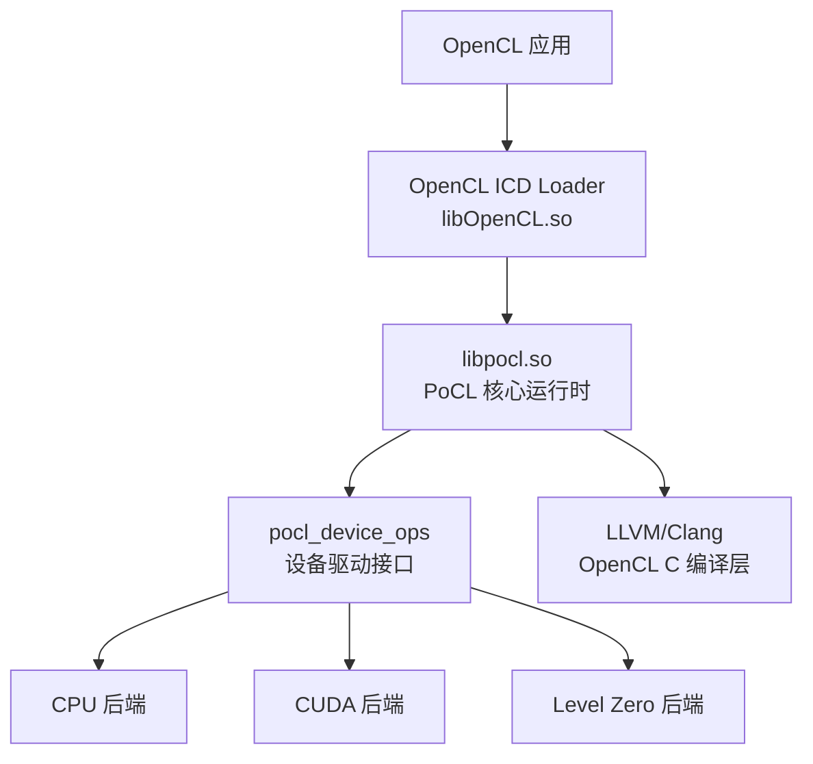
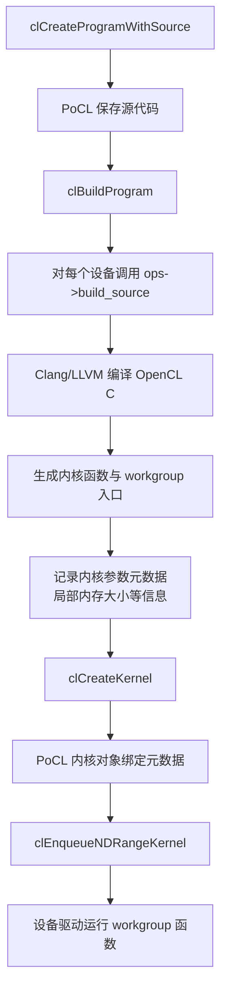
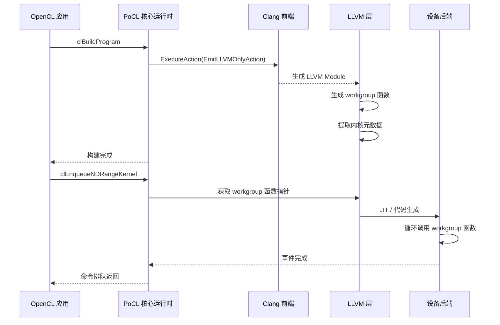

# PoCL 源码分析与驱动理解

> 本文基于 PoCL（Portable Computing Language）主线源码结构进行分析，不同版本的具体函数签名和目录结构可能有差异，但核心设计思想稳定。
>
> 文档目标：通过阅读 PoCL 源码，理解一个 OpenCL 用户态驱动/运行时应当如何组织，尤其是设备驱动层如何通过统一接口接入核心运行时。

---

## 1. 背景与目标

PoCL 是一个开源的 OpenCL 实现，支持 CPU、CUDA、Level Zero 等多种后端设备。它最大的价值在于：

1. 实现了完整的 OpenCL API 层、运行时核心和设备驱动框架。
2. 代码结构清晰，适合用来学习 OpenCL 驱动的内部设计。
3. 设备后端通过一个统一的 `pocl_device_ops` 函数表接入，和 Linux 内核驱动的 `file_operations` 思想非常类似。

通过分析 PoCL，可以理解一个 OpenCL 驱动需要解决的核心问题：

- OpenCL API 如何被导出和分发？
- 平台、设备、上下文、程序、内核、命令队列、内存、事件这些对象如何管理？
- 设备驱动如何实现内核编译、内存分配和命令执行？
- 命令队列和事件如何驱动异步执行？

---

## 2. OpenCL 驱动栈与 PoCL 定位

在典型 Linux 系统中，OpenCL 应用运行路径如下：



关键点：

- 应用链接的是 ICD Loader，而不是某个厂商的具体 OpenCL 库。
- ICD Loader 根据 `/etc/OpenCL/vendors/*.icd` 文件加载 PoCL 的 `libpocl.so`。
- PoCL 核心运行时负责 OpenCL API 对象管理、命令调度、事件依赖等设备无关逻辑。
- 真正的设备相关操作由 `pocl_device_ops` 中注册的后端实现。

在 PoCL 源码树中，并没有单独的 `pocl_icd.c`。ICD 所需符号由**每个 OpenCL API 实现文件末尾的 `POsym()` 宏**导出，宏与 `POname`/`POdeclsym` 等定义在 `lib/CL/pocl_icd.h` 中。例如 `lib/CL/clGetPlatformIDs.c`：

```c
CL_API_ENTRY cl_int CL_API_CALL
POname(clGetPlatformIDs)(cl_uint           num_entries,
                         cl_platform_id *  platforms,
                         cl_uint *         num_platforms) CL_API_SUFFIX__VERSION_1_0
{
  /* CL_INVALID_VALUE if
   *   num_entries is equal to zero and platforms is not NULL
   *   if both num_platforms and platforms are NULL.
   */
  POCL_RETURN_ERROR_COND ((platforms != NULL && num_entries == 0),
                          CL_INVALID_VALUE);

  POCL_RETURN_ERROR_COND ((num_platforms == NULL && platforms == 0),
                          CL_INVALID_VALUE);

  POCL_RETURN_ERROR_COND ((num_platforms == NULL && num_entries == 0),
                              CL_SUCCESS);

  if (platforms != NULL) {
      platforms[0] = &_platforms[0];
  }

  if (num_platforms != NULL)
    *num_platforms = 1;

  return CL_SUCCESS;
}
POsym(clGetPlatformIDs)
```

`POsym` 会把 `clGetPlatformIDs` 重命名为 `POclGetPlatformIDs` 并使其成为导出符号（对应上面 GDB 中看到的 `POclGetPlatformIDs`）。ICD Loader 通过 `dlsym` 找到这些符号，因此 PoCL 可以像普通共享库一样被加载。

---

## 3. 核心对象与设备驱动接口

### 3.1 PoCL 对象模型

PoCL 使用内部结构体表示 OpenCL 对象。核心对象（`_cl_platform_id`、`_cl_context`、`_cl_program`、`_cl_kernel`、`_cl_mem` 等）定义在 `lib/CL/pocl_cl.h` 中，而 `_cl_device_id` 定义在 `lib/CL/devices/devices.h` 中。例如（简化的结构示意）：

```c
// lib/CL/pocl_cl.h（简化）
struct _cl_platform_id {
    cl_uint num_devices;
    cl_device_id *devices;
    char *name;
    ...
};

struct _cl_device_id {
    cl_device_type type;
    struct pocl_device_ops *device_ops;   // 设备驱动函数表
    void *data;                           // 设备私有数据
    ...
};

struct _cl_context {
    cl_uint num_devices;
    cl_device_id *devices;
    ...
};

struct _cl_program {
    cl_uint num_devices;
    struct program_device_data **data; // 每个设备的数据，包含 LLVM IR 等
    ...
};

struct _cl_kernel {
    cl_program program;
    struct kernel_metadata *meta;      // 参数元数据
    void **dyn_arguments;              // 实际参数值
    ...
};

struct _cl_command_queue {
    cl_device_id device;
    cl_command_queue_properties properties;
    ...
};

struct _cl_mem {
    cl_mem_object_type type;
    size_t size;
    void *host_ptr;
    void *device_ptr;                  // 设备私有指针
    ...
};

struct _cl_event {
    cl_int status;
    cl_command_queue queue;
    ...
};
```

其中 `_cl_device_id` 是驱动接口的核心，它通过 `device_ops` 指针把核心运行时与具体后端解耦。核心运行时不直接调用 CPU 或 CUDA 的函数，而是通过 `device->device_ops->xxx()` 完成设备相关操作。

### 3.2 `pocl_device_ops`：设备驱动操作表

`pocl_device_ops` 定义在 `lib/CL/pocl_cl.h:444`，是 PoCL 设备驱动的核心接口。以下是关键字段（省略了 SVM/USM/镜像等，与当前 v7.x 源码对应）：

```c
// lib/CL/pocl_cl.h（简化）
struct pocl_device_ops {
    const char *device_name;

    // 命令提交与同步
    void (*submit)(_cl_command_node *node, cl_command_queue cq);
    void (*join)(cl_device_id device, cl_command_queue cq);
    void (*flush)(cl_device_id device, cl_command_queue cq);

    // 事件通知
    void (*notify)(cl_device_id device, cl_event event, cl_event finished);
    void (*broadcast)(cl_event event);
    void (*wait_event)(cl_device_id device, cl_event event);
    void (*update_event)(cl_device_id device, cl_event event);
    void (*notify_cmdq_finished)(cl_command_queue cq);
    void (*notify_event_finished)(cl_event event);

    // 设备发现与初始化
    unsigned int (*probe)(struct pocl_device_ops *ops);   // 返回探测到的设备数量
    cl_int (*init)(unsigned j, cl_device_id device, const char *parameters);
    cl_int (*post_init)(struct pocl_device_ops *ops);
    cl_int (*uninit)(unsigned j, cl_device_id device);

    // 内存管理（缓冲区）
    cl_int (*alloc_mem_obj)(cl_device_id device, cl_mem mem_obj, void *host_ptr);
    void (*free)(cl_device_id device, cl_mem mem_obj);

    // 读写拷贝回调（由通用驱动实现提供默认版本，见 common_driver.c）
    void (*read)(void *data, void *host_ptr, pocl_mem_identifier *mem_id, ...);
    void (*write)(void *data, const void *host_ptr, pocl_mem_identifier *mem_id, ...);
    void (*copy)(void *data, pocl_mem_identifier *dst, cl_mem dst_buf, ...);

    // 其它：map/unmap、图像、run_native、free_program 等
    ...
};
```

> **注意（与旧资料的不同）**：`probe` 返回的是探测到的设备**数量**（`unsigned int`），并非 `void`；`init`/`uninit` 带一个 `unsigned j` 索引参数。另外，程序构建（`build_source` 等）并不在这张表里，而是走 `program->data[device_i]->build_source`（即 `pocl_program_binary_data`/`pocl_build` 接口，见 `lib/CL/pocl_build.c` 与 `pocl_program.h`）；`map_mem`/`unmap_mem` 也非本表字段。因此，网上很多把 `build_source`/`run` 等直接列进 `pocl_device_ops` 的描述已过时。

这个表把“驱动需要做什么”清晰地列了出来。每个后端都需要实现其中大部分函数，并在 `probe` 阶段返回它找到的设备数量。以 CPU 后端为例，它由 **basic**（`lib/CL/devices/basic/basic.c`，单线程"cpu-minimal"设备）和 **pthread**（`lib/CL/devices/pthread/pthread.c`，多线程"cpu"设备）两部分组成。其中 pthread 后端在 `pocl_pthread_init_device_ops()` 中填充自己的操作表：

```c
// lib/CL/devices/pthread/pthread.c（简化）
void pocl_pthread_init_device_ops(struct pocl_device_ops *ops) {
    ops->device_name = "cpu";
    ops->run = pocl_pthread_run;
    ops->init = pocl_pthread_init;
    ops->probe = pocl_pthread_probe;
    ...
}
```

> 注意：`lib/CL/devices/cpu/cpu_driver.c` 与 `pocl_cpu_device_ops` 在 v6/v7 中已不存在，CPU 后端已拆分重构为 `basic` 与 `pthread` 两个目录，请勿按旧路径查阅。

---

## 4. 平台与设备初始化流程

OpenCL 应用从 `clGetPlatformIDs()` 开始。PoCL 会初始化平台和设备。本节结合源码说明设备注册和探测的细节。

### 4.1 设备注册机制

PoCL 的设备后端被链接到 `libpocl.so` 中。核心运行时在初始化时，会通过一个 `pocl_devices_init_ops[]` 数组收集所有可用的设备操作表，这一过程由 `pocl_init_devices()` 完成，它定义在 `lib/CL/devices/devices.c:624`（**不是** `pocl_util.c`）：

```c
// lib/CL/devices/devices.c（简化）
cl_int pocl_init_devices (cl_platform_id platform)
{
    ...
    /* 为每种设备类型调用其 init_device_ops 填充 ops，再调用 probe 统计设备数量 */
    for (i = 0; i < POCL_NUM_DEVICE_TYPES; ++i)
      {
        pocl_devices_init_ops[i](&pocl_device_ops[i]);      // 例如 pocl_basic_init_device_ops(&ops)
        assert (pocl_device_ops[i].device_name != NULL);
        device_count[i] = pocl_device_ops[i].probe (&pocl_device_ops[i]);
        pocl_num_devices += device_count[i];
      }
    ...
}
```

- 每个后端导出一个 `pocl_xxx_init_device_ops(struct pocl_device_ops *ops)` 函数来填充操作表（basic 为 `pocl_basic_init_device_ops`，pthread 为 `pocl_pthread_init_device_ops`）。
- `probe()` 返回该类型后端探测到的设备数量，而**不是**在 probe 里直接创建 `cl_device_id` 对象；设备对象的创建与初始化发生在之后对 `init()` 的调用中。
- 支持 `POCL_DEVICES` 环境变量选择要启用的后端；若编译时开启 `ENABLE_LOADABLE_DRIVERS`，后端还会作为独立 `.so` 动态加载。

### 4.2 探测设备：`probe` 函数

以 basic 后端为例，`pocl_basic_probe()` 会检测该后端应创建的设备数量并返回。它**只返回数量**，不在此处创建 `cl_device_id` 对象。源码简化如下（`lib/CL/devices/basic/basic.c`）：

```c
// lib/CL/devices/basic/basic.c
unsigned int
pocl_basic_probe(struct pocl_device_ops *ops)
{
    // 读取 POCL_DEVICES="basic" 或 "cpu" 指定的设备个数
    int env_count = pocl_device_get_env_count(ops->device_name);

    pocl_cpu_probe ();   // 用 hwloc 初始化 CPU 拓扑信息

    /* 没有通过环境变量指定时，由 pthread 后端接管多线程 CPU 设备 */
    if (env_count < 0)
        return 0;

    return env_count;
}
```

> 设备对象的真正创建（`calloc` 出 `_cl_device_id`、填充类型/拓扑）发生在 `pocl_init_device()`（`lib/CL/devices/devices.c`）调用各后端的 `init()` 时，而不是在 `probe()` 中。

### 4.3 初始化设备：`init`

`init` 负责分配设备私有资源（例如 basic 的 printf 缓冲、锁等），并填充部分设备属性。

```c
// lib/CL/devices/basic/basic.c（简化）
cl_int pocl_basic_init (unsigned j, cl_device_id device, const char *parameters)
{
    pocl_basic_data_t *d = calloc (1, sizeof (pocl_basic_data_t));
    if (d == NULL) return CL_OUT_OF_HOST_MEMORY;
    d->available = CL_TRUE;
    device->data = d;
    device->available = &d->available;

    ret = pocl_cpu_init_common (device, j);   // 用 hwloc 填充 CPU 设备属性
    ...
    /* basic 是单线程的"cpu-minimal"设备，只代表一个计算单元 */
    device->max_compute_units = 1;
    ...
    return CL_SUCCESS;
}
```

大多数设备属性（CL_DEVICE_MAX_WORK_GROUP_SIZE、CL_DEVICE_LOCAL_MEM_SIZE、版本字符串等）在 v7.x 中由设备无关的 `pocl_init_default_device_infos()` 统一填充，后端只需在 `init()` 里调用 `pocl_cpu_init_common()` 等帮助函数并覆盖个别字段即可，已不存在独立的 `pocl_cpu_init_device_infos()` 回调。

---

## 5. 内核编译流程

OpenCL C 内核需要被编译为设备可执行格式。PoCL 使用 LLVM/Clang 完成大部分工作。



关键点：

1. `clBuildProgram` 最终会调用设备的 `build_source`。
2. PoCL LLVM 层会把每个 OpenCL kernel 编译成 LLVM IR，并生成一个特殊的 workgroup 入口函数。
3. `clCreateKernel` 会根据编译阶段记录的元数据初始化内核参数。
4. `clEnqueueNDRangeKernel` 时，驱动调用 workgroup 函数执行计算。

对于 CPU 后端，LLVM IR 通常会进一步 JIT 为本地机器码；对于 CUDA/Level Zero 后端，则可能生成 PTX/SPIR-V 或直接调用原生运行时。

### 5.1 LLVM 编译执行详解

PoCL 的 LLVM 层是整个运行时中最核心的设备无关编译与执行基础设施。它负责把 OpenCL C 源码转成 LLVM IR，再为每个 kernel 生成可供设备驱动直接调用的 workgroup 函数，最后在设备后端中将 IR 转化为可执行代码。下面结合 PoCL 源码中的关键函数和调用路径，说明这一过程。

#### 5.1.1 从 OpenCL C 到 LLVM IR：Clang 编译入口

OpenCL C 源码编译的入口位于 `lib/CL/pocl_llvm_build.cc`，核心函数是 `pocl_llvm_build_program()`。PoCL 直接使用 Clang 的 `CompilerInstance` 执行 `EmitLLVMOnlyAction`，得到包含所有 kernel 的 `llvm::Module`。

简化后的代码流程如下：

```cpp
// lib/CL/pocl_llvm_build.cc
int pocl_llvm_build_program(cl_program program,
                            unsigned device_i,
                            cl_uint num_input_headers,
                            const cl_program *input_headers,
                            const char **header_include_names,
                            int linking_program)
{
    ...
    clang::CompilerInstance CI;
    std::unique_ptr<clang::CodeGenAction> Act =
        std::make_unique<clang::EmitLLVMOnlyAction>();

    // 设置 OpenCL 语言选项，例如启用 OpenCL 1.2/2.0/3.0 特性
    CI.getLangOpts().OpenCL = 1;
    CI.getLangOpts().OpenCLVersion = 120;  // 根据设备能力动态选择
    CI.getLangOpts().NoBuiltin = 1;        // PoCL 自己提供 OpenCL 内建函数

    // 将源码写入内存缓冲区并执行编译
    if (!CI.ExecuteAction(*Act)) {
        POCL_MSG_ERR("Clang failed to compile source\n");
        return CL_BUILD_PROGRAM_FAILURE;
    }

    // 从 CodeGenAction 中取出 LLVM Module
    std::unique_ptr<llvm::Module> Module = Act->takeModule();

    // 保存到 program 对象中，一个 program 可以包含多个设备的 IR
    program->data[device_i]->llvm_irs.push_back(std::move(Module));
    ...
    return CL_SUCCESS;
}
```

该阶段只负责将 OpenCL C 源码翻译成 **未优化** 的 LLVM IR，并不执行链接或代码生成。后续的链接、优化、workgroup 函数生成都由 PoCL 的 LLVM 层完成。

#### 5.1.2 Workgroup 函数生成

Workgroup 函数生成的实现在 `lib/CL/pocl_llvm_wg.cc` 中，核心函数是 `pocl_llvm_generate_workgroup_function()`。它把一个普通 kernel：

```c
__kernel void vec_add(__global const float *a,
                      __global const float *b,
                      __global float *c)
{
    int i = get_global_id(0);
    c[i] = a[i] + b[i];
}
```

转换成一个设备驱动可以直接调用的函数（workgroup 函数的真实原型定义在 `include/pocl_workgroup_func.h`，带 `group_x/y/z` 参数）：

```c
// 类型定义（include/pocl_workgroup_func.h）
typedef void (*pocl_workgroup_func) (uchar *args,
                                     uchar *pocl_context,
                                     ulong group_x, ulong group_y, ulong group_z);

void _pocl_kernel_vec_add_workgroup(uchar *args, uchar *context,
                                    ulong group_x, ulong group_y, ulong group_z)
{
    __global const float *a = (__global const float *)((void **)args)[0];
    __global const float *b = (__global const float *)((void **)args)[1];
    __global float *c = (__global float *)((void **)args)[2];
    struct pocl_context *pc = (struct pocl_context *)context;

    size_t gx = group_x * pc->local_size[0];
    size_t gy = group_y * pc->local_size[1];
    size_t gz = group_z * pc->local_size[2];

    for (size_t li = 0; li < pc->local_size[2]; li++)
        for (size_t lj = 0; lj < pc->local_size[1]; lj++)
            for (size_t lk = 0; lk < pc->local_size[0]; lk++)
            {
                // 这里是原始 kernel 函数体的克隆，
                // get_global_id(0) 被替换为 gx + lk 等
                int i = gx + lk;
                c[i] = a[i] + b[i];
            }
}
```

> 设备驱动自己负责按 group 循环：对每个 `(gx, gy, gz)` 调用一次该函数。basic/pthread 驱动在 `pocl_basic_run`/`pocl_pthread_run` 中就是如此做的。注意 workgroup 函数并非 `void(void**, struct pocl_context*)`，而是接收 `group_x/y/z` 三个坐标参数。

PoCL 源码中的实现大致如下：

```cpp
// lib/CL/pocl_llvm_wg.cc
int pocl_llvm_generate_workgroup_function (unsigned DeviceI,
                                           cl_device_id Device,
                                           size_t local_x,
                                           size_t local_y,
                                           size_t local_z)
{
    ...
    // 创建 workgroup 函数类型：void(uchar*, uchar*, ulong, ulong, ulong)
    llvm::FunctionType *WorkgroupFuncType = ...;
    llvm::Function *Workgroup =
        llvm::Function::Create(WorkgroupFuncType,
                               llvm::GlobalValue::ExternalLinkage,
                               "_pocl_kernel_" + KernelName + "_workgroup",
                               Module);

    // 为 workgroup 函数创建入口基本块
    llvm::BasicBlock *Entry = llvm::BasicBlock::Create(Module->getContext(),
                                                       "entry", Workgroup);

    // 将 void** 参数转换为原始 kernel 参数类型
    // 并处理 __local 参数的内存分配
    ...

    // 使用 WorkitemHandler 生成针对不同设备策略的循环或 SPMD 代码
    WorkitemHandler *Handler =
        WorkitemHandler::createHandler(device, Kernel, Workgroup);
    Handler->run();

    ...
    return CL_SUCCESS;
}
```

`WorkitemHandler` 是 PoCL 的一个抽象，不同设备后端可以选择不同的 work-item 遍历策略，例如：

- `LoopWorkitemHandler`：生成三重循环，适合 CPU 等标量设备；
- `CBSWorkitemHandler` / `SpmdWorkitemHandler`：生成更适合 SIMD/GPU 的代码。

这种设计让 LLVM 层保持设备无关，同时允许后端通过指定 handler 类型来优化执行模型。

#### 5.1.3 内核元数据提取

编译完成后，PoCL 还需要从 LLVM IR 中提取每个 kernel 的元数据，包括参数个数、类型、地址空间、是否需要局部内存、以及 kernel 的名称等。这些信息存储在 `_cl_kernel` 对象中，供 `clSetKernelArg`、`clEnqueueNDRangeKernel` 等 API 使用。

相关代码位于 `lib/CL/pocl_llvm_metadata.cc`，核心函数是 `pocl_llvm_get_kernels_metadata()`（一次处理 program 在某个设备上的所有 kernel，而非单个 kernel）。简化实现如下：

```cpp
// lib/CL/pocl_llvm_metadata.cc
int pocl_llvm_get_kernels_metadata(cl_program program, unsigned device_i)
{
    ...
    llvm::Function *F = Module->getFunction(KernelName);
    if (!F) return CL_INVALID_KERNEL;

    // 遍历函数参数，提取类型和地址空间信息
    for (auto &Arg : F->args()) {
        llvm::Type *ArgType = Arg.getType();

        cl_kernel_arg_address_qualifier addrq = CL_KERNEL_ARG_ADDRESS_PRIVATE;
        if (ArgType->isPointerTy()) {
            unsigned AS = ArgType->getPointerAddressSpace();
            if (AS == 1) addrq = CL_KERNEL_ARG_ADDRESS_GLOBAL;
            else if (AS == 3) addrq = CL_KERNEL_ARG_ADDRESS_LOCAL;
            else if (AS == 4) addrq = CL_KERNEL_ARG_ADDRESS_CONSTANT;
        }

        kernel->meta->arg_info.push_back(
            {addrq, ArgType->getScalarSizeInBits() / 8, ...});
    }

    // 统计 __local 参数所需的局部内存大小
    size_t local_mem_size = 0;
    for (auto &Arg : F->args()) {
        if (Arg.getType()->isPointerTy() &&
            Arg.getType()->getPointerAddressSpace() == 3) {
            // 局部内存大小由 clSetKernelArg 指定的值决定，
            // 这里通常记录每个 local 参数的位置
        }
    }
    kernel->meta->local_mem_size = local_mem_size;
    ...
    return CL_SUCCESS;
}
```

提取出的元数据会被缓存在 `kernel->meta` 中，避免每次调用时重复分析 IR。对于 CPU 后端，这些信息也会被用来计算 workgroup 函数需要分配的局部内存 buffer。

#### 5.1.4 设备后端对 LLVM IR 的使用

PoCL 的 LLVM 层只负责生成 IR、workgroup 函数和元数据，真正把 IR 变成可执行代码的是各设备后端。LLVM 层的 JIT（现代版本使用 ORC，见 `lib/CL/pocl_llvm_orc.cc`）在命令创建阶段把 workgroup 函数编译为机器码，并把函数指针存进命令节点 `cmd->command.run.wg`。CPU 后端执行时直接按 group 循环调用该指针即可。

basic 后端在 `lib/CL/devices/basic/basic.c` 的 `pocl_basic_run()` 中执行：

```cpp
// lib/CL/devices/basic/basic.c（简化）
void pocl_basic_run (void *data, _cl_command_node *cmd)
{
    struct pocl_context *pc = &cmd->command.run.pc;
    // 处理/转换 kernel 参数，填充 arguments 数组 ...
    // cmd->command.run.wg 是在命令创建/JIT 阶段就绪的 workgroup 函数指针
    for (z = 0; z < pc->num_groups[2]; ++z)
      for (y = 0; y < pc->num_groups[1]; ++y)
        for (x = 0; x < pc->num_groups[0]; ++x)
          {
            ((pocl_workgroup_func)cmd->command.run.wg)((uint8_t *)arguments,
                                                       (uint8_t *)pc, x, y, z);
          }
    ...
}
```

> 注意：旧资料里提到的 `pocl_llvm_get_ptr_to_global()`（位于 `lib/CL/pocl_llvm_api.cc`）已经不存在。workgroup 函数地址通过 JIT（ORC）生成后保存在 `cmd->command.run.wg`，驱动无需自己查符号。

对于 CUDA 后端，`pocl_cuda_build_source()` 会将 LLVM IR 通过 NVPTX 后端生成 PTX，再调用 CUDA Driver API 加载模块。Level Zero 后端则通常将 LLVM IR 转换为 SPIR-V，再交给 Level Zero 运行时。可见，LLVM IR 成为 PoCL 中连接前端和多种后端的“中间语言”。

#### 5.1.5 LLVM 编译执行总体时序

将上述步骤串起来，一个 kernel 从源码到执行的完整时序如下：



这一节的核心结论是：**LLVM 层在 PoCL 中起到承上启下的作用**。它向上承接 OpenCL C 编译和内核元数据管理，向下为不同设备后端提供统一、可执行或可继续翻译的 IR。理解 LLVM 编译执行路径，是理解 PoCL 如何实现“一次编译，多设备执行”的关键。

---

## 6. 命令队列与命令执行流程

PoCL 核心层使用命令队列和事件来组织异步执行。本节结合源码说明命令的创建、提交、调度和完成过程。

### 6.1 命令节点结构

PoCL 使用 `_cl_command_node` 表示一个待执行的命令。定义在 `lib/CL/pocl_cl.h` 中：

```c
// lib/CL/pocl_cl.h（简化）
struct _cl_command_node {
    struct _cl_command_node *next;
    cl_command_type type;   // CL_COMMAND_NDRANGE_KERNEL 等
    cl_event event;         // 对应的事件对象

    union {
        struct {
            cl_kernel kernel;
            struct pocl_context pc;
            void **arguments;
        } run;
        struct {
            cl_mem buffer;
            size_t offset;
            size_t size;
            void *host_ptr;
        } read, write;
        struct {
            cl_mem src_buffer;
            cl_mem dst_buffer;
            size_t src_offset;
            size_t dst_offset;
            size_t size;
        } copy;
        ...
    } command;
};
```

### 6.2 命令创建与入队

以 `clEnqueueNDRangeKernel` 为例，API 入口在 `lib/CL/clEnqueueNDRangeKernel.c:43`。它校验参数后，调用 `pocl_ndrange_kernel_common()`（`lib/CL/pocl_ndrange_kernel.c`）创建命令节点，随后入队。`pocl_create_command()` 与 `pocl_command_enqueue()` 都定义在 `lib/CL/pocl_util.c`。

```c
// lib/CL/clEnqueueNDRangeKernel.c（简化）
CL_API_ENTRY cl_int CL_API_CALL
POname(clEnqueueNDRangeKernel)(cl_command_queue command_queue,
                               cl_kernel kernel,
                               cl_uint work_dim,
                               const size_t *global_work_offset,
                               const size_t *global_work_size,
                               const size_t *local_work_size,
                               cl_uint num_events_in_wait_list,
                               const cl_event *event_wait_list,
                               cl_event *event)
{
    ...
    // 创建命令节点
    struct _cl_command_node *cmd = pocl_create_command(
        command_queue, CL_COMMAND_NDRANGE_KERNEL, event);

    // 填充命令数据
    cmd->command.run.kernel = kernel;
    cmd->command.run.pc.work_dim = work_dim;
    cmd->command.run.pc.global_offset[0] = global_work_offset[0];
    ...
    cmd->command.run.pc.global_size[0] = global_work_size[0];
    ...
    cmd->command.run.pc.local_size[0] = local_work_size[0];
    ...

    // 处理依赖事件
    pocl_command_enqueue(command_queue, cmd);

    return CL_SUCCESS;
}
```

`pocl_command_enqueue()` 会检查依赖事件。如果依赖事件已完成，则立即提交命令；否则将命令挂起，等待事件完成后再调度。

### 6.3 命令提交与执行

命令入队统一走 `pocl_command_enqueue()`，定义在 `lib/CL/pocl_util.c:764`（注意：源码里并没有 `pocl_command_queue.c`）。它负责处理 in-order 队列的串行依赖、把事件挂到队列，最后调用设备驱动的 `submit` 把命令交给后端：

```c
// lib/CL/pocl_util.c（简化）
void pocl_command_enqueue (cl_command_queue command_queue,
                           _cl_command_node *node)
{
    ...
    // in-order 队列：与上一条命令建立事件依赖（串行化）
    if (!(command_queue->properties & CL_QUEUE_OUT_OF_ORDER_EXEC_MODE_ENABLE))
        {
            pocl_create_event_sync (command_queue->last_event.event,
                                    node->sync.event.event);
        }

    DL_APPEND (command_queue->events, node->sync.event.event);

    pocl_update_event_queued (node->sync.event.event);
    command_queue->device->ops->submit (node, command_queue);
    // 事件对象在此被 submit 解锁
}
```

执行策略因后端而异：

- **basic 后端（同步）**：`pocl_basic_submit()` 内部直接调用 `pocl_basic_run()` 把命令当场执行完。
- **pthread 后端（异步）**：`pocl_pthread_submit()` 把命令交给线程池调度器（`pthread_scheduler.c`），由调度线程并行执行各 work-group，完成后经事件通知。
- **GPU 后端（CUDA/Level0 等）**：通常也是异步提交，再通过轮询或完成回调检测。

> PoCL 没有一个在 `submit` 之外、按 `cmd->type` 做 switch 分发的 `run`/`read` 分派层。`submit` 是统一的入口，命令类型在各后端内部再自行处理。

### 6.4 事件完成通知

设备驱动执行完命令后，需要更新事件状态。basic 后端在 `pocl_basic_run()` 里通过 `pocl_event_updated()` 更新事件（更完整的封装是 `pocl_update_event_complete()`，定义在 `lib/CL/pocl_util.c`）：

```c
// lib/CL/devices/common_driver.c（pocl_basic_run 调用链中使用的通用实现）
pocl_event_updated (event, CL_COMPLETE);
```

事件完成后，调度器会唤醒等待该事件的命令，继续调度执行。

---

## 7. 内存对象与数据流

OpenCL 中的缓冲区、图像等内存对象由核心层和设备驱动共同管理。本节通过源码说明内存分配和读写命令的实现。

### 7.1 内存对象创建

`clCreateBuffer` 最终调用 `pocl_create_memobject()`。该函数定义在 `lib/CL/clCreateBuffer.c:34`（声明见 `lib/CL/pocl_shared.h:85`），它会分配 `_cl_mem` 结构体，并通过每台设备的 `device_ops->alloc_mem_obj` 分配设备端内存。

```c
// lib/CL/clCreateBuffer.c（简化）
cl_mem pocl_create_memobject (cl_context context,
                              cl_mem_flags flags,
                              size_t size,
                              cl_mem_object_type object_type,
                              ...)
{
    cl_mem mem = calloc (1, sizeof (struct _cl_mem));
    mem->context = context;
    ...
    // 为 context 中的每个设备调用设备驱动分配内存
    for (unsigned i = 0; i < context->num_devices; i++)
        device_ops->alloc_mem_obj (device, mem, host_ptr);
    ...
    return mem;
}
```

> 注意函数名是 `pocl_create_memobject`（无下划线分隔的 `memobject`），不是 `pocl_create_mem_object`。

### 7.2 CPU 后端内存分配

basic/pthread 等 CPU 后端并不自行实现 `alloc_mem_obj`，而是复用通用驱动实现 `pocl_driver_alloc_mem_obj()`（`lib/CL/devices/common_driver.c:500`）。它直接使用主机内存作为设备指针（共享内存模型），每台设备的指针保存在 `_cl_mem` 的 `device_ptrs[global_mem_id]` 中：

```c
// lib/CL/devices/common_driver.c（简化）
int pocl_driver_alloc_mem_obj (cl_device_id device, cl_mem mem, void *host_ptr)
{
    pocl_mem_identifier *p = &mem->device_ptrs[device->global_mem_id];
    pocl_alloc_or_retain_mem_host_ptr (mem);   // 分配或复用主机缓冲
    p->version = mem->mem_host_ptr_version;
    p->mem_ptr = mem->mem_host_ptr;            // 设备指针 = 主机指针（共享内存）
    ...
    return CL_SUCCESS;
}
```

> `_cl_mem` 中每个设备对应一个 `pocl_mem_identifier device_ptrs[]`（`lib/CL/pocl_cl.h`），而不是文档旧版中的单个 `void *device_ptr`，这样才支持多设备/内存迁移。

对于 CUDA 后端，`pocl_cuda_alloc_mem_obj()` 会调用 `cuMemAlloc()` 分配显存，并将主机指针和设备指针分开管理。

### 7.3 读写命令

`clEnqueueWriteBuffer` 会生成一个写命令，设备驱动需要执行主机到设备的数据拷贝。CPU 后端使用通用驱动实现 `pocl_driver_write()`（`lib/CL/devices/common_driver.c:86`），本质上就是一次 `memcpy`：

```c
// lib/CL/devices/common_driver.c（简化）
void pocl_driver_write (void *data, const void *host_ptr,
                        pocl_mem_identifier *dst_mem_id, cl_mem dst_buf,
                        size_t offset, size_t size)
{
    memcpy ((char *)dst_mem_id->mem_ptr + offset, host_ptr, size);
}
```

对于独立设备，驱动需要发起 DMA 或显式拷贝操作，并在完成时更新事件。

---

## 8. CPU 后端实例：`lib/CL/devices/basic/` 与 `lib/CL/devices/pthread/`

CPU 后端是 PoCL 中最容易理解的设备驱动之一。它在 v7.x 中拆分为两个目录：**basic**（单线程"cpu-minimal"设备）和 **pthread**（多线程"cpu"设备），二者复用 `lib/CL/devices/common_driver.c` 与 `common_utils.c` 中的通用实现。

### 8.1 主要文件

| 文件 | 作用 |
|---|---|
| `basic/basic.c` | 定义 basic 后端操作表（`pocl_basic_init_device_ops`），`pocl_basic_run` 同步执行 |
| `pthread/pthread.c` | 定义 pthread 后端操作表（`pocl_pthread_init_device_ops`），`pocl_pthread_run` |
| `pthread/pthread_scheduler.c` | work-group 并行调度与线程池 |
| `common_driver.c` | 通用驱动实现（`pocl_driver_read/write/copy/alloc_mem_obj` 等） |
| `tbb/tbb_scheduler.cc` | 可选 TBB 后端调度 |

### 8.2 basic 后端执行

basic 后端在用户线程里**同步**执行，把 NDRange 映射为按 group 的三重循环，依次调用 workgroup 函数：

```c
// lib/CL/devices/basic/basic.c（简化）
void pocl_basic_run (void *data, _cl_command_node *cmd)
{
    cl_kernel kernel = cmd->command.run.kernel;
    struct pocl_context *pc = &cmd->command.run.pc;
    // 转换 kernel 参数，填充 arguments[] ...（含 __local 内存分配）
    ...
    for (z = 0; z < pc->num_groups[2]; ++z)
      for (y = 0; y < pc->num_groups[1]; ++y)
        for (x = 0; x < pc->num_groups[0]; ++x)
          {
            ((pocl_workgroup_func)cmd->command.run.wg)((uint8_t *)arguments,
                                                       (uint8_t *)pc, x, y, z);
          }
    ...
}
```

可以看到，basic 驱动的核心就是把 OpenCL 的 NDRange 转换成对 workgroup 函数的三重循环调用。

### 8.3 并行执行

pthread 后端通过 `pthread_scheduler.c` 里的线程池并行执行各个 work-group。调度线程取出命令后，对每个 work-group 创建一个"任务"，由多个线程并行调用 workgroup 函数，每个任务持有独立的参数/上下文副本以保证线程安全。basic 后端则不带独立线程，直接在用户线程中串行循环。

---

## 9. 从 PoCL 理解“驱动”

PoCL 的核心设计和操作系统内核驱动有很多相似之处。

| 内核驱动 | PoCL 设备驱动 |
|---|---|
| `struct file_operations` | `struct pocl_device_ops` |
| `register_chrdev()` | 设备类型注册 |
| `probe()` | `ops->probe()` |
| `open()`/`release()` | `ops->init()` / `ops->uninit()` |
| `read()`/`write()` | 读写命令执行 |
| `mmap()` | `ops->map_mem()` |
| 内核调度器 | OpenCL 命令队列调度 |
| 中断/完成回调 | 事件完成通知 |

因此，学习 PoCL 可以帮助我们理解一个完整的用户态设备驱动框架：

1. **统一的 API 层**：负责参数校验、对象生命周期和同步。
2. **设备无关运行时核心**：负责命令队列、事件依赖、内存协调。
3. **设备驱动操作表**：定义设备后端必须实现的最小接口。
4. **设备后端实现**：把统一命令翻译为具体硬件/线程操作。

例如，PoCL 中设备驱动的 `submit` 类似于内核驱动中的 `ioctl` 或 `write`，它接收一个命令节点，执行后通知上层完成。这种抽象让不同设备的实现可以独立演进。

---

## 10. 工程建议：驱动侧的主要性能问题

从上面的流程可以看到，PoCL 这样的用户态运行时把 OpenCL 的线程安全、命令调度、内存协调都放到了用户空间。这带来了一些共性性能问题，工程化时值得重点考虑。下面结合 PoCL 源码的具体实现和调用路径，对这些问题进行细化分析，并给出可操作的优化建议。

### 10.1 锁竞争是最大的同步开销

OpenCL 接口的线程安全主要靠锁保障，锁竞争会成为多线程应用的瓶颈。PoCL 中有多个锁粒度不同的同步点：

- **命令队列锁**：  
  `pocl_command_enqueue()`（定义于 `lib/CL/pocl_util.c`）在将命令节点插入队列时，会获取命令队列的互斥锁。该锁保护队列的 `last_event` 指针、队列长度以及事件依赖关系。当多个线程共享同一个命令队列并频繁入队时，锁竞争会显著增加延迟。示例代码路径：
  ```c
  // lib/CL/pocl_util.c
  void pocl_command_enqueue(struct _cl_command_queue *cq,
                            struct _cl_command_node *cmd) {
      POCL_LOCK(cq->lock);               // 获取队列锁
      // 维护 last_event、挂起队列等
      ...
      POCL_UNLOCK(cq->lock);
  }
  ```

- **对象引用计数与全局锁**：  
  事件、内存、内核等对象在每次 API 调用时都会更新引用计数。PoCL 通过 `pocl_object_get()` / `pocl_object_put()` 实现引用计数管理，内部使用原子操作或自旋锁。高频率调用 `clSetKernelArg` 和 `clEnqueueNDRangeKernel` 时，这些计数操作会产生大量原子操作，在弱内存序的平台上可能成为瓶颈。

- **全局初始化锁**：  
  首次调用任何 OpenCL API 时，PoCL 会执行全局初始化，包括 `pocl_init_devices()`（`lib/CL/pocl_util.c`），该函数内部使用 `pocl_init_lock` 保证线程安全。初始化过程涉及设备探测、libhwloc 拓扑发现、缓存目录创建、事件追踪初始化等，开销可达几十毫秒甚至上百毫秒。如果应用在热路径中反复触发初始化（例如多个线程首次调用不同 API），会导致严重的启动延迟。

**建议**：

- 单命令队列尽量由单一线程投递；多线程应用中为每个线程创建独立的命令队列。
- 避免在关键循环里频繁调用会加锁的 API（如 `clGetEventInfo`、`clReleaseEvent` 等）。尽量在循环外完成对象创建和参数设置。
- 对于引用计数开销，可以使用批量操作减少单次 API 调用的数量，例如使用 `clSetKernelArg` 一次性设置多个参数（虽然 API 本身一次设置一个，但可以减少调用频率）。
- 使用 PoCL 的调试输出 `POCL_DEBUG=lock` 可以观察锁的使用情况，帮助定位竞争点。

### 10.2 命令提交与等待的延迟

命令提交与执行模式直接影响延迟和吞吐量。PoCL 支持多种调度后端：

- **同步后端（basic）**：  
  `pocl_basic_submit()` 在调用线程中直接执行 `pocl_basic_run()`。这意味着 `clEnqueueNDRangeKernel` 或 `clEnqueueWriteBuffer` 会阻塞调用线程直到命令完成。优点是实现简单、无调度线程开销，适合单线程应用或极小的内核。但对于多线程应用，同步执行无法重叠计算与数据传输，且会阻塞调用者，降低 CPU 利用率。

- **异步后端（pthread / GPU）**：  
  `submit` 函数只负责将命令节点挂到设备的提交队列，然后立即返回。调度线程（如 `pocl_pthread_scheduler`）会异步取出命令并执行。调用者可以继续投递更多命令，实现计算和拷贝的重叠。但异步执行需要依赖事件（`clWaitForEvents` 或 `clFinish`）来同步，事件对象的创建、状态更新和等待操作本身也带来额外开销。例如，每投递一个命令都会创建一个 `_cl_event`，事件完成后需要唤醒等待的线程，涉及条件变量操作。

**建议**：

- 优先使用异步队列并批量投递命令，然后通过 `clWaitForEvents` 或 `clFinish` 分批同步，避免逐个命令同步。
- 将计算密集型内核与内存拷贝操作放在不同的命令队列中，利用多队列并行执行。
- 如果使用 CPU 后端，可以选择 `pthread` 调度器以获得真正的并行执行；对于极短的内核，使用 `basic` 后端可能因为省去调度开销而更优。

### 10.3 内核启动与命令节点的动态分配

每个命令入队时都会动态分配一个 `_cl_command_node` 结构，并且命令节点的生命周期管理涉及多次 malloc/free。此外，内核参数打包和 workgroup 执行过程中也会产生临时内存分配。这些堆操作在命令提交频率极高时（例如深度学习框架逐算子调用）会成为显著开销。

具体分析：

- `pocl_create_command()` 在 `lib/CL/pocl_util.c` 中通过 `calloc` 分配命令节点，并初始化事件等。
- 对于内核执行命令，`pocl_basic_run()` 或 `pocl_pthread_run()` 会为每个 work-group 创建参数数组（`void **args`），可能多次调用 `malloc` 和 `free`。虽然 PoCL 某些版本使用栈上小数组或对象池优化，但通用路径仍存在动态分配。
- `_cl_event` 对象的创建和销毁也很频繁，每个命令都至少有一个事件对象（即使应用没有显式请求事件，内部也会创建用于同步）。

**建议**：

- 对微小内核尽量合并为更大的 ND-Range，减少命令投递次数。例如，将多个向量加法合并为一个较大的 kernel，或使用一个 kernel 处理多个任务。
- 使用命令缓冲（OpenCL 2.0 特性，若设备支持）或自定义持久内核，在应用启动时预创建命令并重复执行。
- 对于驱动开发者，可以实现对象池复用命令节点和事件对象，避免频繁的 malloc/free。PoCL 的 `pocl_create_command` 可以改为从空闲链表获取节点，事件对象也可以复用。
- 使用 `POCL_DEBUG=memory` 可以观察内存分配频率，辅助定位。

### 10.4 编译与缓存

`clBuildProgram` 是 OpenCL 应用中最耗时的操作之一。PoCL 的编译流程包括：

1. Clang 前端将 OpenCL C 源码编译为 LLVM IR。
2. 生成 workgroup 函数（`pocl_llvm_generate_workgroup_function`）。
3. 提取内核元数据。
4. 设备后端可能还会进行额外优化（如 LLVM 优化 Pass）或代码生成（如 JIT 编译为机器码、生成 PTX 或 SPIR-V）。

即使 PoCL 提供了磁盘缓存（默认在 `~/.cache/pocl/kcache`），首次构建仍然较慢。缓存机制通过哈希源码和编译选项来避免重复编译，但以下情况可能导致缓存失效：

- 源码或编译选项变化。
- 头文件（包含路径）内容变化。
- LLVM 版本或 PoCL 版本升级。
- 设备能力信息变化。

此外，`clCreateKernel` 本身不进行编译，但可能触发元数据加载；而 JIT 编译（CPU 后端首次运行 kernel 时）也可能带来额外延迟。如果应用在运行过程中动态创建大量 kernel，编译开销会被放大。

**建议**：

- 对长生命周期程序，在初始化阶段完成所有 `clBuildProgram`，避免在热循环中构建。
- 利用二进制离线编译（`clGetProgramInfo(CL_PROGRAM_BINARIES)` 保存，下次直接 `clCreateProgramWithBinary`）可以完全跳过 Clang 编译。
- 使用 `POCL_CACHE_DIR` 环境变量指定高速缓存目录，并确保其所在文件系统性能良好（如 tmpfs）。
- 对于 CPU 后端，可以预先设置 `POCL_LEAVE_KERNEL_COMPILER_TEMP_FILES=1` 保留中间文件，便于调试和手动优化，但不应在性能敏感场景使用。

### 10.5 内存与数据搬移

内存管理策略因设备类型而异，对性能影响重大。

- **CPU 后端（共享内存）**：  
  `pocl_driver_alloc_mem_obj`（CPU 驱动）通常直接使用主机内存作为设备指针，因此 `clEnqueueWriteBuffer` 和 `clEnqueueReadBuffer` 可以简化为 `memcpy` 或甚至零拷贝（如果用户使用 `CL_MEM_USE_HOST_PTR`）。这是 CPU 后端的一大优势，避免了显式数据搬移，但多设备共享或迁移时，需要通过 `device_ptrs[]` 和事件同步保证一致性，这会引入一定的元数据维护开销。

- **独立设备（GPU 等）**：  
  CUDA/Level Zero 后端必须调用 `cuMemAlloc` 或 `zeMemAllocDevice` 分配显存，然后通过 DMA 进行主机与设备间的数据复制。`clEnqueueWriteBuffer` 和 `clEnqueueReadBuffer` 是显式的拷贝操作，延迟可能高达几十微秒甚至毫秒，尤其是小尺寸传输，DMA 启动开销占比很大。频繁的小块读写会严重降低性能。

- **Map/Unmap 与局部内存**：  
  `clEnqueueMapBuffer` 在独立设备上会触发一次实际的数据传输（设备到主机），并映射到用户地址空间。对于 CPU 后端，映射基本无成本。`__local` 内存（OpenCL 局部内存）在每次 work-group 启动时分配，work-group 数量多且局部内存较大时，分配/释放的开销可能影响整体效率。

**建议**：

- 尽量使用持久缓冲 + 一次性大块传输。对于需要频繁更新的数据，使用 `CL_MEM_USE_HOST_PTR` 或 `CL_MEM_ALLOC_HOST_PTR`（在支持统一内存的平台上）减少拷贝。
- 在 CPU 后端，避免不必要的 `clEnqueueRead/WriteBuffer`，直接使用 `CL_MEM_USE_HOST_PTR` 或映射内存零拷贝访问。
- 合理设置 work-group 大小和 `__local` 内存用量，避免过大的局部内存导致 work-group 数量减少，或者过小的局部内存导致占用率下降。
- 对于独立设备，考虑使用异步拷贝命令（`clEnqueueCopyBuffer`）并与其他计算重叠。

### 10.6 锁与并行度的权衡

PoCL 的 CPU 后端提供了多种调度器，体现了锁与并行度的权衡。

- **`basic` 调度器**：  
  无独立线程，命令在调用线程中同步执行。由于只有一个线程执行 work-group，不存在调度锁竞争，但也没有利用多核并行，导致大 kernel 执行缓慢。适合非常小的 kernel（启动开销小于并行调度开销）或单核环境。

- **`pthread` 调度器**：  
  使用线程池并行执行 work-group。线程池初始化时会创建与 CPU 核心数相等的线程，每个线程从共享的工作队列中获取 work-group 任务。工作队列和任务分配需要同步（如互斥锁或原子操作），这带来了调度开销。但对于大规模并行 kernel，多线程带来的加速远大于调度开销，整体吞吐量更高。  
  PoCL 源码中 `pocl_pthread_scheduler.c` 的 `pocl_pthread_run()` 会调用 `pocl_pthread_submit()` 将 work-group 任务分发给线程池，内部使用条件变量和互斥锁管理任务状态。

- **`tbb` 调度器**：  
  如果 PoCL 编译时启用了 TBB（Intel Threading Building Blocks），则可以使用 TBB 的任务调度器，它内部实现了高效的工作窃取算法，减少了锁竞争，同时提供了良好的负载均衡。对于负载不均衡的 kernel，TBB 往往比 pthread 调度器性能更好。

**建议**：

- 根据内核的并行规模选择后端。例如，对于包含百万级 work-group 的大 kernel，使用 `pthread` 或 `tbb`；对于只有几个 work-group 的小 kernel，使用 `basic` 可能更优，因为省去了线程唤醒和调度的开销。
- 可以通过环境变量 `POCL_DEVICES` 和 `POCL_SCHEDULER` 指定调度器（例如 `POCL_SCHEDULER=basic` 或 `POCL_SCHEDULER=pthread`），在应用运行时动态切换以进行性能测试。
- 在负载不均衡的情况下，优先使用 TBB（若可用），其工作窃取能更好地利用空闲核心。

---

通过深入理解这些性能问题及其背后的源码逻辑，可以针对性地设计应用和调优 PoCL，避免常见性能陷阱，充分发挥 OpenCL 异构并行计算的优势。

驱动性能问题的核心可归纳为三类：**锁/同步**（对象锁、队列锁、事件等待）、**固定开销**（命令节点与参数的动态分配、API 调用边界）、**数据搬移**（主机↔设备传输、缓存未命中）。对计算密集型内核，驱动固定开销占比低；对延迟敏感、内核细碎或 I/O 频繁的应用，这些开销会主导性能，应优先从减少 API 调用次数、降低锁竞争和合并数据搬移入手。

---

## 11. 总结

PoCL 是理解 OpenCL 驱动和运行时的优秀代码库。它展示了一个清晰的分层架构：

- ICD 导出层负责 API 符号和平台加载。
- 核心运行时负责对象管理、命令队列、事件同步。
- 设备驱动层通过 `pocl_device_ops` 接入，实现真正的硬件操作。

抓住 `pocl_device_ops` 这个核心接口，就能从设备角度理解 OpenCL 驱动如何工作：设备发现、程序编译、内存分配、命令执行和事件通知，构成了一个设备后端必须完成的关键路径。掌握这些后，无论是阅读厂商驱动还是开发自定义 OpenCL 后端，都会有清晰的框架。