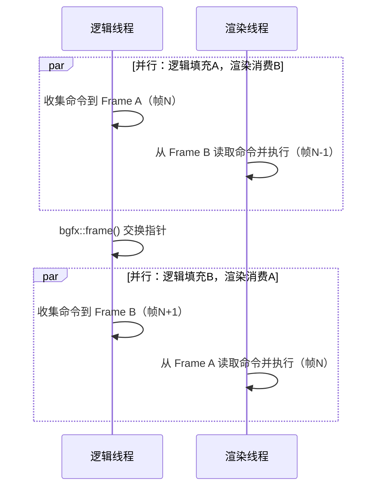

# RHI主流实现调研

&emsp;&emsp;RHI（Render Hardware Interface，渲染硬件接口）是渲染引擎与底层图形 API（如 Direct3D、Vulkan、Metal、OpenGL 等）之间的抽象层。它负责向上层提供统一的资源管理、着色器绑定、命令提交、状态管理等接口，同时将调用翻译到不同的图形后端。不同引擎或中间件对 RHI 的设计目标不同：有的追求简单易用和广泛的平台覆盖，有的追求显式控制与高性能，有的则作为大型引擎的内部抽象层。本文介绍 bgfx、The Forge、Unreal Engine RHI、Diligent Engine、NVRHI、Filament、O3DE Atom RHI 的 RHI 实现，并在最后进行对比。

## 1 BGFX：一个“恰到好处”的跨平台渲染抽象层

&emsp;&emsp;在图形开发的世界里，有两个极端：一端是像 Vulkan、D3D12 这样的底层 API，它们给了你全部的控制权，但你需要写几千行代码才能画出一个三角形；另一端是像 Unity、Unreal 这样的商业引擎，它们功能强大，但抽象层级太高，很多底层细节被隐藏了。bgfx 则站在中间：**它提供一套轻量、统一的 API，让你用一套代码跑遍几乎所有主流图形后端，同时保留了足够的控制力**。

&emsp;&emsp;bgfx的设计哲学用一句话概括就是：**隐藏复杂性，暴露简单性**。

---

### 1.1 核心架构：生产者与消费者的完美解耦

&emsp;&emsp;bgfx 最核心的设计，就是把“提交渲染命令”和“执行渲染命令”完全拆开，形成经典的生产者-消费者模型。

&emsp;&emsp;**生产者**是游戏逻辑线程（API 线程），它负责处理游戏状态、计算变换、组织场景，然后调用 `bgfx::submit` 等 API 提交渲染命令。**消费者**是渲染线程，它负责把这些命令翻译成真正的图形 API 调用（如 `vkCmdDraw`、`ID3D11DeviceContext::Draw`），提交给 GPU。

&emsp;&emsp;为什么这样做？因为 GPU 是异步设备，CPU 提交命令的速度和 GPU 执行命令的速度并不匹配。如果逻辑线程直接调用图形 API，很容易被 GPU 阻塞，浪费 CPU 时间。bgfx 通过双帧缓冲（double buffering）让两者互不等待：



&emsp;&emsp;当逻辑线程调用 `bgfx::frame()` 时，两个 Frame 的指针交换：逻辑线程开始写新的空 Frame，渲染线程则拿到上一帧填满的命令开始执行。只要逻辑线程填满一帧的时间小于渲染线程执行一帧的时间，两者就能完全并行。

&emsp;&emsp;这种设计带来一个副作用：**一帧延迟**。你在第 N 帧提交的绘制，实际上在第 N+1 帧才被 GPU 执行。对大多数游戏来说这完全可接受，但对输入延迟极其敏感的 VR 应用可能需要额外处理。bgfx 也提供了单线程模式（编译时开启），消除这一延迟，但代价是无法并行。

---

### 1.2 一切皆 Handle：轻量资源管理的艺术

&emsp;&emsp;在 bgfx 中，所有 GPU 资源——顶点缓冲、纹理、着色器、帧缓冲——都用一个 `uint16_t` 的索引来表示，称为 Handle。

```cpp
struct TextureHandle { uint16_t idx; };
struct ProgramHandle { uint16_t idx; };
// ...
```

&emsp;&emsp;为什么用 `uint16_t` 而不是指针或更复杂的结构？有几个原因：
1. **内存高效**：一个 Handle 只有 2 字节，几万个资源也只占几十 KB，缓存友好。
2. **安全**：通过 `HandleAlloc` 分配器，可以快速判断 Handle 是否有效、是否已被释放，避免悬垂指针。
3. **跨线程**：Handle 只是一个数字，可以安全地在多线程间传递，不需要考虑所有权问题。

&emsp;&emsp;bgfx 内部维护了一个 `HandleAlloc` 结构，为每种资源类型分配独立的索引空间。当你 `createTexture` 时，它返回一个 Handle；当你 `destroyTexture` 时，它把这个 Handle 标记为已释放，后续对它的任何操作都会被忽略（并触发断言）。这种“软删除”机制极大地简化了资源生命周期管理。

---

### 1.3 命令提交：一帧是如何组织起来的？

&emsp;&emsp;用户每次调用 `bgfx::submit`，bgfx 并不会立即执行绘制，而是生成一个 `RenderItem`，存入当前 Frame 的数组中。`RenderItem` 包含：

- **排序键（SortKey）**：决定这个 DrawCall 在帧内的执行顺序；
- **绑定信息索引**：指向顶点缓冲、索引缓冲、Program、Uniform 等；
- **绘制参数**：如顶点数、索引数、实例数、是否使用间接绘制等。

&emsp;&emsp;所有这些数据都存放在 Frame 的连续内存中，帧结束时统一排序，然后交给渲染线程逐个执行。

**排序键：让状态切换最少化**

&emsp;&emsp;排序是 bgfx 自动优化的关键。每个 DrawCall 都有一个 64 位排序键：

```
┌──────────┬──────────┬───────────┬─────────┬──────────┐
│  View ID │  Depth   │ Program ID│  Blend  │ HasAlpha │
│  (8bit)  │ (32bit)  │ (20/9bit) │ (1bit)  │ (1bit)   │
└──────────┴──────────┴───────────┴─────────┴──────────┘
```

&emsp;&emsp;默认排序策略是 `SortDrawState`，即按 **View → Program → Blend → Depth** 排序。这样排序后，相同 Program（着色器程序）的 DrawCall 会排在一起，相同混合状态的也会排在一起，大幅减少了渲染线程中切换着色器、混合状态的开销。对于深度，它支持按深度值排序（用于透明物体）。排序使用基数排序，时间复杂度 O(n)，即使有 10 万个 DrawCall 也能在一毫秒内完成。

**Encoder：多线程提交的利器**

&emsp;&emsp;早期 bgfx 只支持单线程提交，后来为了利用多核 CPU，引入了 Encoder。一个 Encoder 相当于一个独立的命令流，多个 Encoder 可以在不同线程同时调用 `setState`、`submit` 等，彼此互不干扰。帧结束时，所有 Encoder 的命令被合并到主 Frame 中统一排序执行。这种设计对于构建复杂场景非常有用。例如，你可以开 4 个线程分别构建阴影贴图、主场景、UI、粒子系统，每个线程使用独立的 Encoder，最后一次性提交。bgfx 默认支持最多 8 个 Encoder。

---

### 1.4 后端抽象：一套代码，多平台运行

&emsp;&emsp;bgfx 支持的后端包括：Direct3D 11/12、OpenGL 4.3+、OpenGL ES 3.0+、Vulkan、Metal、WebGPU，甚至还有 PS4 的 GNM、Switch 的 NVN、PS5 的 AGC（需要授权）。它如何做到一套代码同时支持这么多后端？关键是一个统一的接口：`RendererContextI`。每个后端都实现这个接口，提供创建资源、提交命令、翻转缓冲等方法。上层 Context 只与这个接口交互，完全不关心底层是 Vulkan 还是 D3D11。

```cpp
struct RendererContextI {
    virtual bool init() = 0;
    virtual void shutdown() = 0;
    virtual void createIndexBuffer(...) = 0;
    virtual void createVertexBuffer(...) = 0;
    virtual void submit(...) = 0;
    virtual void flip() = 0;
    // ...
};
```

**状态映射：把通用状态翻译成 API 调用**

&emsp;&emsp;bgfx 定义了一套与后端无关的状态位，例如：

- `BGFX_STATE_WRITE_RGB`：是否写入颜色通道
- `BGFX_STATE_DEPTH_TEST_LESS`：深度测试函数为“小于”
- `BGFX_STATE_BLEND_SRC_ALPHA`：混合因子为源 alpha
- `BGFX_STATE_CULL_CW`：剔除顺时针面

&emsp;&emsp;当渲染线程执行到某个 DrawCall 时，它会根据这些状态位，调用当前后端的对应 API。例如 D3D11 后端会设置 `OMSetBlendState`、`RSSetState`、`OMSetDepthStencilState` 等。Vulkan 后端则会创建或查找对应的 VkPipeline。

**状态缓存**：为了减少 API 调用开销，bgfx 会缓存当前状态，只有状态变化时才真正调用 API。这类似于很多引擎的“状态缓存”优化。

**着色器跨平台：shaderc 的魔法**

&emsp;&emsp;写一套着色器代码在多个平台运行，是一件很头疼的事。bgfx 使用一个名为 `shaderc` 的工具，把统一的着色器语言（基于 GLSL 扩展，或 HLSL）编译成各平台所需的格式：

- D3D11 → DXBC 字节码
- Vulkan → SPIR-V
- Metal → metallib
- OpenGL → GLSL 源码

&emsp;&emsp;编译后的二进制包含统一的元数据（Uniform 信息、采样器绑定、输入输出签名等），bgfx 在运行时解析这些元数据，自动绑定 Uniform 和纹理。这意味着开发者只需要维护一份着色器源码，就能在所有平台运行。代价是调试着色器时可能不那么直观，因为中间经过了翻译。

---

### 1.5 资源管理：创建、缓存与延迟销毁

&emsp;&emsp;bgfx 的资源创建流程遵循统一模式：
1. 逻辑线程调用 `bgfx::createXxx()`；
2. Context 分配 Handle，记录元数据；
3. 将创建命令序列化到 CommandBuffer；
4. 渲染线程在下一帧开始时消费命令，调用后端 `createXxx()` 真正创建资源。

&emsp;&emsp;为什么这么麻烦？因为图形 API 的资源创建通常不是线程安全的，必须在渲染线程中执行。bgfx 通过命令缓冲把跨线程的资源操作串行化了。

**动态缓冲与 Transient 缓冲**

&emsp;&emsp;对于每帧都需要更新的顶点/索引数据（如粒子、骨骼动画），bgfx 提供了两种方式：

- **动态缓冲（Dynamic Buffer）**：预先分配一块大内存（默认 1MB 索引、3MB 顶点），通过子分配器切分。你可以 `alloc` 一小块，填充数据，然后提交。如果空间不够，会自动扩展。
- **Transient 缓冲**：这是更轻量的方式，从帧的临时内存池中分配，仅当前帧有效，无需显式释放。适合生命周期很短的临时数据。

**引用计数与延迟销毁**

&emsp;&emsp;资源可能被多个 DrawCall 引用，销毁时不能立即释放，否则渲染线程可能还在使用。bgfx 使用引用计数，当计数归零时，资源被放入释放队列，在帧结束时统一销毁。顶点布局还额外做了去重：相同布局的多个缓冲共享同一个布局对象，节省内存和创建开销。

---

### 1.6 着色器系统与预定义 Uniform

&emsp;&emsp;bgfx 会自动为每个着色器注入一批预定义 Uniform，例如：

- `u_viewProj`：视图投影矩阵
- `u_model[0]`：模型矩阵（支持实例化数组）
- `u_viewRect`：视口矩形
- `u_viewTexel`：像素大小
- `u_alphaRef`：Alpha 测试参考值

&emsp;&emsp;这些 Uniform 由渲染线程在每帧自动设置，开发者不需要手动计算和传递。这大大简化了着色器编写：顶点着色器只需写：

```glsl
gl_Position = u_viewProj * u_model[0] * vec4(a_position, 1.0);
```

&emsp;&emsp;对于绝大多数场景，这些预定义 Uniform 足够使用。如果需要自定义 Uniform，可以通过 `createUniform` 创建，并在 `setUniform` 中每帧更新。着色器程序（Program）的创建也做了去重：如果两个 Program 使用相同的 VS 和 FS，bgfx 会复用已有的 Program Handle，避免重复创建。

---

### 1.7 多线程配置与实际性能

&emsp;&emsp;bgfx 的多线程行为由编译宏 `BGFX_CONFIG_MULTITHREADED` 控制：

- **关闭**：所有 API 调用和渲染在同一线程完成，简单直接，没有延迟。
- **开启**（默认）：API 线程和渲染线程分离，可同时使用多个 Encoder 并行提交。

&emsp;&emsp;同步机制主要依赖两个信号量：

- `m_apiSem`：API 线程等待渲染线程完成上一帧，才能开始写下一帧（防止覆盖）。
- `m_renderSem`：渲染线程等待 API 线程完成当前帧的序列化，才能开始执行。

&emsp;&emsp;这种双缓冲设计保证了两个线程不会同时操作同一帧数据，避免了数据竞争。

**性能表现**：在多核 CPU 上，bgfx 的多线程模式可以显著提升 CPU 吞吐量。特别是场景复杂、DrawCall 多的情况下，逻辑线程的提交和渲染线程的翻译可以并行，整体帧时间缩短。当然，如果瓶颈在 GPU 端，那么多线程帮助有限。

---

### 1.8 关键配置参数一览

&emsp;&emsp;bgfx 允许在编译时通过 `config.h` 调整许多上限和缓冲区大小，以适应不同项目需求。常用参数包括：

| 宏 | 默认值 | 说明 |
|----|--------|------|
| `BGFX_CONFIG_MAX_DRAW_CALLS` | 65535 | 每帧最大 DrawCall 数 |
| `BGFX_CONFIG_MAX_VIEWS` | 256 | 最大 View 数 |
| `BGFX_CONFIG_MAX_TEXTURES` | 4096 | 最大纹理数 |
| `BGFX_CONFIG_MAX_VERTEX_LAYOUTS` | 64 | 最大顶点布局数 |
| `BGFX_CONFIG_DYNAMIC_VERTEX_BUFFER_SIZE` | 3MB | 动态顶点缓冲初始大小 |
| `BGFX_CONFIG_DEFAULT_MAX_ENCODERS` | 8 | 最大 Encoder 数 |
| `BGFX_CONFIG_MULTITHREADED` | 1 | 是否启用多线程 |

&emsp;&emsp;这些宏的默认值对大多数中小型项目足够，如果不够可以调整源码重新编译。但要注意，调大上限会增加内存占用。

---

### 1.9 优缺点分析：它适合你吗？

**优点：**

- **上手快**：API 简洁，文档齐全，示例丰富。
- **跨平台广**：一套代码覆盖 PC、移动、主机、Web。
- **自动优化**：排序、状态缓存、Uniform 管理都自动完成。
- **多线程友好**：Encoder 机制让多核 CPU 得到利用。
- **资源安全**：引用计数 + 延迟销毁，基本不会泄漏。
- **体积小**：核心库只有几百 KB，非常轻量。

**局限：**

- **高级特性缺失**：不支持 Vulkan 的子通道、Mesh Shader、Async Compute 等高级特性；Metal 的资源状态管理也被简化。
- **一帧延迟**：多线程模式下不可避免，不适合对输入延迟极其敏感的应用。
- **固定上限**：排序键中 Program ID 只有 9 bit（最多 512 个 Program），大型项目可能需要修改源码。
- **调试不便**：着色器经过翻译，调试时不如原生 API 直接；图形调试工具需要依赖回调接口集成。
- **计算着色器支持简单**：绑定模型相对固定，无法充分利用现代 GPU 的异步计算能力。

**适合的场景：**
- 独立游戏、原型开发、跨平台工具；
- 需要快速验证渲染想法，而不想深入图形 API 细节；
- 团队规模小，没有专门图形程序员维护多个后端。

**不适合的场景：**
- AAA 级游戏，需要深度定制渲染管线；
- 需要极致性能，愿意投入大量时间手写 Vulkan/Metal；
- 项目需求远超 bgfx 默认上限且无法修改源码。

---

### 1.10 总结

&emsp;&emsp;bgfx 是一个**成熟、务实、久经考验**的渲染抽象层。它在易用性和性能之间找到了一个很好的平衡点，让开发者可以用很少的代码实现跨平台渲染，同时保留了足够的控制力来优化性能。如果你正在寻找一个轻量级的渲染后端，或者想学习图形 API 的抽象设计，bgfx 是一个极好的参考。它的成功证明了：**好的抽象不是把复杂性藏起来，而是把复杂性放在正确的地方**。bgfx 把后端差异藏在了 `RendererContextI` 之后，把状态管理藏在了排序键和缓存之后，把资源生命周期藏在了引用计数和命令缓冲之后。开发者面对的是一个干净、一致的接口，而复杂性则由 bgfx 自身消化。

## 2 The-Forge：AMD 的低开销跨平台图形框架

&emsp;&emsp;在上一节中我们分析了 bgfx，它像一个贴心的助手，帮你隐藏了大量图形 API 的细节。而 The-Forge 则完全不同——它更像一套精良的工具箱，让你拥有近乎原生 API 的控制力，同时避免了跨平台适配的痛苦。The-Forge 由 AMD GPUOpen 团队开发，从 2018 年开源至今，已被众多专业游戏和引擎采用（包括《使命召唤》系列、《狙击精英》系列等）。它的核心目标非常明确：**为现代图形 API（D3D12、Vulkan、Metal）提供一个薄而高效的抽象层，让开发者用一套代码覆盖所有主流平台，同时保持接近手写原生代码的性能**。

&emsp;&emsp;The-Forge 的设计哲学是“小团队友好”和“显式控制，最小抽象”。它不像 bgfx 那样自动排序、隐藏状态管理，而是提供清晰的资源生命周期、命令录制和同步原语，把决策权交还给开发者。本文将从架构、API 设计、资源管理、多线程、着色器系统等方面，深入解析 The-Forge 的设计思路。

---

### 2.1 总体架构：纯 C99 的编译期多态

&emsp;&emsp;The-Forge 的架构非常清晰，分成四个主要层次：

```
┌─────────────────────────────────────────────┐
│          应用层（Game / Application）        │
│    IApp, ICameraController, IUI, IFont      │
├─────────────────────────────────────────────┤
│        渲染 / 资源系统（Renderer / Resource）│
│   IResourceLoader, VisibilityBuffer, ...    │
├──────────────────────┬──────────────────────┤
│   IGraphics.h 公共API │   FSL 着色器系统     │
│  (跨平台抽象接口)      │  (统一资源绑定模型)  │
├──────────┬───────────┼──────────┬───────────┤
│ D3D12.c  │ Vulkan.c  │Metal.mm  │ 主机后端  │
│ (C99)    │ (C99)     │(ObjC++)  │           │
├──────────┴───────────┴──────────┴───────────┤
│  VMA (Vulkan) / D3D12MA (D3D12)             │
│  OS抽象 / 线程系统 / 内存管理                 │
└─────────────────────────────────────────────┘
```

&emsp;&emsp;最引人注目的就是**后端实现全部采用纯 C99**（除了 Metal 因为需要 ObjC++）。为什么选择 C99 而不是 C++？作者在博客中多次提到：C 语言的简单性和可移植性使得代码更容易维护和编译，避免了 C++ 头文件膨胀、模板编译时间过长等问题。对于一个小团队来说，能够快速编译和调试框架本身至关重要。C99 还让代码可以在几乎任何平台上编译，包括一些主机开发环境。

&emsp;&emsp;另一个关键设计是**编译期多态**：The-Forge 不采用虚函数表或运行时动态分派，而是在编译时通过 `#ifdef` 根据目标平台选择相应的后端实现。例如：

```c
#if defined(_WINDOWS)
    #include "Direct3D12/Direct3D12Config.h"
#elif defined(__APPLE__)
    #include "Metal/MetalConfig.h"
#elif defined(__ANDROID__) || defined(__linux__)
    #include "Vulkan/VulkanConfig.h"
#endif
```

&emsp;&emsp;这样每个后端都是独立的 `.c` 文件，公共 API 头文件 `IGraphics.h` 中的结构体通过联合体和条件编译来容纳不同后端的原生句柄，例如：

```c
typedef struct Buffer {
    BufferDesc mDesc;
    union {
        struct {
            ID3D12Resource* pDxResource;
            D3D12MA::Allocation* pDxAllocation;
        } mDx12;
        struct {
            VkBuffer vkBuffer;
            VmaAllocation vmaAllocation;
        } mVk;
        struct {
            id<MTLBuffer> mtlBuffer;
        } mMetal;
    };
} Buffer;
```

&emsp;&emsp;这种做法的好处是**零运行时开销**——没有虚函数调用，没有 RTTI，内存布局紧凑，与手写原生代码几乎无差别。缺点是需要为每个后端编写独立的实现，但 The-Forge 的代码量并不大（D3D12 后端约 6,650 行，Vulkan 约 9,627 行），维护成本可控。

---

### 2.2 公共 API：描述符驱动，显式控制

&emsp;&emsp;The-Forge 的 API 风格与 Vulkan 非常相似：一切资源都通过 `init`/`add`/`remove` 函数管理，所有创建操作都需要填充一个描述符结构体。例如创建一个 Buffer：

```c
BufferLoadDesc loadDesc = {};
loadDesc.pDesc = &bufferDesc;      // BufferDesc 描述大小、内存类型、用途等
loadDesc.ppBuffer = &pBuffer;
addResource(&loadDesc, NULL);      // 异步或同步创建
```

&emsp;&emsp;`addResource` 是资源创建的通用入口，可以同步或异步执行（通过 `ResourceLoadDesc` 中的标志）。这种模式避免了引擎内部维护资源状态机，开发者明确知道每一步发生了什么。主要的资源类型和操作包括：

| 资源类型 | 创建/销毁函数 |
|----------|---------------|
| Buffer | `addBuffer` / `removeBuffer` |
| Texture | `addTexture` / `removeTexture` |
| Render Target | `addRenderTarget` / `removeRenderTarget` |
| Shader | `addShaderBinary` / `removeShader` |
| Pipeline | `addPipeline` / `removePipeline` |
| Descriptor Set | `addDescriptorSet` / `removeDescriptorSet` |
| Resource Heap | `addResourceHeap` / `removeResourceHeap` |
| Queue / Cmd | `initQueue` / `exitQueue`, `initCmd` / `exitCmd` |

&emsp;&emsp;命令提交采用**录制-提交模型**，与 Vulkan 的命令缓冲区非常相似：

```c
beginCmd(cmd);
// 绑定 pipeline、descriptor sets、顶点缓冲、设置视口...
cmdBindRenderTargets(cmd, ...);
cmdBindPipeline(cmd, pipeline);
cmdBindDescriptorSet(cmd, 0, descriptorSet);
cmdBindVertexBuffer(cmd, ...);
cmdDraw(cmd, ...);
endCmd(cmd);
queueSubmit(queue, 1, &cmd, ...);
```

&emsp;&emsp;没有自动排序，没有隐式状态缓存，所有操作都是显式的。这给予开发者最大控制权，也意味着开发者需要自己管理绘制顺序、状态切换等。

---

### 2.3 后端实现：贴近原生，拥抱现代特性

#### 2.3.1 内存管理：统一使用 VMA / D3D12MA

&emsp;&emsp;内存管理是图形框架中最容易出错的部分。The-Forge 选择与 GPUOpen 自己的内存分配器深度集成：

- Vulkan 使用 **VMA**（Vulkan Memory Allocator）
- D3D12 使用 **D3D12MA**（D3D12 Memory Allocator）
- Metal 也通过 VMA 的跨平台适配层统一管理

&emsp;&emsp;VMA 和 D3D12MA 提供了子分配、内存映射、碎片管理、预算追踪等功能，大大简化了显存分配。The-Forge 将内存分为四种类型：

- `GPU_ONLY`：仅 GPU 访问，用于渲染目标、大部分纹理和缓冲
- `CPU_ONLY`：仅 CPU 访问，用于回读数据
- `CPU_TO_GPU`：CPU 写入，GPU 读取（上传堆）
- `GPU_TO_CPU`：GPU 写入，CPU 读取（回读堆）

&emsp;&emsp;每种类型对应不同的分配策略和缓存行为。例如上传堆通常使用环形缓冲区（RingBuffer）来避免频繁分配，回读堆则使用延迟销毁以保证数据安全。

#### 2.3.2 动态渲染：简化 Render Pass

&emsp;&emsp;Vulkan 的 Render Pass 一直是新手噩梦，The-Forge 早期就采纳了 `VK_KHR_dynamic_rendering` 扩展，完全跳过了传统的 Render Pass 对象。D3D12 本身就是动态的，Metal 则使用类似 `MTLRenderPassDescriptor` 的轻量方式。这使得代码路径更加统一，也减少了状态管理复杂性。
&emsp;&emsp;在 API 层，开发者通过 `cmdBindRenderTargets` 直接绑定颜色和深度附件，内部会设置正确的渲染状态，无需预先创建 Framebuffer 对象。

#### 2.3.3 资源堆（Resource Heap）

&emsp;&emsp;D3D12 有资源堆（Heap）的概念，Vulkan 有 Memory Heap，Metal 有 Heap。The-Forge 抽象了 `ResourceHeap`，允许开发者手动管理资源放置，特别是对于纹理流送、渲染目标复用等高级场景。这保留了底层 API 的控制力。

---

### 2.4 多线程模型：命令录制与提交分离

&emsp;&emsp;The-Forge 的多线程支持非常灵活。它提供了两种命令管理方式：

1. **直接使用 Queue 和 Cmd**：开发者可以创建多个 Queue（图形、计算、传输），并为每个线程分配独立的 Cmd，并行录制命令。
2. **使用 GpuCmdRing**：这是一个高层封装，内部维护一个环形缓冲区，每个帧使用一个 Cmd，双缓冲（或更多缓冲）使得 CPU 录制和 GPU 执行不互相阻塞。它自动处理同步，适合大多数游戏循环。

&emsp;&emsp;在多线程录制场景中，每个线程从自己的 `CmdPool` 中获取 `Cmd`，录制完毕后提交到相应的 Queue。同一个 Queue 的提交操作需要用互斥锁保护，但录制阶段完全并行。命令缓冲区都使用 `VK_COMMAND_BUFFER_USAGE_ONE_TIME_SUBMIT_BIT` 标记，因为每帧都会重新录制。

&emsp;&emsp;The-Forge 还提供了完善的**同步原语**：Fence、Semaphore、Barrier。开发者必须显式管理资源状态转换（通过 `cmdResourceBarrier`），这比 bgfx 的自动管理更繁琐，但也给了开发者优化空间。

---

### 2.5 着色器系统：FSL 与 Shader Resource Table

&emsp;&emsp;The-Forge 使用 **FSL（Forge Shading Language）**，它是 HLSL 的超集，通过预处理器和编译器工具链生成各平台的着色器：

- D3D12 → DXIL
- Vulkan → SPIR-V（通过 DXC）
- Metal → MSL（通过 SPIRV-Cross）

&emsp;&emsp;FSL 最大的特色是 **Shader Resource Table (SRT)** 机制。SRT 允许开发者在 C++ 和着色器之间共享同一份数据结构定义，避免了手动绑定偏移计算错误。具体做法是：在 `fsl_srt.h` 中定义资源表结构，例如：

```c
typedef struct SrtData {
    float4 color;
    float4 params;
    uint   textureIndex;
} SrtData;
```

&emsp;&emsp;然后在着色器中包含对应的 `fsl_srt.h`，使用相同的布局。通过宏和编译器扩展，C++ 侧可以直接填充数据，着色器侧直接访问，无需手动计算每个成员在常量缓冲区中的偏移。这极大地提升了开发效率，减少了绑定错误。SRT 按更新频率分为四个描述符集（Descriptor Set）：

1. **Set 0（持久资源）**：整个应用生命周期不变，如全局纹理、采样器。
2. **Set 1（每帧更新）**：相机矩阵、光照数据等。
3. **Set 2（每批次更新）**：材质数据、对象变换。
4. **Set 3（每绘制更新）**：最频繁变化的数据。

&emsp;&emsp;这种分层绑定模型与现代图形 API 的设计思想一致，也方便优化。Root Signature 和 Pipeline Layout 会自动根据这些集合生成。

---

### 2.6 内置高级特性：Visibility Buffer 与异步加载

&emsp;&emsp;The-Forge 不仅仅是一个薄封装，它还提供了一些开箱即用的高级模块：

- **Visibility Buffer**：一个完整的基于 GPU 驱动的渲染管线实现，包括几何剔除、材质解析、延迟着色。许多示例默认使用这个管线，展现了 The-Forge 在现代渲染技术上的深度。
- **IResourceLoader**：异步资源加载系统，支持从磁盘流式加载纹理、网格、着色器，并与渲染线程正确同步。
- **UI 系统**：内置简单的 UI 渲染组件（IUI），方便制作调试界面。
- **数学库和线程系统**：提供跨平台的数学向量/矩阵运算、线程池、信号量等工具。

&emsp;&emsp;这些模块让开发者可以直接开始构建复杂的渲染器，而不需要从零造轮子。

---

### 2.7 设计特点与适用场景

**优点**
- **极低的抽象开销**：纯 C99 后端 + 编译期多态，性能接近手写原生代码。
- **现代 API 特性完整暴露**：支持多队列、异步计算、资源堆、动态渲染、光线追踪（实验性）等。
- **统一的着色器系统**：FSL + SRT 大幅简化了跨平台着色器开发和资源绑定。
- **专业级工具链**：与 AMD 的 Radeon GPU Analyzer、RenderDoc 等工具集成良好。
- **内置高级渲染技术**：Visibility Buffer 等可直接使用，适合快速原型和项目启动。
- **代码清晰，适合学习**：源码结构简单，注释丰富，是学习 D3D12/Vulkan 的好材料。

**局限**
- **学习曲线陡峭**：需要理解现代图形 API 的概念（命令缓冲区、描述符、同步、内存管理等），不适合初学者。
- **显式控制意味着更多代码**：状态管理、资源屏障、内存分配都需要手动处理，开发效率低于 bgfx 这类自动管理框架。
- **C99 的代价**：没有 C++ 的 RAII、模板、智能指针，代码中需要手动管理生命周期，容易出现错误。
- **平台支持偏向现代 API**：不支持 OpenGL / OpenGL ES，老旧设备无法使用。
- **资源堆和 SRT 的复杂性**：虽然提供了便利，但理解这些系统本身也需要时间。

**适合谁？**
- **专业游戏开发团队**：需要跨平台支持，又不想在每个平台上维护不同的渲染代码。
- **图形程序员**：希望有一个结构清晰、可修改的框架作为项目基础，同时能深入底层优化。
- **学习现代图形 API 的开发者**：The-Forge 的代码比 Vulkan/D3D12 官方示例更完整，又不像商业引擎那样封闭。
- **需要高性能的自定义引擎**：如果你想构建自己的渲染器，The-Forge 是一个极好的起点。

**不适合谁？**
- **独立开发者或小团队快速开发**：bgfx 或 Unity/Unreal 更合适，The-Forge 的开发成本较高。
- **需要支持老旧设备或 OpenGL 的项目**：The-Forge 只支持现代 API。
- **不关心底层图形细节的开发者**：如果你只想写游戏逻辑，不想碰命令缓冲区和内存管理，那么 The-Forge 会让你痛苦。

---

### 2.8 总结

&emsp;&emsp;The-Forge 与 bgfx 代表了两种不同的抽象哲学。bgfx 试图隐藏复杂性，提供一键式体验；The-Forge 则选择**暴露复杂性但提供强大工具**，让你在跨平台的同时保持底层控制。它用纯 C99 和编译期多态实现了极高的性能，用 FSL 和 SRT 解决了着色器跨平台的最大痛点，用 VMA 统一了内存管理。

&emsp;&emsp;如果你是一个追求极致的图形程序员，或者你的团队需要一套可靠的跨平台渲染框架作为基础，The-Forge 绝对值得深入研究。它不是“容易”的，但它是“正确”的——在易用性和控制力之间，它毫不犹豫地选择了后者，并因此成为了专业游戏开发领域中一个备受尊敬的存在。

## 3 UE-RHI：工业级渲染抽象层的巅峰之作

&emsp;&emsp;在前两节中，我们分别讨论了 bgfx 的“一键式”抽象和 The-Forge 的“工具箱”式抽象。而 Unreal Engine 的 RHI（渲染硬件接口）则代表了另一种境界：**为一个庞大的商业引擎量身定制的、功能最完整的跨平台图形抽象层**。它不仅要隐藏后端差异，还要支撑起业界最复杂的渲染管线之一——从延迟着色、光线追踪到虚拟纹理、GPU 驱动渲染，UE-RHI 都必须应对自如。

&emsp;&emsp;UE-RHI 支持 D3D11、D3D12、Vulkan、Metal、OpenGL（以及 NullDrv 空设备），覆盖 Windows、Linux、macOS、iOS、Android、主机等平台。与独立图形库不同，UE-RHI 深嵌于 Unreal Engine 的渲染架构中，与 `FRDGBuilder`（渲染依赖图）、`FGPUScene`（GPU 场景数据）等模块紧密协作。它的设计哲学可以概括为：**为大型引擎提供完整的跨平台图形抽象，在保持高性能的同时，让渲染程序员不必关心底层 API 的琐碎细节**。

---

### 3.1 架构概览：三层命令流，一个抽象核心

&emsp;&emsp;UE-RHI 的整体架构可以简化为以下层次：

```
┌─────────────────────────────────────────────┐
│         渲染器层（Deferred Shading 等）      │
│   设置 PSO、绑定资源、提交 DrawCall          │
├─────────────────────────────────────────────┤
│       RHI 命令列表层（FRHICommandList）      │
│   录制命令 → 并行翻译 → RHI 线程串行执行      │
├─────────────────────────────────────────────┤
│         RHI 公共抽象层（FDynamicRHI）        │
│   定义所有后端必须实现的 80+ 纯虚接口        │
├─────────────────────────────────────────────┤
│        后端实现（D3D12RHI / VulkanRHI …）    │
│   将抽象调用翻译为具体图形 API 调用           │
└─────────────────────────────────────────────┘
```

&emsp;&emsp;其中，**命令列表层**是 UE-RHI 最核心的发明。它把渲染线程的 API 调用录制为一种平台无关的中间命令流，然后由专门的 RHI 线程按顺序翻译并提交给 GPU。这种设计实现了渲染线程与图形 API 调用的完全解耦，还允许在多个工作线程上并行录制，最后统一排序执行。

&emsp;&emsp;后端抽象通过 `FDynamicRHI` 这个虚基类实现。每个后端（D3D12、Vulkan、Metal 等）都编译为独立的动态库，并在运行时通过 `GDynamicRHI` 全局指针被访问。`FDynamicRHI` 声明了约 80 多个纯虚函数，覆盖资源创建、状态对象创建、管线状态创建、命令上下文获取、呈现等所有 GPU 操作。这种接口是 C++ 虚函数式的多态，与 The-Forge 的编译期多态形成鲜明对比——虽然多了一次虚调用开销，但换来了更好的模块化和可替换性（例如可以在运行时切换 NullDrv 用于无头测试）。

---

### 3.2 API 设计：不可变状态对象与描述符驱动

&emsp;&emsp;UE-RHI 的 API 风格是**描述符驱动**加**状态初始化器**。创建任何不可变状态对象（如采样器、光栅化状态、混合状态、深度模板状态）时，都需要填充一个 Initializer 结构体，包含所有配置参数。例如：

```cpp
struct FBlendStateInitializerRHI {
    struct FRenderTarget {
        EBlendOperation ColorBlendOp;
        EBlendFactor ColorSrcBlend;
        EBlendFactor ColorDestBlend;
        // ...
        EColorWriteMask ColorWriteMask;
    };
    TStaticArray<FRenderTarget, MaxSimultaneousRenderTargets> RenderTargets;
    bool bUseIndependentRenderTargetBlendStates;
    bool bUseAlphaToCoverage;
};
```

&emsp;&emsp;创建后的状态对象**不可修改**，这意味着多个 PSO 可以安全地共享同一个状态对象。UE-RHI 的 PSO 缓存系统（后面会介绍）正是利用这种不可变性，通过哈希和相等比较来复用状态组合，大幅减少状态切换和对象创建开销。资源创建同样采用描述符：缓冲区使用 `FRHIBufferDesc`，纹理使用 `FRHITextureCreateDesc`，初始数据通过 `FRHIResourceCreateInfo` 提供。这种模式清晰且类型安全，让后端实现可以针对不同资源类型做内存布局和分配的优化。一个值得注意的细节是：UE-RHI 的 API 大量使用 `FRHICommandListBase&` 作为第一个参数，意味着几乎所有操作都发生在命令列表的上下文中，而不是直接作用于全局状态。这为多线程录制和命令重放奠定了基础。

---

### 3.3 资源管理：精细化的引用计数、瞬态别名与状态跟踪

&emsp;&emsp;作为大型引擎的 RHI，UE-RHI 的资源管理极其精细。

#### 3.3.1 引用计数与延迟删除

&emsp;&emsp;所有 RHI 资源继承自 `FRHIResource`，使用**原子引用计数**管理生命周期。但简单的引用计数不够——资源可能被渲染线程和 RHI 线程同时访问，直接删除会导致竞态。UE-RHI 的做法是：

- 引用计数归零时，资源被标记为“待删除”，并放入一个**无锁的延迟删除队列**。
- RHI 线程在每帧的 `FlushPendingDeletes` 中统一销毁这些资源。

&emsp;&emsp;这一机制保证了任何时刻都不会有悬垂指针，也不需要复杂的垃圾回收。

#### 3.3.2 瞬态资源与别名

&emsp;&emsp;现代渲染中，许多纹理和缓冲区只在单帧内临时使用（如阴影贴图、中间渲染目标）。UE-RHI 提供了一套**瞬态资源分配器**，允许这些资源在生命周期不重叠时共享同一块物理内存——这就是**资源别名（Aliasing）**。瞬态资源支持两种分配策略：
- **堆分配（Heap）**：适合大块连续内存；
- **页分配（Page）**：适合小块离散分配。

&emsp;&emsp;系统会记录资源间的 `AliasingOverlaps` 关系，确保不会同时使用同一内存区域的两个资源。这可以显著降低 GPU 内存占用，尤其在大规模场景中。

#### 3.3.3 资源状态转换（Barriers）

&emsp;&emsp;现代图形 API（D3D12、Vulkan）要求显式管理资源状态转换，否则可能导致数据竞争或性能下降。UE-RHI 定义了一个庞大的 `ERHIAccess` 枚举（18+ 种状态），覆盖 CPU 读写、SRV/UAV、RTV/DSV、Copy、Present、光追加速结构等。转换通过 `FRHITransitionInfo` 描述，支持**子资源级别**的精细控制（Mip、ArraySlice、PlaneSlice）。

&emsp;&emsp;更重要的是，UE-RHI 会进行**状态合并**：如果多个转换可以合并为一个更宽的 barrier，它会自动合并，以减少冗余的同步开销。这个系统在保证正确性的同时，尽量降低对 GPU 性能的影响。

---

### 3.4 多线程模型：渲染线程、并行翻译与 RHI 线程

&emsp;&emsp;UE-RHI 的多线程架构是其最复杂的部分，也是其高性能的关键。它采用**三线程模型**：

1. **渲染线程（Render Thread）**：运行游戏逻辑和渲染器代码，通过 `FRHICommandListImmediate` 录制 RHI 命令。
2. **并行工作线程（Parallel Workers）**：可以同时录制多个 `FRHICommandList`，用于并行准备场景数据（如剔除、LOD 选择）或独立的渲染通道。
3. **RHI 线程（RHI Thread）**：接收所有录制完成的命令列表，将它们翻译为具体的图形 API 调用，并按顺序提交到 GPU 队列。

&emsp;&emsp;命令录制采用**延迟执行**模式：所有 RHI 调用被包装为类型擦除的 `FRHICommandBase` 对象，存储在命令列表的线性分配器中（零堆分配）。每个命令包含一个 `Execute` 方法，在 RHI 线程上被调用时执行真正的 API 调用。这种设计的精妙之处在于**并行翻译**：当一个命令列表完成录制后，它可以在工作线程上被翻译为平台相关的命令（例如 D3D12 的 `ID3D12GraphicsCommandList` 调用序列），然后以只读形式提交给 RHI 线程。RHI 线程只需按顺序执行这些翻译好的列表，而不必关心它们最初是如何录制的。此外，UE-RHI 支持 **Bypass 模式**：在某些情况下（如调试或初始化阶段），命令可以直接执行而不经过录制，简化了代码路径。

&emsp;&emsp;线程安全由多个机制保证：原子引用计数、命令列表隔离、RHI 线程串行化、以及每个 API 函数标注的 `FlushType` 注释（表明其线程安全级别）。这种显式的并发控制让渲染程序员能够编写正确且高效的多线程代码。

---

### 3.5 着色器系统：频率完备、绑定灵活、PSO 全生命周期管理

&emsp;&emsp;UE-RHI 的着色器系统覆盖了现代渲染的所有需求。

#### 3.5.1 着色器频率

&emsp;&emsp;它定义了 10 种着色器频率，不仅包括常规的 VS/PS/GS/CS，还支持 Mesh/Amplification（D3D12 的 Mesh Shader）以及光线追踪的 RayGen/RayMiss/RayHitGroup/RayCallable。这种完备性让 UE 能够充分利用最新的 GPU 特性。

#### 3.5.2 批量着色器参数与 Bindless

&emsp;&emsp;参数绑定采用 **Batched Shader Parameters** 模型：将一帧内所有 DrawCall 的着色器参数打包到连续内存中，然后一次调用 `SetBatchedShaderParameters` 批量绑定。这减少了 API 调用次数，特别适合 Bindless 资源模型。UE-RHI 对 Bindless 的支持是渐进式的，通过 `ERHIBindlessConfiguration` 控制使用级别（None / Partial / Full）。在传统绑定和完全 Bindless 之间提供了平滑的过渡路径。Uniform Buffer 采用**不可变创建**模式：创建时传入内容，之后只能整体更新。布局由 `FRHIUniformBufferLayout` 描述，支持静态槽位全局绑定。

#### 3.5.3 PSO 缓存与预编译

&emsp;&emsp;现代图形 API 的 PSO 编译是出名的性能杀手。UE-RHI 构建了一套完整的 **PSO 缓存系统**：运行时缓存（HashMap 去重）、磁盘序列化（跨会话复用）、异步预编译（在加载界面提前编译所需 PSO）。系统会跟踪预编译状态（Active / Complete / Missed / TooLate），帮助开发者识别和优化 PSO 编译卡顿。这套体系是 UE 能够支持大型开放世界游戏（如《堡垒之夜》）而不被 PSO 编译卡顿拖垮的关键。

---

### 3.6 设计特点与评价

&emsp;&emsp;UE-RHI 的独特之处可以总结为以下几点：

1. **深度引擎集成**：不是独立库，而是与 UE 的渲染器、场景系统、RDG 紧密耦合，提供完整的 AAA 级功能支持。
2. **三线程命令模型**：渲染线程、并行翻译、RHI 线程的协作，是业界最复杂的多线程 RHI 架构之一，极大提升了 CPU 利用率。
3. **完整的资源状态跟踪**：子资源级别的 barrier 控制，加上状态合并优化，在正确性和性能之间取得平衡。
4. **瞬态资源别名**：自动共享临时资源内存，减少显存占用。
5. **PSO 全生命周期管理**：从缓存到磁盘序列化再到异步预编译，解决了现代图形 API 的最大痛点。
6. **多 GPU 与光线追踪原生支持**：通过 `FRHIGPUMask` 和多队列抽象，原生支持多 GPU 和光追管线。
7. **内置验证层**：在开发构建中自动检查 API 使用正确性，帮助尽早发现错误。

**优点：**
- 功能最完整、最接近底层 API 能力的抽象层之一；
- 经过大量商业项目验证，稳定性和性能有保障；
- 对多线程、Bindless、光追等现代特性支持完善；
- 资源管理自动化程度高（延迟删除、瞬态别名）。

**局限：**
- 学习曲线极陡，需要深入理解 UE 渲染架构；
- 与引擎绑定，无法单独使用；
- 代码复杂，维护成本高；
- 为了兼容多个后端，部分高级 API 特性被封装得较深。

**适合场景：**
- Unreal Engine 的渲染开发（包括定制渲染管线、插件开发）；
- 研究工业级 RHI 设计的开发者；
- 希望借鉴其资源管理、PSO 缓存等系统的引擎开发者。

**不适合场景：**
- 独立游戏或小团队快速开发（直接使用 UE 即可，无需接触 RHI 层）；
- 需要轻量级渲染抽象的项目（选择 bgfx 或 The-Forge 更合适）。

---

### 3.7 小结

&emsp;&emsp;UE-RHI 是**为 Unreal Engine 量身打造的工业级渲染抽象**。它不像 bgfx 那样追求极简，也不像 The-Forge 那样坚持显式控制，而是在功能完整性、性能优化、开发效率之间找到了一个为大型团队服务的平衡点。它证明了：在一个复杂的商业引擎中，RHI 层可以成为支撑起所有渲染特性的坚实底座，而不是一个薄薄的封装。对于任何想要深入理解游戏引擎渲染架构的人来说，UE-RHI 都是一座不可绕过的里程碑。

## 4 Diligent Engine：现代图形 API 的“全能翻译官”

&emsp;&emsp;Diligent Engine 是一个现代、跨平台的底层图形 API 抽象层和渲染框架，由 Diligent Graphics LLC 开发，采用 Apache 2.0 许可证开源。它支持 Direct3D 11、Direct3D 12、OpenGL/OpenGL ES、Vulkan、Metal、WebGPU 等多种图形后端，覆盖 Windows、Linux、macOS、iOS、Android、Web 等平台。Diligent Engine 的设计哲学是提供**一致的前端 API**，使用 HLSL 作为统一着色语言，同时支持平台特定的着色器格式（GLSL、MSL、SPIR-V、DX 字节码），并在性能上充分利用现代图形 API 的特性。

&emsp;&emsp;与 bgfx 的“自动挡”和 The-Forge 的“手动挡”不同，Diligent Engine 更像一辆配备多种驾驶模式的高性能车：它既保留了传统 API（D3D11、OpenGL）的易用性，又完全拥抱了现代 API（D3D12、Vulkan、Metal）的显式控制，还通过统一的 HLSL 着色器编译管线，让开发者用一套着色器代码跑遍所有后端。本文将从架构、API 设计、资源绑定、多线程、着色器系统等方面，解析 Diligent Engine 如何实现这种“全能”特性。

---

### 4.1 模块化架构：清晰的层次与灵活的组装

&emsp;&emsp;Diligent Engine 采用模块化的 Git 子仓库组织，各模块物理和逻辑上清晰分离。核心仓库包含以下主要部分：

- **DiligentCore**：核心图形抽象层，包含所有后端实现和公共接口定义。
- **DiligentTools**：工具模块，提供纹理加载、ImGui 集成、资源打包等实用功能。
- **DiligentFX**：高级渲染效果库，内置 PBR、Bloom、SSR 等常用效果。
- **DiligentSamples**：丰富的示例与教程，帮助快速上手。

&emsp;&emsp;依赖关系非常清晰：Core 是基础，Tools 和 FX 构建在 Core 之上，Samples 则使用所有上层模块。用户可以根据需要只链接所需的后端库，通过 CMake 选项（如 `DILIGENT_NO_DIRECT3D11`、`DILIGENT_NO_VULKAN`）灵活裁剪。

&emsp;&emsp;在 Core 内部，`Graphics/` 目录严格遵循“接口 + 实现”分离模式。所有公共接口（`IRenderDevice`、`IDeviceContext`、`IPipelineState` 等）定义在 `GraphicsEngine/interface/` 目录下，用户代码只依赖这些头文件，完全不接触后端特定代码。每个后端（D3D11、D3D12、OpenGL、Vulkan、Metal、WebGPU）都有独立的实现目录，编译为独立的库。此外，`GraphicsEngineD3DBase` 和 `GraphicsEngineNextGenBase` 提供了 D3D11/D3D12 以及下一代 API 的共享基础设施，减少代码重复。

&emsp;&emsp;这种设计让 Diligent Engine 既保持了接口的稳定性，又方便了后端的独立开发和维护。

---

### 4.2 公共 API：COM 风格与描述符驱动

#### 4.2.1 基于 COM 的引用计数对象模型

&emsp;&emsp;Diligent Engine 的所有 GPU 对象都继承自 `IObject`，采用类似 COM 的引用计数机制。开发者使用 `RefCntAutoPtr<T>` 智能指针自动管理生命周期，无需手动调用 `AddRef`/`Release`。

&emsp;&emsp;资源接口层次清晰：`IDeviceObject` 是所有设备对象的基类，提供 `GetDesc()` 方法获取创建时的描述符；具体的 `IBuffer`、`ITexture`、`IShader`、`IPipelineState` 等都继承自它。这种设计使得资源元数据始终可访问，便于调试和反射。

#### 4.2.2 统一的创建入口与工厂模式

&emsp;&emsp;所有资源通过 `IRenderDevice` 接口统一创建，例如 `CreateBuffer`、`CreateTexture`、`CreateGraphicsPipelineState` 等。每个后端有独立的工厂函数（如 `GetEngineFactoryD3D12()`），返回对应的工厂接口，用于创建设备、上下文和交换链。

&emsp;&emsp;特别值得一提的是，Diligent Engine 支持**附着到已有的原生设备/上下文**。例如，如果应用程序已经创建了 D3D12 设备，可以直接将其传入引擎，实现与现有渲染环境的无缝互操作。这为集成到已有引擎或工具链提供了极大便利。

#### 4.2.3 命令提交：立即上下文与延迟上下文

&emsp;&emsp;命令提交通过 `IDeviceContext` 接口完成。Diligent Engine 提供两种上下文：

- **立即上下文（Immediate Context）**：直接提交命令到 GPU，适合主渲染线程。
- **延迟上下文（Deferred Context）**：用于多线程录制命令列表，录制完成后提交给立即上下文执行。

&emsp;&emsp;`IDeviceContext` 接口覆盖了完整的图形操作：资源状态转换、渲染目标设置、管线绑定、绘制（包括 Mesh Shader、间接绘制）、计算调度、光线追踪、命令列表执行、同步等。资源状态转换有三种模式：不转换、自动转换、验证模式，兼顾性能与调试需求。

&emsp;&emsp;所有资源创建都通过描述符结构体完成，描述符具有默认值构造函数，用户只需设置需要修改的字段。关键枚举如 `USAGE_DEFAULT`、`USAGE_DYNAMIC`、`BIND_SHADER_RESOURCE`、`BIND_RENDER_TARGET` 等，清晰地表达了资源的用途和访问模式。

---

### 4.3 管线状态与资源绑定：三级变量分类的精妙设计

#### 4.3.1 单体 PSO 设计

&emsp;&emsp;Diligent Engine 采用 D3D12/Vulkan 风格的单体 PSO 设计，一个 PSO 包含完整的管线状态：所有着色器阶段、输入布局、混合状态、光栅化状态、深度模板状态等。支持的管线类型包括图形、计算、Mesh Shader、光线追踪和 Tile Shading。

&emsp;&emsp;图形 PSO 的创建示例展示了描述符的丰富性：渲染目标格式、深度模板状态、混合状态、光栅化状态、输入布局、着色器绑定等都可以在一个结构体中配置。这种设计虽然创建时略显繁琐，但运行时切换 PSO 非常高效，也便于缓存和预编译。

#### 4.3.2 三级着色器变量分类

&emsp;&emsp;Diligent Engine 最独特的设计之一是**三级着色器变量分类**，用于优化资源绑定性能：

- **静态变量（Static）**：在 PSO 创建后绑定一次，之后不再改变。例如全局相机参数、光照贴图等。静态变量直接绑定到 PSO 上，访问开销最低。
- **可变变量（Mutable）**：按材质或对象频率变化的资源，如漫反射纹理、法线贴图。通过 Shader Resource Binding（SRB）对象管理，每个 SRB 实例绑定一次，可以批量提交。
- **动态变量（Dynamic）**：频繁随机变化的资源，绑定开销最高，但灵活性最强。

&emsp;&emsp;通过这种分类，开发者可以根据资源的更新频率选择最合适的绑定方式，从而在性能和灵活性之间取得平衡。引擎底层会根据变量类型优化描述符堆的分配和更新策略。

#### 4.3.3 Shader Resource Binding（SRB）与资源签名

&emsp;&emsp;SRB 是绑定可变和动态资源的容器。开发者从 PSO 或显式的 Pipeline Resource Signature（PRS）创建 SRB，然后通过 `GetVariable` 获取变量并设置资源。SRB 的分配粒度可以配置，以优化内存使用。

&emsp;&emsp;PRS 允许将资源布局从 PSO 中独立出来，在多个 PSO 之间共享。例如，多个 PSO 可以使用相同的 PRS，只需在创建时指定签名即可。这种机制减少了重复定义，也方便了资源布局的管理。

&emsp;&emsp;此外，Diligent Engine 支持**批量资源映射**，通过 `ResourceMapping` 对象一次性绑定大量资源，适合自动化绑定和工具集成。

---

### 4.4 着色器系统：HLSL 一统天下

#### 4.4.1 统一 HLSL 源语言

&emsp;&emsp;Diligent Engine 使用 HLSL 作为统一着色语言，所有后端都接受 HLSL 输入。对于不支持 HLSL 的后端，引擎内置编译管线自动转换：

- D3D11/D3D12：原生 HLSL，编译为 DXBC/DXIL。
- Vulkan：通过 glslang 编译为 SPIR-V。
- OpenGL/GLES：转换为 GLSL。
- Metal：通过 SPIRV-Cross 转换为 MSL。

&emsp;&emsp;这意味着一份 HLSL 着色器源码可以在所有平台运行，大大简化了跨平台开发。同时，引擎也支持平台原生着色器（如 GLSL、MSL），但推荐使用 HLSL 以获得最佳一致性。

#### 4.4.2 着色器创建与反射

&emsp;&emsp;创建着色器时，需要指定源文件路径、入口点、着色器类型、源语言、宏定义等。引擎会自动进行着色器反射，提取资源绑定信息，用于构建 SRB 内部结构和验证绑定正确性。编译输出（包括错误信息和完整源码）可以通过 `IDataBlob` 获取，方便调试。

&emsp;&emsp;支持**异步着色器编译**，通过 `PSO_CREATE_FLAG_ASYNCHRONOUS` 标志，PSO 可以在后台编译，避免主线程卡顿。开发者可以查询 PSO 状态（`READY` / `COMPILING`）来决定何时使用。

#### 4.4.3 JSON 渲染状态描述

&emsp;&emsp;Diligent Engine 支持基于 JSON 的渲染状态描述语言，可以声明式地定义着色器、PSO、资源签名等。这种描述可以在运行时解析，也可以通过离线工具（Render State Packager）预编译为二进制格式。这为工具链集成和资源管理提供了便利。

---

### 4.5 多线程与同步：延迟上下文与命令列表

&emsp;&emsp;Diligent Engine 的多线程支持围绕**延迟上下文**和**命令列表**展开。开发者可以创建多个延迟上下文，每个上下文独立录制命令，录制完成后生成命令列表，提交给立即上下文执行。命令列表类型（图形、计算、传输）决定了它可以在哪个队列上执行。

&emsp;&emsp;引擎支持多命令队列（Graphics、Compute、Transfer），每个立即上下文绑定到特定队列。`ImmediateContextMask` 标志位控制 PSO 可以在哪些上下文中使用，这对于多队列渲染（如异步计算）非常重要。

&emsp;&emsp;同步方面，提供 Fence 用于 CPU-GPU 和 GPU-GPU 同步。`EnqueueSignal`、`EnqueueWait`、`Wait` 等操作让开发者能够精确控制命令执行顺序。

---

### 4.6 高级特性与互操作性

&emsp;&emsp;Diligent Engine 几乎覆盖了现代图形 API 的所有高级特性：

- **光线追踪**：完整的 BLAS/TLAS、Shader Binding Table、`TraceRays` 命令。
- **Mesh Shader**：支持 Amplification 和 Mesh Shader。
- **Tile Shading**：Metal 后端原生支持。
- **可变速率着色（VRS）**：支持逐图元和基于纹理的 VRS。
- **稀疏资源**：支持稀疏纹理。
- **Wave Intrinsics**：支持 GPU Wave 操作。
- **异步计算**：通过多队列实现。
- **PSO 缓存**：提供 `IPipelineStateCache` 接口，支持磁盘缓存。
- **设备内存管理**：暴露 `IDeviceMemory`，允许显式控制内存分配。
- **超分辨率**：内置 SuperResolution 模块。

&emsp;&emsp;此外，Diligent Engine 提供丰富的**原生 API 互操作**能力。例如，可以从 D3D12 设备获取原生 `ID3D12Device` 和 `IDXGIAdapter`，从 Vulkan 设备获取 `VkDevice` 和 `VkInstance`，或者将引擎附着到已有的原生设备上。这使得 Diligent Engine 可以轻松集成到已有代码库中，作为渲染后端的“翻译层”。

&emsp;&emsp;Diligent Engine 的独特优势在于：同时支持传统 API 和现代 API，且都经过充分优化；统一的 HLSL 着色器编译管线极大简化了跨平台开发；COM 风格接口使得它可以从 C++ 和 C# 中方便地使用；丰富的原生 API 互操作能力让它成为理想的“翻译层”。

---

### 4.8 小结

&emsp;&emsp;Diligent Engine 是目前最全面的开源图形 RHI 实现之一。它不像 bgfx 那样过度抽象，也不像 The-Forge 那样只关注现代 API，而是巧妙地平衡了易用性、性能和平台覆盖。无论你是需要快速原型开发，还是构建高性能游戏引擎，Diligent Engine 都能提供恰到好处的抽象层次。
&emsp;&emsp;它的设计哲学可以概括为：**提供一致、现代、高效的图形 API 抽象，同时不牺牲对底层细节的控制**。对于那些希望一套代码跑遍所有平台，又不想被特定引擎绑定的开发者来说，Diligent Engine 是一个极佳的选择。

## 5 NVRHI：NVIDIA 的轻量级 RHI，专为光线追踪而生

&emsp;&emsp;NVRHI（NVIDIA Rendering Hardware Interface）是 NVIDIA 推出的轻量级渲染硬件接口抽象层，主要服务于其官方 SDK 和示例项目，如 RTXGI（全局光照）、RTXDI（直接光照）、Donut 渲染框架等。它的核心设计理念是**最小化抽象开销**——在提供接近原生 API 性能的同时，将跨图形 API 的繁琐差异封装起来，让开发者专注于渲染算法本身。NVRHI 支持 Vulkan 1.3、Direct3D 12 和 Direct3D 11 三个后端，尤其对 NVIDIA 的硬件特性（如光线追踪、Shader Execution Reordering）提供了深度集成。

&emsp;&emsp;与前文讨论的 Diligent Engine 或 The-Forge 相比，NVRHI 更像一把精心打磨的“手术刀”：它不追求覆盖所有平台和后端，而是针对 NVIDIA 生态做极致优化，将状态追踪、资源绑定等易错环节自动化，让开发者用最少的代码实现高性能渲染。

---

### 5.1 架构与模块组织

&emsp;&emsp;NVRHI 采用 COM 风格接口设计，所有资源接口继承自 `IResource`，通过 `RefCountPtr<T>` 智能指针自动管理生命周期。代码结构清晰：

- `include/nvrhi/`：公共头文件，核心接口定义集中在 `nvrhi.h`（约 4000 行）。
- `src/common/`：跨后端共享实现，如状态追踪逻辑。
- `src/vulkan/`、`src/d3d12/`、`src/d3d11/`：各后端独立实现。
- `src/validation/`：可选的验证层，采用装饰器模式包裹真实设备，检查 API 调用合法性。

&emsp;&emsp;NVRHI 支持两种构建模式：静态库模式（各后端分别编译链接）和动态库模式（单一 DLL/SO），方便集成到不同项目中。这种灵活性对于 SDK 分发尤为重要。

---

### 5.2 公共 API：Builder 模式与编译期描述符

&emsp;&emsp;NVRHI 的 API 设计极具现代感，大量使用 **Builder 模式**初始化描述符。所有 `set*` 方法返回 `constexpr` 引用，意味着在编译期即可完成求值，运行时零开销。例如创建纹理描述：

```cpp
auto texDesc = TextureDesc()
    .setWidth(1920).setHeight(1080)
    .setFormat(Format::RGBA8_UNORM)
    .setIsRenderTarget(true)
    .setDebugName("GBuffer_Albedo")
    .enableAutomaticStateTracking(ResourceStates::Common);
```

&emsp;&emsp;这种链式调用风格清晰且不易出错，配合 C++17 的 `constexpr` 特性，让描述符初始化几乎不产生运行时开销。

&emsp;&emsp;核心接口包括 `IDevice`（设备与资源创建）、`ICommandList`（命令录制）、`ITexture` / `IBuffer`（资源）、`IShader` / `IShaderLibrary`（着色器）、`IGraphicsPipeline` / `IComputePipeline`（管线）、`IBindingLayout` / `IBindingSet`（绑定）、`IHeap`（显存堆）以及 `rt::IPipeline`（光线追踪管线）。接口职责单一，层次分明。

---

### 5.3 后端抽象与验证层

&emsp;&emsp;NVRHI 通过接口继承实现多后端支持：每个后端定义自己的 `Device` 类，继承并实现统一的 `nvrhi::IDevice` 接口。例如 Vulkan 后端还额外提供 `vulkan::IDevice` 接口，用于访问原生 Vulkan 对象。这种设计允许用户在需要时绕过抽象层直接操作底层 API，同时保持公共代码的整洁。

&emsp;&emsp;验证层是可选的，通过装饰器模式包裹真实设备。它会在开发构建中检查资源状态、绑定一致性、生命周期等，帮助开发者尽早发现问题。验证层对性能有轻微影响，但可以在发布时完全移除。

---

### 5.4 资源管理：直接分配与虚拟资源

&emsp;&emsp;NVRHI 支持两种资源创建方式：

1. **直接创建**：引擎自动分配显存，简单快捷。
2. **虚拟资源 + 手动绑定**：先创建不占用显存的虚拟资源，再手动绑定到 `IHeap` 的特定区域。这种模式对于实现 D3D12 的稀疏资源（Sparse Resources）或自定义内存管理至关重要。

&emsp;&emsp;Vulkan 后端使用 `VulkanAllocator` 封装内存分配，支持 Buffer Device Address、导出内存、专用分配等高级特性。`UploadManager` 实现命令列表级别的上传缓冲区子分配，每个 `BufferChunk` 最小 4096 字节，有效减少了小内存分配的开销。

&emsp;&emsp;资源的生命周期通过**自动追踪**管理：命令列表会记录对 `IBindingSet` 的引用，当 GPU 完成执行后，通过 `ICommandListLifetimeTracker::runGarbageCollection()` 统一释放。这种机制避免了手动管理资源引用计数的繁琐，也防止了过早释放导致的 GPU 访问非法内存。

---

### 5.5 多线程模型：真正的并行录制

&emsp;&emsp;对于 D3D12 和 Vulkan，NVRHI 支持**真正的多线程并行命令列表录制**——每个线程可以创建独立的命令列表，同时录制，最后统一提交。这与现代图形 API 的设计一致，能够充分利用多核 CPU。

&emsp;&emsp;Vulkan 后端使用 Timeline Semaphore 进行队列间同步，简化了 CPU-GPU 和 GPU-GPU 的同步逻辑。每个提交线程应拥有独立的 `ICommandListLifetimeTracker`，以正确管理资源生命周期，避免数据竞争。

&emsp;&emsp;D3D11 后端受限于 API 设计，不支持多线程命令录制，所有命令列表映射到单一的即时上下文。这体现了 NVRHI 对后端能力差异的诚实处理：不强行统一，而是尊重底层限制。

---

### 5.6 着色器处理：预编译字节码与特化常量

&emsp;&emsp;NVRHI 接受**预编译的着色器字节码**（DXBC/DXIL/SPIR-V），不包含运行时编译器。这意味着开发者需要使用外部工具（如 DXC、glslangValidator）将着色器编译为目标格式。这种方式简化了运行时依赖，也允许完全控制编译参数。

&emsp;&emsp;支持 **Vulkan 特化常量**：同一个 `VkShaderModule` 可以通过附加不同的 specialization info 来生成多个管线变体，无需重新编译着色器。这对于性能调优和减少着色器变体数量非常有用。

&emsp;&emsp;**着色器库（Shader Library）** 用于光线追踪管线：单个 SPIR-V/DXIL 文件可以包含多个入口点（如 RayGen、Miss、HitGroup），NVRHI 会正确管理这些入口点的绑定和调用。

---

### 5.7 绑定模型与自动状态追踪

&emsp;&emsp;NVRHI 的绑定模型分为三级：

- **BindingLayout**：描述着色器期望的资源布局（类似 Root Signature 或 Descriptor Set Layout）。
- **BindingSet**：填充具体的资源绑定，与 BindingLayout 对应。
- **Bindless Layout**：支持无限制的描述符数组，实现完全 Bindless 渲染。

&emsp;&emsp;NVRHI 最显著的差异化特性是**自动资源状态追踪与屏障插入**。开发者只需声明资源的预期状态（如 `ResourceStates::RenderTarget`、`ResourceStates::ShaderResource`），NVRHI 会在命令列表执行时自动插入必要的 barrier，将资源转换到所需状态。这极大地减少了手动管理状态转换的错误，尤其对于复杂的光线追踪管线。

&emsp;&emsp;系统内部维护每个资源的当前状态和所需状态，通过 `requireTextureState` / `requireBufferState` 方法请求状态变更，然后自动合并和优化 barrier。还支持**永久状态优化**（`setPermanentTextureState`），将某些资源的初始状态固定，避免不必要的转换。

---

### 5.8 光线追踪与 NVIDIA 专属特性

&emsp;&emsp;NVRHI 对光线追踪的支持堪称完备，不仅涵盖标准的 BLAS/TLAS、光线追踪管线、Shader Table，还集成了多项 NVIDIA 独有或领先的硬件特性：

- **Opacity Micromap (OMM)**：用于加速半透明几何体的光线追踪。
- **Cluster Acceleration Structure (CLAS)**：集群级加速结构，适合复杂场景。
- **Linear Swept Spheres (LSS)**：支持线性扫掠球体几何，用于特效和粒子。
- **Shader Execution Reordering (SER)**：着色器执行重排序，显著提升非连贯光线追踪性能。
- **RTXMU 集成**：自动管理 BLAS 压缩，减少显存占用。

&emsp;&emsp;这些特性使得 NVRHI 成为开发高性能光线追踪应用的理想选择，尤其是针对 NVIDIA RTX 硬件的优化。

---

### 5.9 设计特点与适用场景

&emsp;&emsp;**优点：**

- **最小抽象开销**：API 设计贴近底层，性能损耗极低。
- **自动状态追踪**：大幅减少手动 barrier 管理的错误和工作量。
- **光线追踪深度集成**：对 NVIDIA 硬件特性支持最全面。
- **轻量级**：代码量小，易于集成和定制。
- **Builder 模式 + constexpr**：描述符初始化零开销，代码清晰。
- **灵活的构建方式**：静态/动态库可选，方便 SDK 分发。

&emsp;&emsp;**局限：**

- **后端覆盖有限**：仅支持 Vulkan、D3D12、D3D11，缺少 Metal 和 OpenGL。
- **偏向 NVIDIA 生态**：部分高级特性仅适用于 NVIDIA 硬件。
- **无内置着色器编译器**：需要外部工具链。
- **学习曲线**：需要理解现代图形 API 和 NVRHI 的抽象约定。

&emsp;&emsp;**适合场景：**

- NVIDIA SDK 和示例项目开发；
- 高性能光线追踪应用（尤其是针对 RTX 硬件优化）；
- 需要轻量级 RHI 且主要面向 Windows/Linux 平台的项目；
- 希望自动管理资源状态转换，同时保持底层控制力的开发者。

&emsp;&emsp;**不适合场景：**

- 需要广泛平台覆盖（如移动端、macOS）的项目；
- 依赖 OpenGL 或 Metal 的跨平台应用；
- 需要内置着色器编译工具链的快速原型开发。

---

### 5.10 小结

&emsp;&emsp;NVRHI 是一个**面向 NVIDIA 生态、注重性能和光线追踪的轻量级 RHI**。它不像 Diligent Engine 那样追求全平台覆盖，也不像 UE-RHI 那样构建庞大的命令系统，而是将自动状态追踪、Builder 描述符、光线追踪集成等特性做到极致。对于需要高性能、低开销，并且主要面向现代图形 API 的开发者来说，NVRHI 提供了一条高效且可靠的路径。

&emsp;&emsp;它的存在也提醒我们：**抽象层的价值不在于覆盖多少后端，而在于是否能在目标场景中显著降低开发成本**。NVRHI 正是通过聚焦 NVIDIA 硬件和现代 API，实现了这一目标。

## 6 Filament：为移动端 PBR 而生的轻量级渲染引擎

&emsp;&emsp;Filament 是 Google 开源的跨平台物理渲染（PBR）引擎，最初为 Android 平台设计，如今已支持 OpenGL/ES、Vulkan、Metal、WebGPU 以及 Noop（空后端）五种后端，覆盖 Android、iOS、macOS、Linux、Windows 和 Web 等平台。它的 RHI 层以**工程精度极高**著称，代码结构清晰，抽象克制，尤其适合移动端 PBR 渲染场景。

&emsp;&emsp;与前面讨论的几款 RHI 不同，Filament 并非一个独立的图形抽象库，而是一个完整的渲染引擎，但其内部的后端抽象层设计同样值得深入剖析。Filament 的哲学是**简单高效**：避免过度抽象，直接暴露图形 API 的能力，同时通过精心设计的抽象层保证跨平台一致性。这种理念使得 Filament 在移动设备上能够充分发挥硬件性能，同时保持代码的可维护性。

---

### 6.1 三层架构：公共 API、命令流与后端实现

&emsp;&emsp;Filament 采用经典的三层架构，各层职责清晰：

| 层级 | 职责 | 关键类 |
|------|------|--------|
| **公共 API 层** | 用户接口，资源创建/销毁，渲染状态设置 | `Engine`, `Renderer`, `View`, `Scene`, `Material` |
| **Backend 抽象层** | 命令录制/分发，资源管理，跨后端统一接口 | `Driver`, `CommandStream`, `HandleAllocator`, `DriverBase` |
| **图形 API 实现层** | 具体图形 API 调用 | `VulkanDriver`, `MetalDriver`, `OpenGLDriver`, `WebGPUDriver` |

&emsp;&emsp;公共 API 层是开发者直接接触的部分，提供了场景管理、材质系统、渲染器配置等高级功能。Backend 抽象层则负责将高层的渲染指令翻译为后端的图形 API 调用，并通过命令流（Command Stream）实现异步执行。图形 API 实现层为每个后端编写具体代码，处理资源创建、状态绑定、绘制调用等底层细节。

&emsp;&emsp;后端支持矩阵如下：

| 后端 | 平台 | Shader 语言 |
|------|------|-------------|
| OpenGL/ES | Android, iOS, macOS, Linux, Windows, WASM | ESSL 1.0 / ESSL 3.0 |
| Vulkan | Android, Linux, Windows, macOS | SPIR-V |
| Metal | iOS, macOS | MSL / Metal Library |
| WebGPU | 所有平台（通过浏览器） | WGSL |

&emsp;&emsp;这种覆盖范围使得 Filament 能够适应从低端移动设备到高端桌面平台的多种环境。

---

### 6.2 类型化句柄：安全高效的资源标识

&emsp;&emsp;Filament 使用**类型化句柄**系统管理所有 GPU 资源。每个资源类型对应一个 `Handle<T>` 模板类，内部是一个 32 位整数，其中包含 27 位索引、4 位（age）和 1 位堆标志：

```cpp
template<typename T> class Handle : public HandleBase {
    HandleId mId;  // 27-bit index + 4-bit age + 1-bit heap flag
};
```

&emsp;&emsp;句柄分配器采用分层设计，根据资源大小将句柄放入不同的池中：

| 池化类型 | 用途 |
|----------|------|
| Pool P0 | 小型资源（HwFence, HwSync 等） |
| Pool P1 | 中型资源（HwBufferObject, HwIndexBuffer 等） |
| Pool P2 | 大型资源（HwTexture, HwProgram 等） |
| Heap | 溢出资源 |

&emsp;&emsp;这种池化设计减少了内存碎片，提高了分配效率。同时，每个池化句柄带有一个 4 位 age 标签，当资源被释放时，age 递增。下次使用该句柄时，通过校验 age 即可检测出 Use-After-Free 错误，极大地增强了调试安全性。

---

### 6.3 后端抽象：Driver 接口与平台工厂

&emsp;&emsp;Filament 的后端抽象核心是 `Driver` 接口，它是一个纯虚基类，定义了所有后端必须实现的方法。`DriverBase` 提供了一些公共实现，各后端继承并扩展：

```
Driver (纯虚接口)
  └── DriverBase (公共实现)
        ├── OpenGLDriverBase → OpenGLDriver
        ├── VulkanDriver
        ├── MetalDriver
        ├── WebGPUDriver
        └── NoopDriver
```

&emsp;&emsp;`Platform` 接口则充当后端工厂，负责创建图形 API 上下文、管理原生窗口、提供 Blob 缓存等。这种设计使得引擎初始化时可以根据目标平台动态选择后端，而无需修改上层代码。

---

### 6.4 资源管理：Vulkan 后端的三级内存策略

&emsp;&emsp;以 Vulkan 后端为例，Filament 实现了精细的三级内存管理：

| 级别 | 机制 | 用途 |
|------|------|------|
| **VMA** | `VmaAllocator` | GPU 内存分配 |
| **Stage Pool** | `VulkanStagePool` | CPU→GPU 暂存缓冲区 |
| **Buffer Cache** | `VulkanBufferCache` | GPU 缓冲区池化复用 |

&emsp;&emsp;VMA（Vulkan Memory Allocator）负责物理设备内存的分配与回收，支持子分配和碎片管理。Stage Pool 用于处理 CPU 到 GPU 的数据上传，通过环形缓冲区复用暂存内存，减少分配开销。Buffer Cache 则缓存常用的 GPU 缓冲区（如 uniform buffer），避免频繁创建和销毁。

&emsp;&emsp;此外，Filament 为 Vulkan 后端实现了独立的资源管理系统（`fvkmemory` 命名空间），支持线程安全和非线程安全两种引用计数模式。只有 `PROGRAM`、`FENCE`、`TIMER_QUERY`、`SYNC` 等少数资源使用线程安全模式，其余资源均采用非线程安全计数，以降低原子操作的开销。这得益于 Filament 的单线程命令流模型（后文详述），使得大部分资源操作都发生在同一个线程中。

---

### 6.5 多线程模型：单线程命令流与环形缓冲区

&emsp;&emsp;Filament 采用**单线程命令流**模型，这是其架构中非常独特的一点。用户线程（通常是主线程）通过 `CommandStream` 将命令序列化到环形缓冲区，而 Driver 线程从缓冲区读取命令并执行：

```
用户线程 ─── CommandStream::method() ───→ CircularBuffer ───→ Driver 线程执行
```

&emsp;&emsp;命令分为三类（通过 `DriverAPI.inc` 宏定义自动生成）：

| 类型 | 行为 |
|------|------|
| 异步命令 | 序列化到命令缓冲区，延迟执行 |
| 同步命令 | 直接通过虚函数调用 |
| 返回值命令 | 异步执行但返回句柄（句柄立即可用） |

&emsp;&emsp;`CommandBufferQueue` 使用环形缓冲区实现无锁命令传递。当缓冲区空间不足时，用户线程会自动阻塞（背压机制），等待 Driver 线程消费命令。这种设计避免了锁竞争，同时保证了命令的 FIFO 顺序。

&emsp;&emsp;值得注意的是，Filament 选择单线程执行后端命令，而不是像其他引擎那样并行录制多个命令列表。这是出于简单性和移动端 CPU 核心数有限的考虑。对于移动平台，单线程命令流已经足够，而且避免了复杂的同步问题。

---

### 6.6 着色器处理：材质系统与异步编译

&emsp;&emsp;Filament 的着色器生成管线紧密集成在材质系统中。开发者编写 `.mat` 材质文件，其中包含着色器代码片段和参数定义。构建时，`filamat`（MaterialBuilder）将材质编译为统一的 GLSL，然后通过 SPIRV-Cross 转换为各后端所需格式（ESSL/SPIR-V/MSL/WGSL）。

&emsp;&emsp;着色器编译支持异步执行，使用 `CompilerThreadPool` 管理三级优先级队列，避免阻塞主线程。Vulkan 后端使用描述符集绑定模型，支持 4 个描述符集和动态偏移，通过位掩码快速检查布局兼容性，进一步优化了管线创建速度。

---

### 6.7 设计特点与评价

&emsp;&emsp;Filament 的设计中有几个值得称道的独特之处：

1. **宏驱动的 Driver API**：通过 `DriverAPI.inc` 文件自动生成接口声明、分发函数和类型定义，消除了手写代码的不一致风险，也使得添加新命令变得非常简单。
2. **环形缓冲区命令队列**：无锁设计，自动背压，既保证了高性能，又避免了死锁。
3. **VMA 外部同步模式**：Filament 禁用了 VMA 的内部同步，因为所有 VMA 调用都在单一线程中执行，进一步减少了不必要的锁开销。
4. **资源引用计数的双模式**：根据资源类型选择是否使用原子计数，平衡了安全性与性能。
5. **Descriptor Set 位掩码优化**：使用位掩码快速判断描述符集布局兼容性，加速 PSO 创建。
6. **Feature Level 系统**：支持渐进式功能启用，可以根据硬件能力调整渲染特性，适配低端设备。

&emsp;&emsp;**优点：**

- 轻量且专注：专为 PBR 和移动端优化，代码量适中。
- 后端覆盖全面：包括 OpenGL/ES、Vulkan、Metal、WebGPU，跨平台能力强。
- 命令流模型简单可靠：单线程执行避免了复杂的并发问题。
- 句柄安全：age 标签有效防止 Use-After-Free。
- 着色器管线成熟：材质系统与着色器编译深度集成。

&emsp;&emsp;**局限：**

- 不适合需要极致多线程并行的桌面级大型游戏（仅单 Driver 线程执行后端命令）。
- 抽象层级比纯粹的 RHI 库更高，因为它是完整引擎的一部分。
- 对非 PBR 或高度定制渲染管线的支持有限。

&emsp;&emsp;**适合场景：**

- 移动平台的高性能 PBR 渲染。
- 需要快速集成 PBR 材质的跨平台应用。
- 对代码质量和可维护性有较高要求的项目。

&emsp;&emsp;**不适合场景：**

- 需要完全控制底层图形 API 的引擎开发者（可使用更薄的 RHI 层）。
- 需要多线程并行命令录制的大规模桌面游戏。

---

### 6.8 小结

&emsp;&emsp;Filament 是一个**设计精良、专注移动端 PBR 的跨平台渲染引擎**。它的 RHI 层通过类型化句柄、单线程命令流和分级内存管理，在简洁性和性能之间找到了绝佳平衡。对于希望在移动设备上获得高质量 PBR 渲染的开发者来说，Filament 提供了一个开箱即用且高度可定制的解决方案。它的存在也证明了一点：**好的抽象不一定复杂，简单直接的架构同样能够支撑起强大的跨平台渲染能力**。

## 7 O3DE-RHI：帧图驱动的现代渲染抽象

&emsp;&emsp;O3DE（Open 3D Engine）的 Atom 渲染器配备了一个设计精良的 RHI 层，通常称为 O3DE-RHI。它采用 Gem（插件）化架构，支持 Vulkan、Direct3D 12、Metal 和 Null（空后端）四个后端，为引擎提供了统一的图形抽象。O3DE-RHI 的核心设计原则包括多设备支持、帧图驱动、工厂模式和分离式资源管理，特别适合需要复杂渲染管线和 GPU 驱动渲染的大型游戏引擎。

&emsp;&emsp;与之前讨论的几种 RHI 不同，O3DE-RHI 最突出的特点是**深度集成帧图（Frame Graph）系统**，将资源生命周期和命令调度提升到了全局优化的层面。接下来我们深入其架构与设计。

---

### 7.1 整体架构：分层与模块化

&emsp;&emsp;O3DE-RHI 位于引擎的 `Gems/Atom/RHI/` 目录下，采用清晰的分层架构：

```
┌─────────────────────────────────────────────────────┐
│                    应用层 / 特性层                     │
├─────────────────────────────────────────────────────┤
│              RPI (Render Pipeline Interface)         │
│    Pass / Material / Shader / Model / Scene         │
├─────────────────────────────────────────────────────┤
│              RHI (Render Hardware Interface)         │
│  FrameScheduler / FrameGraph / Scope / DrawPacket   │
├──────────┬──────────┬──────────┬───────────────────┤
│  Vulkan  │   DX12   │   Metal  │      Null         │
└──────────┴──────────┴──────────┴───────────────────┘
```

&emsp;&emsp;RPI 层负责渲染管线的组织（如 Pass 系统、材质系统），RHI 层则提供底层图形抽象，包括帧图执行、资源管理和命令录制。这种分离使得渲染管线的设计可以独立于具体图形 API。

---

### 7.2 公共 API：多设备与资源池

&emsp;&emsp;O3DE-RHI 采用双层 API 设计，将面向用户的高层接口与后端实现区分开来：

| 层级 | 类名示例 | 说明 |
|------|----------|------|
| 多设备层 | `Resource`, `PipelineState`, `ShaderResourceGroup` | 用户直接操作，可跨设备 |
| 单设备层 | `DeviceResource`, `DevicePipelineState`, `DeviceShaderResourceGroup` | 后端实现，绑定具体设备 |

&emsp;&emsp;资源通过 Pool（池）进行管理，创建与初始化分离。支持多种资源池类型：`BufferPool`、`ImagePool`、`StreamingImagePool`、`TransientAttachmentPool` 等。这种设计允许资源的延迟初始化、复用和高效分配。

---

### 7.3 ScopeProducer 与帧图：声明式渲染

&emsp;&emsp;O3DE-RHI 最核心的抽象是 **ScopeProducer**。每个渲染任务（如一个 Pass）实现为一个 ScopeProducer，通过三个阶段与帧图交互：

```cpp
class MyScopeProducer : public RHI::ScopeProducer {
    // 阶段1：声明帧图依赖
    void SetupFrameGraphDependencies(FrameGraphInterface frameGraph) override { ... }
    // 阶段2：编译资源
    void CompileResources(const FrameGraphCompileContext& context) override { ... }
    // 阶段3：录制命令
    void BuildCommandList(const FrameGraphExecuteContext& context) override { ... }
};
```

&emsp;&emsp;帧生命周期包括：ImportScopeProducer → Compile（四阶段编译）→ Execute → EndFrame。在编译阶段，帧图会分析所有 ScopeProducer 的资源依赖，自动插入资源屏障、分配瞬态资源，并进行可能的优化（如资源别名、并行执行）。这种模型使得渲染管线的编写从命令式转变为声明式，极大地降低了资源管理的复杂度。

---

### 7.4 后端抽象：工厂模式与可扩展性

&emsp;&emsp;`Factory` 是后端抽象的核心，每个后端实现自己的 Factory，负责创建各种资源对象。O3DE 支持工厂优先级机制，允许根据硬件能力自动选择最佳后端。Vulkan 后端使用 VMA（Vulkan Memory Allocator）进行内存分配，并包含对象缓存、异步上传队列、Bindless 描述符池等组件，以确保高性能。

&emsp;&emsp;这种工厂模式使得添加新后端相对简单：只需实现一套 Factory 和相关 Device 类，而不必修改上层代码。

---

### 7.5 资源管理：瞬态附件与别名堆

&emsp;&emsp;O3DE-RHI 的内存管理极为先进，采用了分层分配策略：

- **TransientAttachmentPool**：帧级瞬态资源池，专门管理帧内临时附件（如中间渲染目标）。
- **AliasedHeap**：堆级别名分配器，允许多个生命周期不重叠的资源共享同一内存区域。
- **FreeListAllocator**：自由链表分配器，用于细粒度内存分配。

&emsp;&emsp;瞬态附件是帧内临时资源，生命周期仅限于一帧。通过别名堆，这些瞬态资源可以复用同一块物理内存，显著减少了 GPU 内存占用和分配开销。帧图在编译阶段就能确定资源的生命周期，从而高效地安排别名。

---

### 7.6 多线程模型：三级 PSO 缓存与并发

&emsp;&emsp;O3DE-RHI 支持多线程命令录制，各线程可以独立构建命令列表。为了应对并行编译管线状态对象（PSO）时的锁争用问题，它设计了**三级 PSO 缓存**：

1. **全局只读缓存**：热路径，无锁，存储已编译完成的 PSO。
2. **全局待定缓存**：有锁，用于去重正在编译的 PSO，避免重复编译。
3. **线程本地缓存**：无锁，减少线程间的争用。

&emsp;&emsp;这种设计在并发环境下既保证了性能，又避免了重复编译。资源池使用 `shared_mutex` 支持并发读，命令队列在独立线程执行，进一步提升了 CPU 利用率。

---

### 7.7 着色器处理：SRG 与 Bindless

&emsp;&emsp;**Shader Resource Group（SRG）** 是 O3DE-RHI 的核心着色器绑定抽象。SRG 定义了着色器所需的资源集合（如纹理、缓冲区、采样器），类似于 Vulkan 的描述符集或 D3D12 的根签名。SRG 支持 Bindless 资源绑定，各后端实现方式不同：

- D3D12 使用统一描述符堆；
- Vulkan 使用类型化描述符池；
- Metal 使用 Argument Buffer。

&emsp;&emsp;这种抽象让上层渲染代码可以不必关心底层绑定机制，同时充分利用各 API 的 Bindless 能力。

---

### 7.8 设计特点与总结

&emsp;&emsp;O3DE-RHI 的独特设计可归纳为以下几点：

1. **完整的帧图系统**：提供全局视野的帧编译与优化，自动管理资源生命周期和屏障。
2. **多设备原生支持**：通过 DeviceMask 实现透明的多 GPU 支持，适用于高端渲染场景。
3. **先进的内存管理**：瞬态资源 + 别名堆 + 自动生命周期管理，显著降低显存占用。
4. **三级 PSO 缓存**：优雅解决并行编译的锁争用问题，提升多线程性能。
5. **屏障自动优化**：智能合并屏障，减少 API 调用开销。
6. **Gem 化架构**：模块化设计，便于扩展新后端和维护。

&emsp;&emsp;**优点：**
- 帧图系统使复杂渲染管线的资源管理变得简单可靠。
- 多 GPU 支持开箱即用。
- 内存管理先进，适合高分辨率渲染和大规模场景。
- 多线程设计出色，能充分利用多核 CPU。

&emsp;&emsp;**局限：**
- 与 O3DE 引擎绑定，无法独立使用。
- 学习曲线较陡，需要理解帧图、ScopeProducer 等概念。
- 后端覆盖不如独立 RHI 库广泛（仅 Vulkan、DX12、Metal）。

&emsp;&emsp;**适合场景：**
- 使用 O3DE 引擎开发的大型游戏或可视化项目。
- 需要复杂渲染管线、多 GPU 支持和 GPU 驱动渲染的场景。
- 希望利用帧图系统简化资源管理的开发者。

&emsp;&emsp;**不适合场景：**
- 独立于引擎之外的轻量级图形抽象需求。
- 需要支持移动端老旧设备（OpenGL ES）的项目。

&emsp;&emsp;O3DE-RHI 代表了现代游戏引擎 RHI 的一个重要方向：**帧图驱动、资源自动优化、多设备友好**。对于那些希望在大型项目中获得高效渲染和可维护性的团队，O3DE 提供了一个强大的技术底座。

## 8 不同 RHI 引擎对比

&emsp;&emsp;在前面的章节中，我们逐一剖析了七个具有代表性的 RHI 实现：bgfx、The-Forge、UE-RHI、Diligent Engine、NVRHI、Filament 和 O3DE-RHI。它们分别代表了不同的设计哲学、目标场景和优化侧重。本章将对它们进行多维度的横向对比，帮助开发者根据自身项目需求做出更明智的选择。

---

### 8.1 核心特性对比

| 特性 | bgfx | The-Forge | UE-RHI | Diligent Engine | NVRHI | Filament | O3DE (Atom) |
|------|------|-----------|--------|-----------------|-------|----------|-------------|
| **API 风格** | C API 封装 | 纯 C99 | C++ 虚函数 | COM 风格 | COM 风格 | C++ 类 | 双层抽象 |
| **后端数量** | 8+ | 3 (D3D12/VK/MTL) | 3+ (D3D11/D3D12/VK 等) | 5 (D3D11/D3D12/VK/MTL/WGPU) | 3 (D3D11/D3D12/VK) | 5 (GL/VK/MTL/WGPU/Noop) | 4 (VK/DX12/MTL/Null) |
| **运行时后端切换** | ✅ | ❌ (编译期) | ❌ (编译期) | ✅ | ❌ (编译期) | ✅ | ❌ (编译期) |
| **多设备支持** | ❌ | ❌ | ❌ | ❌ | ❌ | ❌ | ✅ (DeviceMask) |
| **帧图系统** | ❌ | ❌ | ✅ (RDG) | ❌ | ❌ | ❌ | ✅ (完整 DAG) |
| **自动状态追踪** | ❌ | ❌ | ❌ | ❌ | ✅ (核心特性) | ❌ | ❌ |
| **Bindless 支持** | ❌ | ❌ | 部分 | ✅ | ❌ | ❌ | ✅ |
| **光线追踪** | 基础 | 基础 | ✅ (引擎集成) | ✅ | ✅ (NV 扩展) | ❌ | ✅ |
| **Mesh Shader** | ❌ | ❌ | ✅ (UE5) | ❌ | ✅ | ❌ | ❌ |
| **验证层** | ✅ | ❌ | ✅ | ✅ | ✅ (装饰器) | ❌ | ✅ |

&emsp;&emsp;从表格可以看出，不同 RHI 在功能覆盖上差异明显。bgfx 和 Diligent Engine 更注重后端广度；UE-RHI 和 O3DE 提供了引擎级的帧图和高级特性；NVRHI 则在自动状态追踪和 NVIDIA 光线追踪扩展上独树一帜。

---

### 8.2 设计哲学对比

| RHI | 设计哲学 | 目标场景 |
|-----|----------|----------|
| **bgfx** | 隐藏复杂性，暴露简单性 | 快速跨平台原型，中小型项目 |
| **The-Forge** | 显式控制，最小抽象 | 专业游戏开发，小团队 |
| **UE-RHI** | 引擎深度集成，功能完整 | 大型游戏引擎，AAA 项目 |
| **Diligent Engine** | 通用跨平台抽象，API 兼容 | 需要广泛 API 支持的项目 |
| **NVRHI** | 最小化抽象开销 | NVIDIA SDK，光线追踪示例 |
| **Filament** | 简单高效，移动端优化 | 移动端 PBR 渲染 |
| **O3DE (Atom)** | 帧图驱动，多设备支持 | 复杂渲染管线，多 GPU 场景 |

&emsp;&emsp;设计哲学直接决定了每个 RHI 的适用边界。例如，bgfx 的“隐藏复杂性”使其对初学者友好，但在极致性能调优时可能不够灵活；The-Forge 的“显式控制”则完全相反，性能上限高但需要更多代码。

---

### 8.3 性能特性对比

| 特性 | bgfx | The-Forge | UE-RHI | Diligent | NVRHI | Filament | O3DE |
|------|------|-----------|--------|----------|-------|----------|------|
| **命令录制开销** | 中等 | 低 | 中等 | 低 | 低 | 低 | 中等 |
| **内存管理** | 自动 | VMA/D3D12MA | 平台原生 | 自有 | VMA | VMA | VMA/D3D12MA |
| **多线程支持** | Encoder 并行 | 命令列表并行 | 三线程模型 | 延迟上下文 | 命令列表并行 | 单线程命令流 | 命令列表并行 |
| **PSO 管理** | 运行时缓存 | 编译期绑定 | PSO 缓存+磁盘 | 单体 PSO | PSO 缓存 | 运行时缓存 | 三级缓存 |
| **状态切换优化** | SortKey 自动排序 | 手动管理 | 手动管理 | 手动管理 | 自动追踪 | 手动管理 | 帧图优化 |

&emsp;&emsp;上表概括了各 RHI 在核心性能相关机制上的差异，但“命令录制开销”和“状态切换优化”等只是粗略分类。接下来，我们将深入分析每个 RHI 为提升性能所做的**极致优化**，并特别关注其在桌面端和移动端的差异化策略。

---

### 8.4 极致性能优化剖析：桌面与移动端的差异化策略

&emsp;&emsp;性能优化是 RHI 设计的核心目标之一。不同的 RHI 根据其目标平台和设计哲学，采用了截然不同的优化策略。下面我们逐一分析七个 RHI 中最具代表性的性能优化措施，并区分哪些针对桌面端多核 CPU 和高端 GPU，哪些针对移动端功耗、带宽和内存受限的环境。

#### 8.4.1 bgfx：自动排序与状态缓存

&emsp;&emsp;bgfx 的性能优化重点在于**减少状态切换**和**多线程提交**。

- **桌面端优化**：通过 64 位排序键自动对 DrawCall 排序，将相同 Program、混合状态、深度状态的绘制聚集在一起，大幅降低渲染线程中的 API 状态切换开销。同时支持多 Encoder 并行编码，充分利用桌面多核 CPU。
- **移动端优化**：bgfx 的动态缓冲和 Transient 缓冲机制有效减少了内存分配次数；此外其轻量级 Handle 系统和内部资源池也有助于降低移动端内存占用和分配开销。但 bgfx 并未针对移动 GPU 做特殊优化（如 Tile-Based 渲染），因此移动端性能主要依赖后端驱动的通用优化。

#### 8.4.2 The-Forge：显式控制与内存管理

&emsp;&emsp;The-Forge 强调显式控制，其性能优化主要来自于**贴合现代 API** 和 **高效内存管理**。

- **桌面端优化**：使用 VMA 和 D3D12MA 进行子分配，减少内存碎片和分配调用；支持多线程命令列表录制和多个命令队列（Graphics/Compute/Transfer），使得 CPU 和 GPU 可以高度并行。动态渲染（Dynamic Rendering）避免了 Vulkan Render Pass 的创建开销。
- **移动端优化**：The-Forge 对移动端的支持相对较弱（主要面向桌面和主机），但通过 MoltenVK 在 iOS/macOS 上运行 Vulkan，性能仍可接受。其内存分配策略同样适用于移动端，但缺乏针对移动 GPU 的特殊优化（如 On-Tile 优化）。

#### 8.4.3 UE-RHI：三线程命令模型与 PSO 全生命周期管理

&emsp;&emsp;UE-RHI 服务于 Unreal Engine 这一 AAA 级引擎，性能优化极为全面。

- **桌面端优化**：三线程模型（渲染线程、并行翻译、RHI 线程）最大化 CPU 利用率；命令列表的并行翻译允许工作线程提前将抽象命令翻译为后端调用；PSO 缓存与预编译系统显著减少了运行时卡顿；瞬态资源别名大幅降低显存占用；资源状态自动合并减少了冗余 barrier。
- **移动端优化**：UE 针对移动端有专门的渲染路径（如 Mobile Renderer），RHI 层同样受益于命令列表延迟执行、资源池化和瞬态资源。在 Vulkan 移动后端，支持 Android 的 HWUI 优化和 Vulkan 扩展（如 `VK_KHR_dynamic_rendering`），尽量减少 Render Pass 创建开销。此外，UE 在移动端默认使用 Forward Renderer，降低带宽压力。

#### 8.4.4 Diligent Engine：三级变量分类与异步编译

&emsp;&emsp;Diligent Engine 在保持广泛后端支持的同时，也做了不少性能优化。

- **桌面端优化**：三级着色器变量分类（Static/Mutable/Dynamic）允许引擎根据资源更新频率选择最优的绑定方式，减少描述符更新开销；支持异步 PSO 编译，避免主线程卡顿；多命令队列和延迟上下文支持并行命令录制。
- **移动端优化**：在 Vulkan 移动后端，Diligent 使用 VMA 并预配置移动 GPU 友好的内存标志；在 OpenGL ES 后端，它优化了 uniform 更新和状态缓存。此外，WebGPU 后端使得 Diligent 可以在浏览器中运行，但移动 Web 性能受限于浏览器实现。

#### 8.4.5 NVRHI：自动状态追踪与 NVIDIA 硬件优化

&emsp;&emsp;NVRHI 专注于 NVIDIA 生态和光线追踪性能。

- **桌面端优化**：自动资源状态追踪和屏障插入消除了手动管理 barrier 的错误和开销；支持 Shader Execution Reordering（SER）和 Opacity Micromap 等 NVIDIA 专属特性，在 RTX 硬件上大幅提升光线追踪效率；Vulkan 后端使用 Timeline Semaphore 和精细的上传管理器，减少同步和内存分配开销。
- **移动端优化**：NVRHI 对移动端支持有限（仅 Vulkan 可通过 MoltenVK 运行在 iOS/macOS，Android 上原生 Vulkan）。其自动状态追踪在移动 GPU 上也能减少 CPU 开销，但缺少对移动 GPU 特性的深度优化。

#### 8.4.6 Filament：移动端优先的极致优化

&emsp;&emsp;Filament 从设计之初就为移动端 PBR 渲染而生，因此其优化大多针对移动端。

- **移动端优化**：
  - **单线程命令流**：避免多线程同步开销，适合移动端 CPU 核心数较少的情况。
  - **VMA 外部同步模式**：禁用 VMA 内部同步，因为所有 VMA 调用都在单线程执行，减少了原子操作。
  - **Stage Pool 和 Buffer Cache**：针对移动端内存带宽有限的情况，通过暂存缓冲池化和复用减少分配和拷贝。
  - **Feature Level 系统**：根据硬件能力动态启用/禁用特性，适配低端设备。
  - **着色器运行时编译**：在目标设备上生成最优着色器，利用移动 GPU 的特定扩展。
- **桌面端优化**：桌面端不是 Filament 的主要目标，但通过多线程着色器编译（CompilerThreadPool）和 Vulkan/Metal 后端的优化，在桌面也能获得不错的性能。

#### 8.4.7 O3DE-RHI：帧图驱动的全局优化

&emsp;&emsp;O3DE-RHI 的帧图系统带来了全局视角的资源优化。

- **桌面端优化**：帧图自动分析资源生命周期，插入屏障并合并冗余屏障；瞬态资源别名大幅减少显存占用；三级 PSO 缓存解决多线程编译争用；支持多设备（DeviceMask），在多 GPU 场景下可以并行执行不同 Pass。
- **移动端优化**：帧图同样适用于移动端，减少不必要的资源分配和状态转换；通过 AliasedHeap 降低内存占用；Vulkan 后端使用移动友好的描述符池策略；Metal 后端利用 Argument Buffer 减少绑定开销。但 O3DE 整体更偏向桌面和主机。

---

### 8.5 着色器处理对比

| RHI | 着色器语言 | 编译策略 | 绑定模型 |
|-----|------------|----------|----------|
| **bgfx** | GLSL/HLSL → 交叉编译 | 离线编译 | 索引式绑定 |
| **The-Forge** | FSL (HLSL 超集) | 离线编译 | Root Signature + SRT |
| **UE-RHI** | HLSL | 引擎编译管线 | ShaderParameter |
| **Diligent** | HLSL (统一) | 运行时/异步编译 | SRB + PSO |
| **NVRHI** | HLSL → SPIR-V/DXBC | 预编译字节码 | Layout + Set |
| **Filament** | GLSL → SPIRV/MSL/WGSL | 运行时编译 | 描述符集 |
| **O3DE** | HLSL/GLSL | 离线编译 | SRG + Bindless |

&emsp;&emsp;着色器处理直接影响跨平台开发和性能。统一使用 HLSL 的方案（如 Diligent、The-Forge）便于工具链统一，但运行时编译可能增加启动时间；预编译字节码（NVRHI）则相反。

---

### 8.6 适用场景推荐

&emsp;&emsp;根据不同项目需求，推荐以下 RHI 方案：

**快速原型与中小型项目**：
- **bgfx**：API 最简单，学习曲线平缓，平台覆盖最广。
- **Filament**：移动端优化出色，PBR 渲染开箱即用。

**专业游戏开发**：
- **The-Forge**：C99 实现，显式控制，适合小团队追求极致性能。
- **UE-RHI**：功能最完整，适合 AAA 项目（需绑定 Unreal Engine）。

**跨平台引擎开发**：
- **Diligent Engine**：API 支持最广泛，COM 风格接口，互操作性强。
- **O3DE (Atom)**：帧图系统先进，多设备支持，适合复杂渲染管线。

**NVIDIA 技术展示与光线追踪**：
- **NVRHI**：最小化抽象开销，光线追踪支持最完整，NVAPI 深度集成。

---

### 8.7 技术趋势观察

&emsp;&emsp;从这七个 RHI 的设计中，可以观察到以下技术趋势：

1. **显式控制成为主流**：除 bgfx 外，所有实现都支持或默认使用现代显式 API（D3D12/Vulkan/Metal），反映了行业向低开销 API 的迁移。
2. **内存管理标准化**：VMA（Vulkan Memory Allocator）和 D3D12MA 成为事实标准，被 The-Forge、Filament、O3DE 等多个实现采用。
3. **Bindless 渲染兴起**：O3DE、Diligent 开始支持 Bindless 资源绑定，减少描述符切换开销，尤其有利于大规模场景和 GPU 驱动渲染。
4. **帧图系统普及**：UE-RHI、O3DE 采用帧图（Frame Graph）系统，实现全局帧优化和自动资源生命周期管理，降低开发负担。
5. **多线程命令录制**：几乎所有现代实现都支持多线程命令录制，提升 CPU 利用率，适应多核处理器。
6. **光线追踪集成**：NVRHI、Diligent、UE-RHI、O3DE 都提供光线追踪支持，逐渐成为标配功能。
7. **着色器跨平台编译**：HLSL 作为中间语言，通过 SPIRV-Cross 等工具转译到各后端格式，成为事实标准。

---

### 8.8 总结

&emsp;&emsp;七个 RHI 实现各有特色，没有绝对的“最佳”选择。bgfx 以简单易用见长，The-Forge 强调显式控制，UE-RHI 功能最完整，Diligent Engine 跨平台能力最强，NVRHI 面向 NVIDIA 生态，Filament 专注移动端 PBR，O3DE 提供先进的帧图系统。

&emsp;&emsp;选择 RHI 方案时，应综合考虑以下因素：
- **项目规模**：小型项目选择 bgfx/Filament，大型项目考虑 UE-RHI/O3DE。
- **团队技术栈**：熟悉 C 可选 The-Forge，熟悉 C++ 可选 Diligent/O3DE。
- **目标平台**：移动端优先考虑 Filament，桌面/主机可选 The-Forge/Diligent。
- **性能需求**：追求极致性能可选 NVRHI/The-Forge，平衡性能与易用性可选 bgfx/Diligent。
- **功能需求**：需要光线追踪可选 NVRHI/Diligent，需要帧图系统可选 O3DE/UE-RHI。

&emsp;&emsp;无论选择哪个 RHI，其核心价值都在于：**隐藏底层 API 差异，提供统一的资源管理和命令提交接口，让开发者专注于渲染算法而非平台细节**。而它们在性能优化上的种种努力，最终都是为了在各自的目标场景中实现最高效的图形渲染。