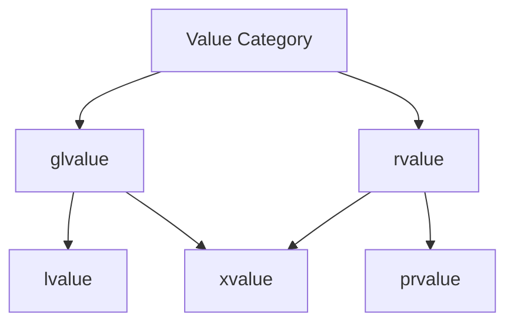

# 正确理解C++中的值语义：move

&emsp;&emsp;C++每个表达式都有自己独特的类型和值类别。其中值类别能够让我们和编译器正确的理解每一份内存的生命周期，从而能够在保证安全的情况下对内存资源进行高效的利用。大多数情况下，值类别的判断交给编译器就可以了，让编译器决定哪部分资源可以跳过复制直接复用，哪部分资源只需要浅拷贝不需要深拷贝。但是编译器并不是万能的，很多场景编译器无法确定资源是否可以复用，只能以最保守的方式进行优化。因此往往需要我们程序员告诉编译器哪部分资源可以复用移动，而对应的手段就是通过显式转换表达式的值类别（通常是将左值转换为将亡值 xvalue），来告诉编译器‘我保证这个对象之后不会再被使用，你可以安全地窃取它的资源’。而对应的转换就是本篇文章要谈论的```std::move```。

## 1 正确理解```std::move```
### 1.1 value category
&emsp;&emsp;在真正深入理解```std::move```之前，先简单回顾下C++中的```value category```，这是理解一切的基础。


| 类别 | 英文 | 描述 | 典型例子 | 能否取地址? | 能否移动? |
| --- | --- | --- | --- |--- | --- |
| 左值 | lvalue | 具有名称并且在内存中占据特定位置的值，所有的左值都可以通过```&```进行取值获得其内存地址。 | int x;, x, *ptr, func() (返回引用) | ✅ 能 | ❌ 通常不能 (除非 std::move) |
| 纯右值 | prvalue | 没有具体的标识，一般为临时对象或者字面量，并且创建后需要立即使用。 | 5, true, MyClass(), x + y | ❌ 不能 | ✅ 能 (直接移动) |
| 将亡值 | xvalue | 有身份，但接近生命周期结束，资源可被窃取。只能通过std::move标记 | std::move(x), 返回右值引用的函数调用 | ✅ 能 | ✅ 能 |

&emsp;&emsp;从上面的描述也能够看出来对lvalue、xvalue、prvalue的判断是比较容易的，如果具名变量被```std::move```标记就一定是xvalue，如果是一个字面量或者临时对象一定是prvalue，如果对象有名称能够取址操作一定是lvalue。

### 1.2 ```std::move```
&emsp;&emsp;从上面的描述能够很清晰的看到```std::move```的作用就是**将一个左值标记为可移动的对象，也就是说告诉编译器这个对象的资源后续不再使用，你可以直接在需要拷贝这部分资源的场景下，不拷贝直接拿这部分资源去完成后续的工作是安全的。** 这也是经常能够看到很多博客将被```std::move```标记的对象称为过期对象，可窃取资源的对象。

&emsp;&emsp;那么```std::move```是怎么实现的呢。从下面libc++中的实现能够看出，```move```的实现就是一个类型转换，首先将值的所有引用限定符删除，再加上```&&```标记为右值引用。所以```move```的根本含义就是给对应的对象打上个标签，表示当前对象的资源已经不会再被使用，编译器可以根据场景优化这部分内存的使用了。
```cpp
template<typename _Tp>
constexpr typename std::remove_reference<_Tp>::type&&
move(_Tp&& __t) noexcept
{
    return static_cast<typename std::remove_reference<_Tp>::type&&>(__t);
}
```

&emsp;&emsp;对应```move```的作用就是能够减低部分场景下内存的开销。当然对于大多是内置类型```move```的行为和你期望的一致，但是对于一些自定义类型还是需要用户根据场景实现合适的```move```构造函数。

```cpp
#include <iostream>
#include <cstring>
#include <utility> // 包含 std::move

class MyString {
private:
    char* data;
public:
    // 构造函数
    MyString(const char* str) {
        std::cout << "Constructor called\n";
        if (str) {
            data = new char[strlen(str) + 1];
            strcpy(data, str);
        } else {
            data = nullptr;
        }
    }

    // 拷贝构造函数 (深拷贝) -> 慢，分配新内存
    MyString(const MyString& other) {
        std::cout << "Copy Constructor (Deep Copy)\n";
        if (other.data) {
            data = new char[strlen(other.data) + 1];
            strcpy(data, other.data);
        } else {
            data = nullptr;
        }
    }

    // 移动构造函数 (窃取资源) -> 快，只指针赋值
    MyString(MyString&& other) noexcept {
        std::cout << "Move Constructor (Stealing Resources)\n";
        data = other.data;      // 直接拿走指针
        other.data = nullptr;   // 将原对象置空，防止析构时重复释放
    }

    // 析构函数
    ~MyString() {
        std::cout << "Destructor: deleting " << (data ? data : "nullptr") << "\n";
        delete[] data;
    }

    void print() const {
        std::cout << "Content: " << (data ? data : "nullptr") << "\n";
    }
};

int main() {
    MyString s1("Hello"); 
    // s1 是左值，拥有 "Hello" 的内存

    // --- 场景 A: 普通拷贝 (没有 std::move) ---
    // s1 是左值，调用拷贝构造函数
    MyString s2 = s1; 
    s2.print(); // Hello
    s1.print(); // Hello (s1 依然有效)

    // --- 场景 B: 使用 std::move ---
    // std::move(s1) 将 s1 转换为右值引用 (Xvalue)
    // 这会匹配移动构造函数 MyString(MyString&&)
    MyString s3 = std::move(s1); 

    s3.print(); // Hello (s3 拿走了资源)
    s1.print(); // nullptr (s1 被掏空了！状态有效但内容为空)

    return 0;
}
```

## 2 正确的使用```std::move```
&emsp;&emsp;既然```move```能够提升性能降低开销，那么是不是代码里面只要涉及到不再使用资源的转换都可以使用```move```，答案显然不是的，下面简单描述下哪些行为需要注意。

### 2.1 不要使用move后的对象

&emsp;&emsp;使用```std::move```将对象转为右值引用后，该对象的资源会被转移，其自身会处于“有效但未定义”的状态（即对象仍存在，但无法保证其内部数据的有效性）。因此，```move```操作后，严禁再使用原对象的资源（如访问成员变量、调用非```const```成员函数等），仅可对其执行销毁、赋值等不依赖内部数据的操作，否则会导致未定义行为。

```cpp
#include <string>
#include <utility>

int main() {
    std::string str = "test";
    std::string str2 = std::move(str); // 转移str的资源到str2
    // 错误：move后使用原对象str的资源
    std::cout << str.size() << std::endl; // 未定义行为，可能输出0或乱值
    // 正确：仅对原对象执行赋值（不依赖内部数据）
    str = "new test";
    return 0;
}
```

### 2.2 不要move const对象

&emsp;&emsp;```const```对象无法被```move```，因为```move```操作的核心是转移对象的资源，而```const```修饰会禁止对对象内部资源进行修改，此时```std::move```作用于```const```对象时，会返回```const```右值引用，无法匹配普通的移动构造函数/移动赋值运算符（其参数通常为非```const```右值引用），最终会调用拷贝构造函数/拷贝赋值运算符，达不到```move```的预期效果，还会造成语义混淆。

示例：
```cpp
#include <string>
#include <utility>

int main() {
    const std::string str = "const test";
    // std::move作用于const对象，返回const右值引用
    std::string str2 = std::move(str); 
    // 实际调用拷贝构造，而非移动构造（str的资源未被转移）
    std::cout << str << std::endl; // 仍输出：const test
    return 0;
}
```

### 2.3 move会破坏NVRO

&emsp;&emsp;NVRO（Named Return Value Optimization，具名返回值优化）是编译器的一种优化手段，用于消除函数返回时具名局部对象的拷贝开销，直接将局部对象构造在函数外部的目标位置。若在返回时对具名局部对象使用```std::move```，会强制将对象转为右值，从而阻止编译器进行NVRO优化，反而可能引入移动构造的开销，违背优化初衷。除非明确不需要NVRO，否则不应在返回具名局部对象时使用```move```。

```cpp
#include <string>

// 错误：使用move破坏NVRO，无法消除拷贝/移动开销
std::string badReturn() {
    std::string str = "bad";
    return std::move(str); // 强制移动，阻止NVRO
}

// 正确：不使用move，编译器会进行NVRO优化，无拷贝/移动开销
std::string goodReturn() {
    std::string str = "good";
    return str; // NVRO生效，直接构造到函数外部
}

int main() {
    auto s1 = badReturn();  // 有移动构造开销
    auto s2 = goodReturn(); // 无任何拷贝/移动开销
    return 0;
}
```

### 2.4 注意移动构造函数需要noexcept

&emsp;&emsp;移动构造函数（及移动赋值运算符）建议添加```noexcept```修饰，原因有两点：
1. 移动操作本身不应抛出异常（若移动过程中抛出异常，原对象资源已被部分转移，会导致对象处于不可控状态）；
2. 标准容器（如```vector```、```deque```等）在扩容时，若元素的移动构造函数是```noexcept```的，会使用移动操作提升效率；若不是```noexcept```，容器会退化为使用拷贝构造函数，避免异常安全问题，丧失移动语义的优势。

```cpp
#include <vector>
#include <utility>

class Test {
public:
    // 无noexcept的移动构造函数
    Test(Test&&) {} 
    // 有noexcept的移动构造函数
    // Test(Test&&) noexcept {}
};

int main() {
    std::vector<Test> vec;
    vec.reserve(10); // 扩容时，若移动构造无noexcept，会调用拷贝构造
    // 若打开上面的noexcept注释，扩容时会调用移动构造，效率更高
    return 0;
}
```

### 2.5 正确的实现move的例子

&emsp;&emsp;以下示例展示了如何正确定义移动构造函数、移动赋值运算符，并规范使用```std::move```，同时满足```noexcept```要求，避免常见错误：
```cpp
#include <iostream>
#include <utility> // 包含std::move

class MyString {
private:
    char* data;
    size_t length;

public:
    // 默认构造函数
    MyString() : data(nullptr), length(0) {}

    // 构造函数（分配资源）
    explicit MyString(const char* str) {
        length = strlen(str);
        data = new char[length + 1];
        strcpy(data, str);
    }

    // 拷贝构造函数（深拷贝）
    MyString(const MyString& other) {
        length = other.length;
        data = new char[length + 1];
        strcpy(data, other.data);
    }

    // 移动构造函数（noexcept，转移资源）
    MyString(MyString&& other) noexcept : data(nullptr), length(0) {
        // 转移other的资源，将other置为“有效但未定义”状态
        data = other.data;
        length = other.length;
        other.data = nullptr; // 避免other析构时释放已转移的资源
        other.length = 0;
    }

    // 移动赋值运算符（noexcept，转移资源）
    MyString& operator=(MyString&& other) noexcept {
        if (this != &other) { // 避免自赋值
            // 释放当前对象的资源
            delete[] data;
            // 转移other的资源
            data = other.data;
            length = other.length;
            other.data = nullptr;
            other.length = 0;
        }
        return *this;
    }

    // 析构函数（释放资源）
    ~MyString() {
        delete[] data;
    }

    // 辅助打印函数
    void print() const {
        if (data) {
            std::cout << data << std::endl;
        } else {
            std::cout << "空字符串" << std::endl;
        }
    }
};

int main() {
    MyString str1("Hello Move");
    MyString str2 = std::move(str1); // 正确使用move，转移str1的资源
    str2.print(); // 输出：Hello Move
    str1.print(); // 输出：空字符串（str1已被转移，不可再使用其资源）

    MyString str3;
    str3 = std::move(str2); // 移动赋值，转移str2的资源
    str3.print(); // 输出：Hello Move
    str2.print(); // 输出：空字符串

    return 0;
}
```

## 3 ```std::forward```和```std::move```的区别
&emsp;&emsp;```std::move```和```std::forward```均是```C++11```引入的右值引用相关工具，核心作用都是“传递对象的值类别”，但二者语义、使用场景完全不同，核心区别在于：```std::move```是“无条件将对象转为右值”，会固定改变对象的值类别；```std::forward```是“条件性传递对象的值类别”，仅在模板转发场景中，保留原始对象的左值/右值属性，不会主动改变值类别。

1.  ```std::move```：无条件将输入对象（无论左值、右值）转为“非const右值引用”，其核心目的是“触发移动语义”，转移对象资源，不关心对象原始的值类别。调用```std::move```后，原对象会处于“有效但未定义”状态，不可再使用其资源。

2.  ```std::forward```：仅用于“模板转发”场景（针对模板参数为万能引用的情况），条件性传递对象的值类别——若原始对象是左值，转发后仍为左值；若原始对象是右值，转发后仍为右值，即“保持原始值类别不变”，核心目的是“完美转发”，避免因值类别转换导致的拷贝开销或语义错误。

&emsp;&emsp;```std::move```用于明确需要转移资源的场景：当我们明确不需要再使用原对象，希望将其资源转移给新对象时（如对象赋值、函数返回局部对象且无需NVRO优化等），使用```std::move```。

&emsp;```std::forward```用于模板完美转发场景：模板函数中，需要将参数传递给其他函数，且希望保留参数原始的左值/右值属性（避免左值被转为右值、或右值被转为左值），此时必须使用```std::forward```。若不使用，会导致右值被转为左值，触发拷贝语义。
```cpp
#include <iostream>
#include <utility>
#include <string>

// 辅助函数：打印值类别（左值/右值）
void printType(const std::string& str) {
    std::cout << "左值引用：" << str << std::endl;
}
void printType(std::string&& str) {
    std::cout << "右值引用：" << str << std::endl;
}

// 模板转发函数（万能引用T&&）
template<typename T>
void forwardTest(T&& arg) {
    // 完美转发：保留arg原始值类别
    printType(std::forward<T>(arg)); 
    // 对比：不使用forward，会将右值转为左值
    // printType(arg); 
}

int main() {
    std::string str = "left value";
    forwardTest(str); // 传入左值，转发后仍为左值，输出“左值引用：left value”
    
    forwardTest("right value"); // 传入右值，转发后仍为右值，输出“右值引用：right value”
    return 0;
}
```

## 4 移动语义的演进

&emsp;&emsp;移动语义的演进核心是优化资源转移效率、拓展适用场景、提升安全性与易用性，从C++11引入到C++23完善，逐步成为现代C++高效内存管理的核心支撑，各版本核心改进如下：

&emsp;&emsp;**C++11：奠定移动语义基础**：首次引入移动语义，解决拷贝语义的性能痛点；新增右值引用（T&&）、移动构造/赋值运算符，建立左值、纯右值、将亡值的 值类别体系；引入```std::move```和```std::forward```工具，实现资源所有权转移，支持```std::unique_ptr```等不可拷贝类型的容器存储与传递。

&emsp;&emsp;**C++14：细节优化，提升易用性**:未改动核心机制，优化```std::move```、```std::forward```的实现，消除边缘歧义；引入```std::make_unique```，优化智能指针移动场景的安全性；扩展```constexpr```支持，适配编译期移动操作，拓展使用场景。

&emsp;&emsp;**C++17：强化优化与标准库适配**:引入强制拷贝消除，无需依赖移动构造即可实现资源高效转移；完善容器移动适配，要求移动构造/赋值标记```noexcept```保障异常安全；结构化绑定配合移动语义，简化复杂对象移动操作；将```noexcept```纳入类型系统。

&emsp;&emsp;**C++20：拓展场景，完善语义规范**:依托Ranges库、协程等新特性，拓展移动语义适用场景；Ranges算法原生支持移动，协程```co_return```支持移动返回；引入```std::move_only_function```，填补可移动函数对象的空白；明确移动后源对象“有效但未定义”的安全状态。

&emsp;&emsp;**C++23：细节补全，简化使用**:优化函数返回隐式移动逻辑，无需显式调用```std::move```；优化范围```for```循环临时变量生命周期，避免移动异常；完善衰减复制逻辑，提升模板编程适配性；优化Ranges库，拓展移动语义在```std::mdspan```等科学计算场景的应用。


## 5 参考文献
- [cppreference-value_category](https://en.cppreference.com/w/cpp/language/value_category.html)
- [std::move doesn't move anything: A deep dive into Value Categories](https://0xghost.dev/blog/std-move-deep-dive/)